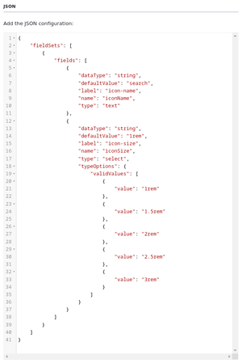
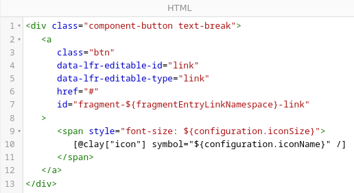

# Creating Custom Fragments for Clarity

Liferay offers a wide range of out-of-the-box fragments and configurations to help streamline website development. However, when these options don't satisfy your design requirements, you can quickly create custom fragments using HTML, CSS, and JavaScript. In addition to these core web development languages, you can leverage Clay utilities<!--w/c? Styles?-->, define configuration options using JSON, and add Liferay-specific tags and attributes. These elements empower you to define editable sections, embed widgets, reuse available classes, and more.

<!--TASK:  -->

Liferay DXP includes the fragments editor UI for creating and managing fragments in your site. Additionally, you can export fragment sets and work on them locally, using your preferred tools. Then, once your local work is complete, you can import the set back into Liferay. Furthermore, you can instantiate React components within your page fragments using static JavaScript imports, expanding the range of functionalities you can integrate into your custom fragments.

When creating a fragment, you can copy and modify existing fragments or start from scratch. You can also create custom fragments by saving container compositions in the page editor. Saving container compositions offers a convenient way to recreate specific arrangements of fragments on other pages. However, you cannot edit compositions via the Fragments Editor UI.

Here you'll use the Fragments Editor UI to create and import custom fragments for Clarity's site.

!!! tip “When to Use Custom Fragments”
    Liferay recommends using out-of-the-box fragments and configuration options whenever possible. When you do need custom fragments, Liferay recommends leveraging available style tokens to simplify fragment code, which promotes design consistency across your website elements and improved maintainability.

<!--TASK:
## Defining Fragment Configuration Options

## Using Liferay Tags and Attributes

## Updating Fragments

Propagation.

-->

## Exercise: Creating Custom Fragments

<!-- Exercise 8a -->

Page fragments are reusable drag-and-drop elements for designing page layouts, displaying content, building forms, and more. They are built using HTML, CSS, and JavaScript and can provide both structure and functionality to pages. Liferay provides a variety of fragments out-of-the-box, but you can develop your own.

The training workspace includes a set of custom fragments called Clarity components. While this fragment includes most of what Clarity needs, they still need a custom Search Button fragment. Here you'll create it as Walter Douglas.

To do this,

1. Open the *Site Menu* (), expand *Design*, and click *Fragments*.

1. Under Fragment Sets, click *Clarity Components*.

1. Click *New*, select *Basic Fragment*, and click *Next*.

1. Enter `Search Button` and click *Add*.

1. Go to the *Configuration* tab and copy the contents of the `search-button-configuration.json` file into the editor. This file is in the `[repository-folder]/exercises/lesson-8/` folder.

   

   This defines two configuration options for the fragment: `iconName` and `iconSize`. You can reference these options in the fragment's code.

1. Return to the *Code* tab and replace the contents of the HTML window with the contents of the `search-button.ftl` file. This file is also in the `[repository-folder]/exercises/lesson-8/` folder.

   

   Notice this includes references to the configuration options you defined in the previous step: `${configuration.iconSize}` and `${configuration.iconName}`. This way you can configure the icon's name and size when you add the fragment to a page.

1. Click *Publish*.

You can now add this fragment to Clarity's master pages. But before you do this, let's import some additional fragments that you'll use throughout the following exercises.

## Exercise: Importing Fragments

<!-- Exercise 8b -->

When building pages with fragments, you can save any container and its contents as a composition for reuse. Clarity's team has provided some fragments to wireframe the Home page, FAQ page, and Leadership Profile display page. To use these fragments, you must first import them to your site as Walter Douglas.

While in the Fragments application,

1. Under Fragment Sets, click *Clarity Page Compositions*.

1. Click *Actions* () for the fragment set and select *Import*.

   

1. Click *Select File*, navigate to the `[repository-folder]/exercises/lesson-8/` folder in the training workspace, and select `page-composition-faq.zip` file.

1. Click *Import*.

1. Click *Done* when finished.

   This adds the FAQ Page composition to the current fragment set. You can now import the display page composition.

1. Repeat the above steps to import these compositions:

   | Fragment Set                 | File                                         |
   |:-----------------------------|:---------------------------------------------|
   | Clarity Page Compositions    | `page-composition-home.zip`                  |
   | Clarity Display Compositions | `display-composition-leadership-profile.zip` |

Great! Now that you've created and imported Clarity's custom fragments, you can add them to pages.

## Exercise: Adding Custom Fragments to Master Pages

<!-- Exercise 8c -->

After creating the Search Button fragment, you'll add it to the primary and secondary master pages as Walter Douglas.

To do this,

1. Open the *Page Templates* application and begin editing *Primary Master Page*.

1. Add the *Search Button* fragment to the Header User Actions container.

   

1. In the Browser side panel (), select the *link* sub-element for the Search Button fragment.

1. In the configuration side panel, go to the *Link* tab and configure these settings:

   | Tab  | Setting | Value  |
   |:-----|:--------|:-------|
   | Link | Link    | Page   |
   | Link | Page    | Search |

   Now when users click the button, they're directed to Clarity's Search page.

1. Click *Publish Master*.

1. Click *Ok* in the popup.

1. Repeat these steps to update *Secondary Master Page*.

Great! Next, let's add the imported fragment compositions to Clarity's pages.

## Exercise: Adding Fragment Compositions to Pages

<!-- Exercise 8d -->

Fragment compositions are reusable arrangements of page elements saved within a fragment container. You can use them to quickly duplicate layouts between site pages to accelerate development and achieve a more consistent design.

Here you'll add the fragment compositions to their corresponding pages as Walter Douglas.

To do this,

1. Begin editing one of these pages or display page:

   * Home (Content Page)
   * FAQ (Content Page)
   * Leadership Profile (Display Page Template)

1. Drag and drop the corresponding fragment composition into the page's central content area.

   !!! note
       For the Home page, remove its default content before adding the fragment composition.

   

1. Click *Publish*.

1. Repeat this process until you've finished adding the page compositions to the other pages.

Now Clarity's pages are wireframed and ready for content.

## Conclusion

Congratulations! You've created and imported custom fragments and compositions for Clarity's pages. You've also finished wireframing Clarity's master pages and added compositions to their blank pages.

Next, you'll apply Clarity's styling to finish setting up the site before moving on to managing and displaying Clarity's content in Module 7.

Next Up: [Applying Clarity's Brand Styling](./applying-claritys-brand-styling.md)

## Additional Resources

See official documentation to learn more about creating and managing Liferay fragments:

* [Using Fragments](https://learn.liferay.com/web/guest/w/dxp/site-building/creating-pages/page-fragments-and-widgets/using-fragments)
* [Page Fragment Editor Interface Reference](https://learn.liferay.com/web/guest/w/dxp/site-building/developer-guide/reference/fragments/page-fragment-editor-interface-reference)
