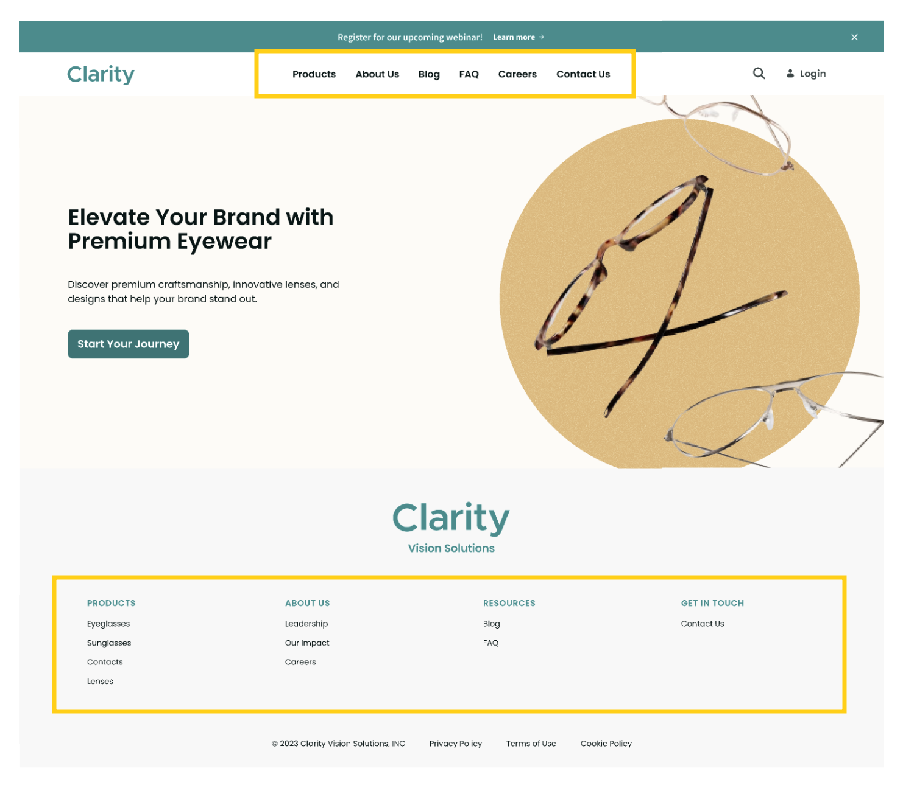
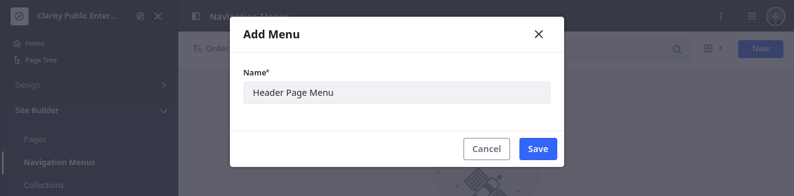
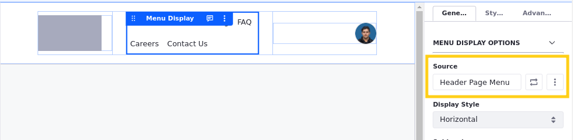

# Creating Navigation Menus for Clarity’s Master Pages

Navigation is an integral part of designing a clear and intuitive user experience. In Liferay, setting up navigation involves creating menus and then adding them to pages using widgets or fragments. Each menu can include links to both internal and external pages or content. Since pages and navigation are decoupled, you can organize your pages and content without worrying about how it will affect navigation. You can also customize the look and feel of your menus and even tailor navigation based on user roles, preferences, or location, to deliver personalized experiences. In these ways, Liferay’s flexible navigation menus can help ensure users easily find what they need.

As seen in the previous exercises, Clarity’s header and footer designs include multiple navigation menus. When designing the master pages, you used the default menu, which includes all site content pages. Now it is time to create custom menus that only include the desired pages. Then you can update the master pages to use them instead of the default menu.

## Exercise: Creating Navigation Menus

<!-- Exercise 7a -->

Most of the custom navigation menus that Clarity needs are provided in the training workspace. However, they still need a menu for their page header that only includes these pages: Products, About Us, Blog, FAQ, Careers, and Contact Us.

Here you'll create this custom navigation menu as Walter Douglas.

To do this,

1. Open the *Site Menu* (), expand *Site Builder*, and click *Navigation Menus*.

1. Click *New*.

1. For Name, enter `Header Page Menu`.

   

1. Click *Save*.

   This creates a blank menu and directs you to its edit page. Now you can add pages to it.

1. Click *Add*. This displays a list of available types of items you can add to the menu.

1. Select the *Page* item type.

   

1. Check these pages:

   * About Us
   * Blog
   * Careers
   * Contact Us
   * FAQ
   * Products

   

1. Click *Select*. This saves your changes to the menu.

1. Click *Actions* () for one of the menu items and select *View Info*. This opens a side panel where you can update its display name if desired.

   

1. Drag and drop the pages into this order:

   * Products
   * About Us
   * Blog
   * FAQ
   * Careers
   * Contact Us

   These changes are saved automatically, so the menu is ready to use.

Now that the header page menu is defined, you can update the menu display fragment in each master page's header to use it. But before returning to Clarity's master pages, let's update their Footer Resource Menu to include the recently created FAQ page.

1. Return to the *Navigation Menus* overview page.

1. Select *Footer Resources Menu*.

1. Click *Add*.

1. Select the *Page* item type.

1. Check *FAQ*.

1. Click *Select*.

With Clarity's navigation menus complete, let's return to Clarity's master page templates and update their header menu displays to use the correct navigation menu.

## Exercise: Updating Menu Display Fragments

<!-- Exercise 7b -->

When you add a menu display fragment or widget to a page, you can determine which menu to display. Here you'll update the header menu display fragment in Clarity's master pages as Walter Douglas.

To do this,

1. Begin editing the *Primary Master Page* template.

1. Select the *menu display* fragment in the header.

1. In the configuration side panel, click *Change Source* () for the menu's source.

1. Click *Header Page Menu* and click *Select This Level*.

   

1. Click *Publish Master*.

1. Repeat this process to update the Secondary Master Page’s menu display fragments.

Once finished, navigate to the Home page to see how your changes to the template were automatically applied to the connected pages.

## Conclusion

Congratulations! You’ve finished setting up the navigation menus for Clarity’s master pages. Next you'll create custom fragments to finish Clarity's page headers.

Next Up: [Creating Custom Fragments for Clarity](./creating-custom-fragments-for-clarity.md)

## Additional Resources

See official documentation to learn more about creating and displaying custom navigation menus:

* [Using the Navigation Menus Application](https://learn.liferay.com/web/guest/w/dxp/site-building/site-navigation/using-the-navigation-menus-application)
* [Navigation Menu Element Types](https://learn.liferay.com/w/dxp/site-building/site-navigation/navigation-menu-element-types)
* [Configuring Menu Displays](https://learn.liferay.com/w/dxp/site-building/site-navigation/configuring-menu-displays)
