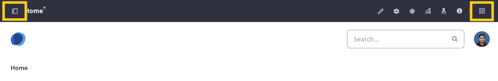

# Setting Up Clarity's Site

Liferay sites are customizable spaces for building personalized digital experiences. Each site includes applications for creating content, designing pages, and more. With these features, you can bring your custom solutions to life, whether intranets, public sites, customer portals, or e-commerce storefronts. In fact, you can leverage Liferay's multi-site capabilities to create multiple such sites in the same Liferay instance. This flexibility empowers you to build solutions tailored to your needs.

In this lesson, you'll create a site from scratch and familiarize yourself with the Liferay site builder interface. <!--TASK: Add transition to section on templates and initializers.-->

!!! note
    In a real world scenario, site contributors would work in a shared Liferay DXP environment. However, for training purposes, you’ll work in a local instance to finish your own copy of the site.

## Using Templates and Initializers

When creating a Liferay site, you can start from scratch, or create a site template. With site templates, you can create pages, add menus, configure widgets, create taxonomies--basically anything you can do when creating a site. You can then use that template to create multiple sites with the same basic elements. This is a great way to ensure all sites begin with the same boilerplate and follow consistent standards (e.g., accessibility). Also, since templates are designed using Liferay’s intuitive interface, they are accessible to non-technical users.

Liferay also provides site initializers for quickly duplicating site structures, content, and more. These powerful tools offer everything a site template can, with the added benefit of leveraging Liferay's API. This grants you the ability to break free from the limitations of the site itself, enabling advanced functionalities like user and role management. However, unlike site templates, site initializers currently lack the ability to propagate changes to multiple, generated sites. Also, they are more complex and require technical knowledge.

!!! note “Site Templates vs. Site Initializers”
    If you want to spin up a solution, complete with user groups, roles, and maybe users, then you’ll want to use a site initializer. However, if you need to duplicate a basic site structure along with placeholder content and you want to propagate template changes to connected sites, then a site template is the right choice.

Currently, Clarity is only focused on creating a single public site. But if they ever want to provide partners with a white labeling service that allows them to spin up their own “Clarity Sites” with their own branding, site templates could help simplify and accelerate provisioning.

## Exercise: Creating a Site

<!-- Exercise 4a -->

The training workspace includes a prebuilt site, Clarity Public Enterprise Website. However, to see what the site creation process looks like, let's create a new test site as Ian Miller.

To do this,

1. Sign in as Ian Miller, Clarity's IT manager.

   * Username: `ian.miller@clarityvisionsolutions.com`
   * Password: `learn`

   !!! note
       So far we've used Clarity's administrator user, which has complete control over the Liferay instance. In practice, it's best to limit the use of such high-level accounts to ensure optimal security.

1. Open the *Global Menu* (), go to the *Control Panel* tab, and click *Sites*.

1. Click *New*.

   Here you can select from available templates and initializers.

1. Select the *Blank Site* template.

1. Enter `Clarity Distributor Portal` for name.

1. Click *Add*.

   This creates a new empty site and redirects you to its configuration page.

Clarity could use the new site to build a channel for selling products to their distributors. But for this course, we'll focus on optimizing Clarity's public enterprise website.

Next, you'll learn about site membership and how you can grant users site specific roles. But before that, let's take a quick tour to familiarize ourselves with Liferay's site building UI.

## Exploring the Site Building UI

Liferay's site building UI offers an intuitive interface for creating and managing your sites, assets, and applications. You can access these features through the Site Menu () and Global Menu ().

The Site Menu provides access to a site's applications. Here, you can access Liferay's suite of applications for creating and designing site pages and content. All data for these applications is site scope, meaning other sites cannot access it. From the Site Menu, you can also navigate between sites () and explore the current site's page structure ().

The Global Menu provides access to core Liferay functionalities for your entire Liferay DXP environment. This includes managing users, creating sites, building applications, and more. Available features appear in three tabs: Applications, Commerce, and Control Panel. From here, you can also quickly switch between sites in your Liferay instance.

* **Applications Tab**: Includes applications that relate to relate to sites (e.g., asset libraries, workflows, publications, search).
* **Commerce Tab**: Includes applications for setting up e-commerce solutions (e.g., catalogs, products, price lists).
* **Control Panel Tab**: Includes core applications (e.g., sites, users, objects), configuration options, and platform tools.

## Conclusion

Congratulations! In this lesson, you've explored options for creating Liferay sites and familiarized yourself with Liferay's site builder UI. The next step is to configure Clarity's website.

Next Up: [Configuring the Clarity Site](./configuring-the-clarity-site.md)

## Additional Resources

See official documentation to learn more about Liferay's site building and management features:

* [Getting Started with Site Building](https://learn.liferay.com/w/dxp/site-building/getting-started-with-site-building)
* [Sites](https://learn.liferay.com/w/dxp/site-building/sites)
* [Site Templates](https://learn.liferay.com/w/dxp/site-building/sites/site-templates)
