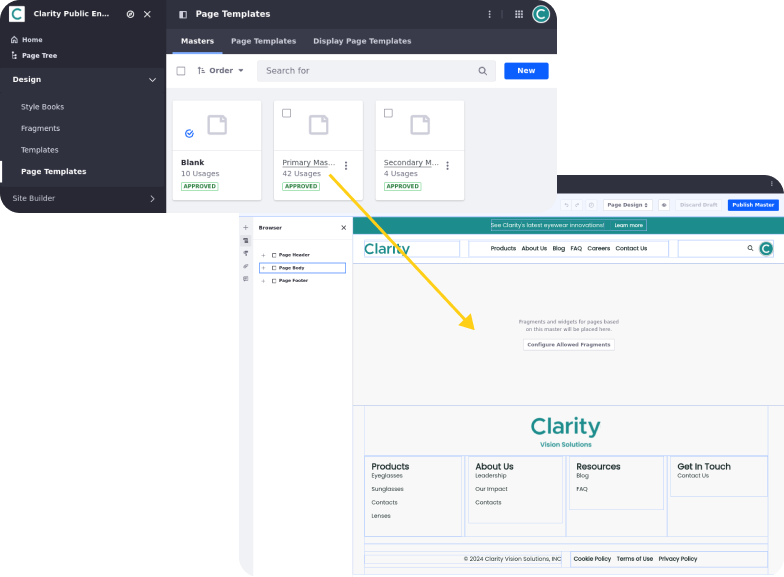

# Understanding Page Design

Site pages are canvases for designing rich content experiences with robust functionality. Each page’s structure consists of a header, footer, and central design area. The process and tooling for designing these page sections is essentially the same for content pages, display pages, and utility pages. You begin with selecting a master page template to define the page’s header and footer. This template is designed using page elements and navigation menus. After this, you can design the central content area of the page using the same page elements. Throughout this process, you can apply custom styling to align with your brand.

<!--TASK: -->

Before continuing on to design Clarity’s pages, let's review Liferay’s page editor UI and the core concepts of Liferay page design.

## Exploring the Page Editor UI

<!--TASK: Convert to video-->

Liferay’s page editor UI is organized into two main sections: the editing toolbar and side panels.

The toolbar includes tools for creating unique user experiences, localizing content, switching between edit modes, and auditing page SEO and accessibility. When integrated with Analytics Cloud, you can also access A/B testing and content performance metrics.

The page side panels include all available page elements (fragments and widgets), as well as configuration options for both the page and its elements. You can drag and drop elements from the left panel into the central design area and arrange them to create your desired structure. Also, this panel provides quick access to design options (e.g., master page, style book) and content included in the page. During page design, contributors can leave comments on pages to collaborate.

When you select a page element, you can access configuration options in the right side panel. Available options can vary, though some are common to all. These options are organized into three tabs: General, Styles, and Advanced. Additionally, you can select a fragment’s sub-elements (e.g., text, image) to access additional settings, like content mapping and links.

## Page Elements

Page elements are the most basic units of page design. They include fragments, widgets, and some frontend client extensions. These building blocks are combined within the Liferay editor to create the layout and functionality of your website pages.

### Fragments

Page fragments are reusable drag-and-drop elements for designing page layouts, displaying content, building forms, and more. They are built using HTML, CSS, and JavaScript and can provide both structure and functionality to pages. Liferay provides a variety of fragments out-of-the-box, but you can develop your own.

### Widgets

Page widgets are web applications that you can drag and drop onto your page directly or embed in a page fragment. These widgets provide a wide range of functionalities, enabling you to add search capabilities, navigation elements, interactive content feeds, and more. However, it's important to note that styling these widgets can be more complex. While Liferay offers some default styling options, extensive customization relies on freemarker templates.

### Client Extensions

Liferay provides two types of frontend client extensions for creating page elements: IFrame and Custom Element. Both of these client extensions register applications with Liferay and render them as widgets on site pages. We’ll address these types of elements later in Module 10.

## Navigation Menus

Navigation is a core part of website design. With Liferay navigation menus, you can create multiple menus for navigating both internal and external pages or content. For example, a menu could include a subset of content pages, or links to display pages and external resources. During creation, you can determine which elements are included in a menu and how they’re organized. Then, once created, you can add your menus to site pages using fragments or widgets.

## Page Headers and Footers

In Liferay, designing page headers and footers involves creating master page templates. These templates are designed using the same tools and elements as pages. In advanced cases, you can also add CSS styling and JavaScript to the page’s header or footer to ensure it loads at the beginning or end of page loads. Once defined, you can then use the master page to create new pages or apply it to existing pages. Each page using the template inherits the design and styling of the master page. Out of the box, Liferay provides the Blank master page template that you used in the previous lesson to create the site structure.

## Styling Site Pages

Liferay provides a robust set of styling tools for both technical and non-technical users. Together, they can help ensure a consistent visual identity and user experience across all website elements, including fonts, colors, logos, and layouts. Streamline development and integrate existing styles for a faster, more efficient design process. Core Liferay concepts related to site styling include themes, style books, frontend client extensions, and page element configurations.

<!--

^ Add diagram representing Liferay's styling tools (i.e., Themes, Styles Books, Frontend CX, and individual page element styling). The diagram could be something similar to the [Themes](https://learn.liferay.com/w/dxp/liferay-development/customizing-liferays-look-and-feel/themes) article in our official documentation, however it should fit Liferay's new "styling story". The diagram also doesn't necessarily need to be a pyramid.

-->

### Themes

Themes determine the baseline look and feel for your website, including color schemes, typography, spacing, and other styling options. They serve as the starting point for additional configurations that you can make using style books and frontend client extensions. By default, Liferay includes the Classic and Dialect themes out of the box, but users can create and deploy their own as OSGi modules. However, custom themes are only available for self-hosted and Liferay PaaS deployments. Creating custom themes is a complex process and can create technical debt/overhead when updating your Liferay instance.

!!! important
    Due to their complexity and incompatibility with Liferay SaaS, Liferay does not recommend using custom themes for site styling. Instead, you should use a combination of master page templates, style books, and frontend client extensions to achieve the same goal.

### Style Books

Style books provide a way for you to make changes to the look and feel of your site without the need to make code changes and deal with deployments. They work by granting access to CSS variables defined by a theme so you can update their values via the Liferay UI. Once set, users can apply the style book to all site pages or on a page by page basis. In turn, this applies the styling to all page elements using the CSS variables. This makes style books a convenient way to update site styling for marketing campaigns.

### Frontend Client Extensions

Liferay offers frontend client extensions to provide a flexible and secure way to customize the appearance of your website. With them, you can inject design assets directly into your site pages, empowering you to achieve the desired look and feel without modifying Liferay’s core code.

Available frontend client extensions for styling site pages include:

* JavaScript (JS): Add JavaScript to pages.
* CSS: Add CSS resources to a page’s header.
* Theme CSS: Override the current theme’s CSS files for pages (`main.css` and `clay.css`).
* Theme Favicon: override the theme’s favicon for pages.
* Sprite Map: Override the default Clay sprite map used for page icons on a page.

Together, these client extensions can provide frontend resources to site pages for the desired look and feel.

!!! note “Themes vs. Frontend Client Extensions”
    For site styling, leverage frontend client extensions with master pages and style books. By externalizing customizations, client extensions reduce upgrade risks and complexity associated with custom themes. Additionally, this approach is compatible with all deployment options (Self-Hosted, PaaS, SaaS).

<!--TASK: Note additional client extensions, note token definitions-->

### Individual Page Element Styles

When configuring individual page elements, you can apply custom styling in the Styles tab. Here, you can enter values directly, or use available stylebook tokens. Additionally, you can apply custom CSS to individual page elements in the Advanced tab. Together, these configurations provide a convenient way to override styling for individual instances of an element without affecting others of the same type. Applying styles in this way is similar to inline styling, though with the convenience of Liferay’s visual page editor.

## Conclusion

Congratulations! You’ve explored the different parts of Liferay page design. Next, let’s finish designing Clarity's custom master page templates.

Next Up: [Designing Clarity’s Master Pages](./designing-claritys-master-pages.md)

## Additional Resources

See official documentation to learn more about Liferay's page design features:

* [Using Content Pages](https://learn.liferay.com/w/dxp/site-building/creating-pages/using-content-pages)
* [Page Fragments and Widgets](https://learn.liferay.com/web/guest/w/dxp/site-building/creating-pages/page-fragments-and-widgets)
* [Using the Navigation Menus Application](https://learn.liferay.com/web/guest/w/dxp/site-building/site-navigation/using-the-navigation-menus-application)
* [Master Page Templates](https://learn.liferay.com/w/dxp/site-building/creating-pages/defining-headers-and-footers/master-page-templates)
* [Site Appearance](https://learn.liferay.com/w/dxp/site-building/site-appearance)
* [Customizing Liferay's Look and Feel](https://learn.liferay.com/w/dxp/liferay-development/customizing-liferays-look-and-feel)
