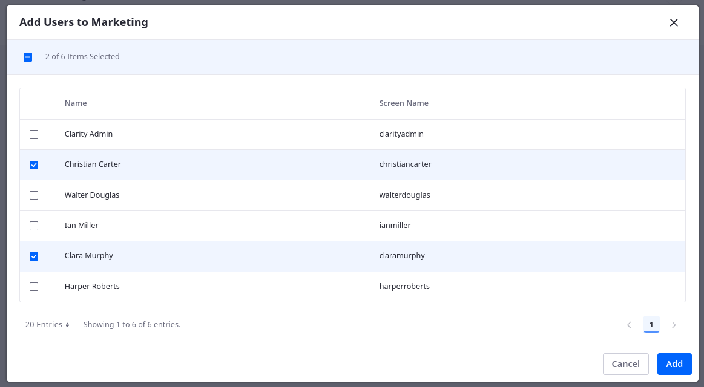
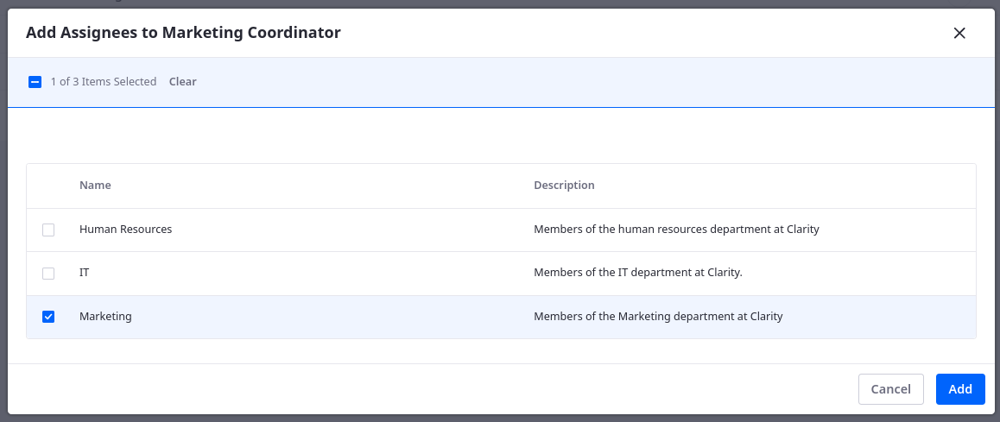

# Creating Users, User Groups, and Roles

Clarity has the following team members who are contributing to build their public enterprise website:

| Screen Name     | Email                                         | First Name | Last Name | Job Title                  |
|:----------------|:----------------------------------------------|:-----------|:----------|:---------------------------|
| christiancarter | `christian.carter@clarityvisionsolutions.com` | Christian  | Carter    | Marketing Coordinator      |
| claramurphy     | `clara.murphy@clarityvisionsolutions.com`     | Clara      | Murphy    | Marketing Manager          |
| harperroberts   | `harper.roberts@clarityvisionsolutions.com`   | Harper     | Roberts   | Human Resources Specialist |
| ianmiller       | `ian.miller@clarityvisionsolutions.com`       | Ian        | Miller    | IT Manager                 |
| walterdouglas   | `walter.douglas@clarityvisionsolutions.com`   | Walter     | Douglas   | Web Developer              |

The training workspace already includes all of these users except for *Christian Carter*. In real world scenarios, large organizations like Clarity, would leverage an active directory to import their users into Liferay. However, for training purposes, you'll create a user, a user group, and roles manually.

## Exercise One: Creating Users

<!-- Exercise 3a: Creating Users -->

As the Clarity Admin,

1. Open the *Global Menu* (), go to the *Control Panel* tab, and click *Users and Organizations*.

   

   Here you can view and manage all users for the current Liferay instance. This should include the Clarity Admin user along with Walter Douglas, Ian Miller, Clara Murphy, and Harper Roberts.

   

1. Click *New*.

1. To set the user's profile image, click the *Change Image* button (), click *Select*, navigate to the`[repository-folder]/exercises/lesson-3/` folder in the training workspace, and select `christian-carter.png`, and click *Done*.

   

1. Enter these details for Christian Carter:

   | Field         | Value                                         |
   |:--------------|:----------------------------------------------|
   | Screen Name   | `christiancarter`                             |
   | Email Address | `christian.carter@clarityvisionsolutions.com` |
   | Job Title     | `Marketing Coordinator`                       |
   | First Name    | `Christian`                                   |
   | Last Name     | `Carter`                                      |

   

1. Click *Save*.

   You can now access additional configuration options for Christian Carter.

1. In the left menu, click *Password*.

1. Enter `learn` for his password.

   

1. Click *Save*.

Great! You've added Christian Carter to Clarity's Liferay instance. Next you'll create a user group to help organize and manage Clarity's users.

## Structuring Organizations with User Groups

!!! important **Key Decision**
   Deciding how to group and assign permissions to users is a key decision point as you build out your enterprise website. In this situation, it's recommended to use Liferay user groups to model your organization’s structure on the new site.

In a real-world scenario, organizations like Clarity have hundreds of users, and managing them individually is impossible. To help reduce the burden of user management, Liferay provides user groups for easily assigning roles to related users. User groups can also be leveraged for assigning site membership. Instead of assigning individual users to a site, assign user groups.

Clarity needs these user groups:

| Group Name      | Description                                           |
|:----------------|:------------------------------------------------------|
| Human Resources | Members of the human resources department at Clarity. |
| IT              | Members of the IT department at Clarity.              |
| Marketing       | Members of the marketing department at Clarity.       |

The training workspace already includes these user groups except for *Marketing*. 

## Exercise Two: Creating and Assigning User Groups

<!-- Exercise 3b: Creating and Assigning User Groups -->

As the Clarity Admin,

1. Open the *Global Menu* (), go to the *Control Panel* tab, and click *User Groups*.

   

1. Click *New*.

1. Enter these details for the user group:

   | Field       | Value                                             |
   |:------------|:--------------------------------------------------|
   | Name        | `Marketing`                                       |
   | Description | `Members of the marketing department at Clarity.` |

   

1. Click *Save*.

   This creates the user group, so you can now add Clarity's marketing users to it.

1. Click the *Marketing* user group.

1. Click *New*.

1. Select *Christian Carter* and *Clara Murphy*.

   

1. Click *Add*.

Great! Now any roles assigned to the Marketing user group are automatically assigned to all team members.

## Understanding Roles

Roles are collections of permissions that you can assign to multiple users. Each role has a specific scope that's determined by its type: regular, site, organization, asset library, or account. This is because sometimes you don’t want certain permissions to carry across multiple contexts in a Liferay instance.

| Role type          | Scope                                                                              |
|:-------------------|:-----------------------------------------------------------------------------------|
| Regular Role       | This is the most extensive permission scope, and it spans across the whole portal. |
| Site Role          | Permissions are scoped to a particular site.                                       |
| Organization Role  | Permissions are scoped to particular organization's users.                         |
| Asset Library Role | Permissions are scoped to an asset library for sharing resources                   |
| Account Role       | Permissions are given to users who are a part of an account.                       |

Liferay provides [out-of-the-box roles](https://learn.liferay.com/en/w/dxp/users-and-permissions/roles-and-permissions/understanding-roles-and-permissions), but you can also create custom roles with your choice of permissions to fit your business needs.

Clarity plans to leverage Liferay's OOTB roles, but they also want these custom roles:

| Type    | Title                    | Description                                                         |
|:--------|:-------------------------|:--------------------------------------------------------------------|
| Regular | Content Manager          | Clarity role for those managing content on Liferay.                 |
| Regular | IT Manager               | Clarity role for a manager within the IT department.                |
| Regular | Web Developer            | Clarity role for a front end developer within the IT Department.    |
| Regular | Marketing Coordinator    | Clarity role for an individual contributor from the marketing team. |
| Site    | Site Content Contributor | Site based role for those contributing to the Clarity site.         |

The training workspace includes all of these roles except for *Marketing Coordinator*.

## Exercise Three: Creating and Assigning User Roles

<!-- Exercise 3c: Creating and Assigning User Roles -->

As the Clarity Admin,

1. Open the *Global Menu* (), go to the *Control Panel* tab, and click *Roles*.

1. Click *New*.

1. Enter these details for the role:

   | Field       | Value                                                                 |
   |:------------|:----------------------------------------------------------------------|
   | Type        | `Regular`                                                             |
   | Title       | `Marketing Coordinator`                                               |
   | Description | `Clarity role for an individual contributor from the marketing team.` |
   | Key         | `Marketing Coordinator`                                               |

   

1. Click *Save*.

   This creates the role, so you can add permissions and assign it to users. Since this role should apply to all marketing team members, you can assign it to the Marketing user group.

1. Go to the *Assignees* tab and click *User Groups*

   

1. Click *New*.

1. Select *Marketing*.

   

1. Click *Add*.

Great! You've created and assigned a role to Clarity's marketing users.

## Organizations

Clarity relies on user groups and roles for a significant portion of their user and permission management. However, Liferay offers Organizations as an additional user management tool. Organizations can be used to model the hierarchy of a company. It is also an important part of managing groups of accounts.

As their business grows and site requirements evolve, Clarity can consider leveraging Liferay organizations in the future.

See official documentation to learn more about [organizations](https://learn.liferay.com/w/dxp/users-and-permissions/organizations/understanding-organizations).

## Accounts

Liferay also offers additional tools around accounts. These can be used to model business relationships to help manage external parties. For example, Liferay accounts can model a business to consumer (B2C) context in which a customer is a single user. Accounts can also model a business to business (B2B) context where a customer represents an external company with multiple users. See official documentation to learn more about [accounts](https://learn.liferay.com/w/dxp/users-and-permissions/accounts).

## Conclusion

Now that we have these users, roles, and user groups set up, let's move on to setting permissions and securing Clarity content.

Next Up: [Setting Permissions and Securing Clarity Content](./setting-permissions-and-securing-clarity-content.md)
