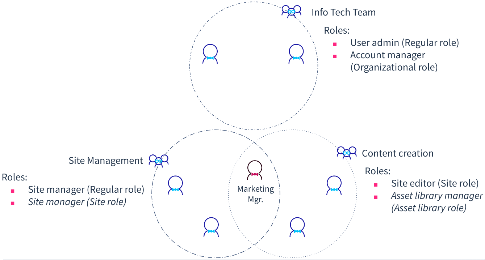
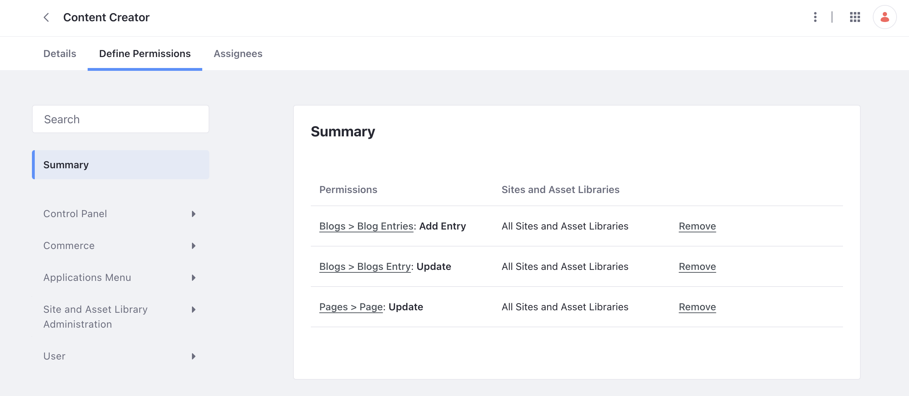
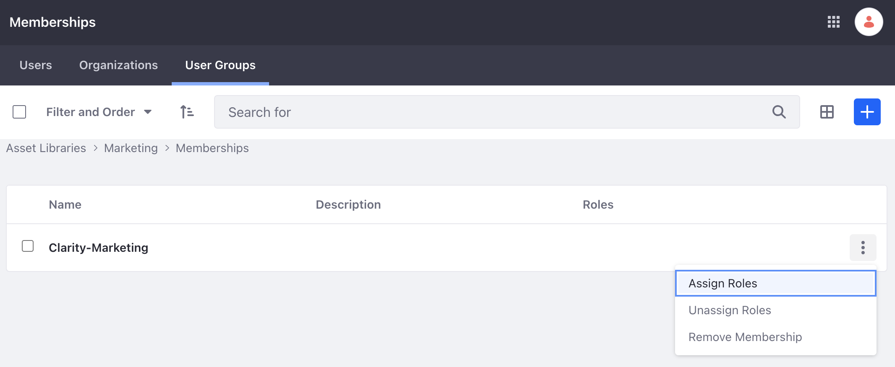

# Managing and Organizing Clarity Users

Clarity team members were provisioned through Okta and have already logged into Liferay, but their roles and permissions have not been set yet. Liferay's out-of-the-box features are designed to help manage and grant permissions to these users based on their company role and responsibilities on the new site.

The primary concern in user management is managing user access to content and platform features. Common use cases includes giving privileges to access parts of the platform or specific resources, as well as restricting user access from unauthorized resources or actions. Basically, when user management is done right, everyone is granted access only to the resources and functionalities necessary for their roles.

At Clarity, each person has different responsibilities in developing the new enterprise website. Let's take a closer look at the different types of users involved, their roles, the groups they belong to, and the responsibilities they have for the site.

| Name | Role | User Group | Responsibility|
|:--- |:--- |:--- |:--- |
| Ian Miller | IT Manager | Clarity-IT | Ensures efficient operation of IT infrastructure by aligning technology strategy with organizational objectives. |
| Jane Newton | Marketing Content Manager | Clarity-Marketing | Creates and implements content strategies to attract and engage visitors, driving brand awareness and conversions. |

## Defining Roles and Permissions

Permissions are individual checks that determine whether a user can access a specific resource or perform a certain activity. For example, creating or editing a blog post. In Liferay, permissions are assigned to roles, as opposed to being assigned to individuals. Roles then serve as a collection of permissions. Using roles promotes reuse within the permissions structures and discourages directly assigning permissions to individual users.

Liferay provides [out-of-the-box roles](https://learn.liferay.com/en/w/dxp/users-and-permissions/roles-and-permissions/understanding-roles-and-permissions). Custom roles can also be created with your choice of permissions to fit your business. Then, these roles can then be assigned to Liferay users.

The different default roles also fall under different scoping. Sometimes, you don’t want a certain permission to carry across a whole Liferay instance or even across a whole site. For example, you may want to assign the role of site administrator to two different people; a different administrator per site. Use scoped roles to limit what users can and cannot access. 

| Role type | Scope |
|:--- |:--- |
| Regular Role | This is the most extensive permission scope, and it spans across the whole portal. |
| Site Role | Permissions that are scoped to a particular site. |
| Organization Role | Permissions that are scoped to particular users of an organization. |
| Asset Library Role | Permissions attached specifically to shared resources, particularly related to asset libraries and asset management. |
| Account Role | Permissions that are given to users who are a part of an account. |

## Structuring Your Organization through User Groups

!!! important **Key Decision**
    Deciding how to group and assign permissions to users is a key decision point as you build out your enterprise website. Using Liferay's user groups feature to model your organization’s structure and responsibilities on the new site is the recommended approach in this situation.

To increase efficiency, roles can also be assigned to entire user groups. The purpose behind this is to promote reuse and simplify the user management experience. 

Let’s take a look at how we could create user groups, roles and permissions for Jane Newton to be able to access and edit relevant content for marketing. 

!!! note
    The following exercises assume that you already have the Clarity site up and running and have the sample Clarity users, roles, etc.

### Exercise 1 - Assigning the Permissions and Roles for the Marketing User Group

1. Let's impersonate Jane Newton to see what the application looks like from her point of view. 
   1. Navigate to _Control Panel_ &rarr; _Users and Organizations_. 
   1. Click on the options icon next to Jane Newton and click _Impersonate User_. Notice how she does not have access to any of the resources she needs (e.g. site menu, asset library, etc.).

1. Verify the permissions for the Clarity content manager role.

    

    1. Navigate to _Control Panel_ &rarr; _Roles_. Click on the Clarity content manager role.
    1. Click on the _Define Permissions_ tab. Notice how the content manager role has permissions around asset libraries and site pages. This is because the content managers need access to asset libraries and pages. Permissions can be added or removed from this definitions page. For example, permissions for blogs might also be added for the role.

1. Now that the permissions for the role have been verified, let's assign a user group to the role. Note that Liferay roles can also be assigned to individual users, but assigning it to user groups promotes reusability and ease of future maintenance as discussed above. 

    

    1. Still within the edit page for the Clarity content manager role, click on the _Assignees_ tab. 
    1. Click the _User Groups_ tab. 
    1. Click the add button and assign the Clarity marketing user group to role. 

1. Let's make sure that Jane Newton is part of the clarity marketing user group. 
    1. Navigate to _Control Panel_ &rarr; _User Groups_.
    1. Click the options icon next to the Clarity marketing user group and click _Assign Members_. 
    1. Click the add button and assign Jane Newton to the user group.

1. Content managers also need access to Clarity's marketing asset library, so let's check that as well. Verify the permissions for the Clarity asset library manager role.
    1. Navigate to _Control Panel_ &rarr; _Roles_. 
    1. Click on the asset library roles tab. 
    1. Click on the Clarity asset library manager role. 
    1. Click on the _Define Permissions_ tab. Notice how the role has permissions around asset libraries as well as documents and media. Permissions can be added or removed from this definitions page.

1. Let's associate the correct asset library to this asset library role. 
    1. Navigate to _Applications_ &rarr; _Asset Libraries_ and click on the marketing asset library. 
    1. Scroll down and click _Memberships_. 
    1. Click the user groups tab and click the add icon. 
    1. Assign the Clarity marketing user group to the membership. 

        

    1. Then, click on the options icon of the Clarity marketing user group and click assign roles. Assign the Clarity asset library manager role.

1. Let's impersonate Jane Newton again to verify what she can access. 
    1. Navigate to _Control Panel_ &rarr; _Users and Organizations_. 
    1. Click on the options icon next to Jane Newton and click _Impersonate User_. 
    1. Notice that she now has access to the product menu to add and edit site pages. She also has access to the asset library under the applications menu.

Well done! Now everyone in the Clarity marketing user group has the correct permissions on the platform.

To learn more about user management in general, see our [documentation](https://learn.liferay.com/w/dxp/users-and-permissions).

## Organizations

Clarity relies on user groups and roles for a significant portion of their user and permission management. However, Liferay offers Organizations as an additional user management tool.

Organizations can be used to model the hierarchy of a company. It is also an important part of managing groups of accounts. In the next article, you'll be adding Lily Lewis, an account manager that oversees the Opportune Optics organization.

As their business grows and site requirements evolve, Clarity can consider leveraging Liferay organizations in the future.

Learn more about Liferay organizations [here](https://learn.liferay.com/w/dxp/users-and-permissions/organizations/understanding-organizations).

Next Up: [Modeling B2B Relationships with Liferay Accounts](./modeling-b2b-relationships-with-liferay-accounts.md)
