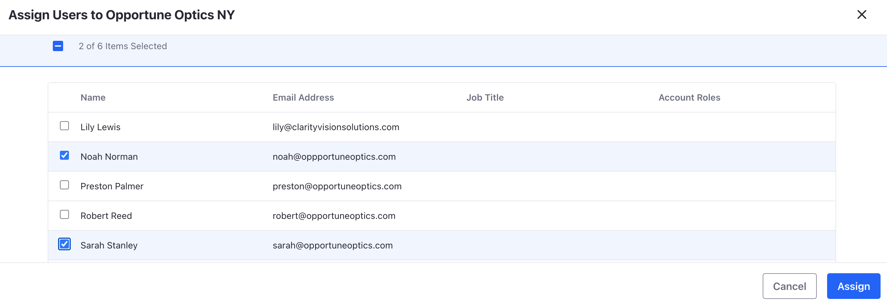
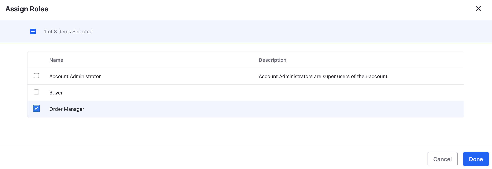
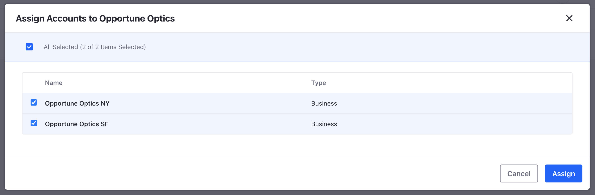
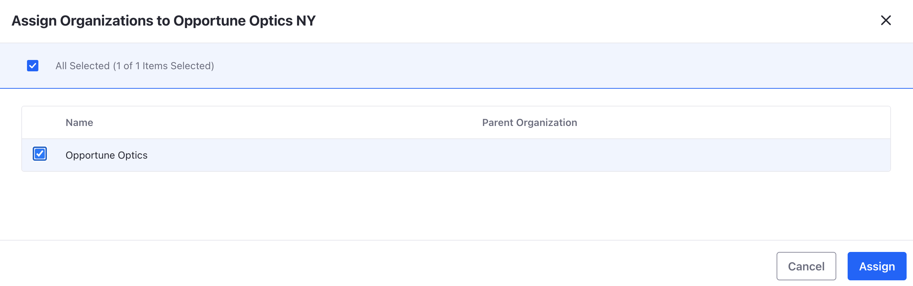

# Modeling B2B Relationships with Liferay Accounts

We've set up Clarity's internal users with the right roles and permissions. We now turn our attention to Clarity's business to business (B2B) customers. The Liferay accounts framework can be used to manage external parties. For example, Liferay accounts can model a business to consumer (B2C) context in which a customer is a single user. Accounts can also model a B2B context where a customer represents an external company with multiple users.

Accounts enable increased organizational structure and customized user experiences primarily around commerce or business needs. Its approach is different from user management, because customers or vendors don’t need to interact with the site the same way employees need to. Customers and vendors don’t need to create or manage content on Liferay, but they do need to be able to place an order and track the order status. In our example, Clarity has a B2B partner called Opportune Optics that has stores across the country. See a summary in the table below of different users:

| Name | Account | Account Group | Role | Organization |
|:--- |:--- |:--- |:--- |:--- |
| Noah Norman | Opportune Optics NY | Opportune Optics | Order Manager | Opportune Optics |
| Sarah Stanley | Opportune Optics NY | Opportune Optics | Buyer | Opportune Optics |
| Preston Palmer | Opportune Optics SF | Opportune Optics | Order Manager | Opportune Optics |
| Robert Reed | Opportune Optics SF | Opportune Optics | Buyer | Opportune Optics |
| Lily Lewis | N/A | Opportune Optics | Account Manager | Opportune Optics |

For our next exercise we will create accounts for Opportune Optics and associate users with the accounts.

!!! note
    These users are already created with the Clarity sample site. If you do not have the Clarity sample site, create these users from within the Liferay UI.

## Exercise 1 - Creating Accounts and Account Users

### Creating Opportune Optics NY Account

1. Navigate to _Control Panel_ &rarr; _Accounts_. Click the add icon to add a new account.

1. Input `Opportune Optics NY` as the account name. Select `Business` as the account type. Click _Save_.

1. Click the _Users_ tab and click the add icon to add new users. Click _Assign Users_ and select Noah Norman and Sarah Stanley from the list of users. Click _Assign_.

   

1. Noah and Sarah should now appear under the list of users associated with the account. Click the options icon next to Noah Norman and click _Assign Roles_. Select _Order Manager_ and click _Done_. In the same way, assign the _Buyer_ role to Sarah. These default account roles come with different permissions in which the buyer can view and add items to an accounts cart, while the order manager can view and approve an order.

   

### Creating Opportune Optics SF Account

1. Navigate back to the accounts page. Click the add icon and create a new account for `Opportune Optics SF`.

1. Assign Preston Palmer and Robert Reed to the account. Then, assign the order manager role to Preston and the buyer role to Robert.

### Creating an Opportune Optics Account Group

Use account groups to keep accounts organized. For example, since Opportune Optics has different stores, group them together under one account group. Account groups gives the possibility of customizing price lists, offering discounts, and changing product visibility for the accounts in the group. This is great for Clarity's account management because of the special pricing agreements they have with Opportune Optics.

1. Navigate to _Control Panel_ &rarr; _Account Groups_. Click the add icon to create a new account group.

1. Input `Opportune Optics` as the account group name. Click _Save_.

1. Click on the _Accounts_ tab. Click the add icon to assign accounts.

1. In the pop up window, select `Opportune Optics NY` and `Opportune Optics SF` and click _Assign_.

   

### Associating an Organization

As Opportune Optics represents a large number of accounts, it makes sense for Clarity to assign a dedicated B2B account manager to all the accounts. The account manager role has permissions such as adding items to an account's shopping cart or submitting an order on behalf of an account. The role is available through Liferay organizations. This again is a time-saver for Clarity as it means the account manager can help Opportune Optics with order management and fulfillment.

1. Navigate to _Control Panel_ &rarr; _Accounts_. Click on _Opportune Optics NY_ and click the _Organizations_ tab. Click the add icon.

1. Assign the account to the _Opportune Optics_ organization.

   

   !!! note
       This organization was already created with the sample Clarity site. If you do not have this organization, create it from within the Liferay UI.

1. In the same way, assign _Opportune Optics SF_ to the _Opportune Optics_ organization.

1. Next, navigate to _Control Panel_ &rarr; _Users and Organizations_. Click on _Lily Lewis_ and click on _Organizations_.

1. Click _Select_ and select the _Opportune Optics_ organization. Click _Add_.

1. Finally, click on _Roles_. Click _Select_ next to organization roles. Click _Choose_ next to account manager. Scroll to the bottom and click _Save_. Lily is now the account manager for the Opportune Optics organization. She has the permissions now to view and submit orders for Opportune Optics.

To learn more about Liferay accounts and modeling B2B relationships, see our official documentation about [accounts](https://learn.liferay.com/w/dxp/users-and-permissions/accounts).

Congratulations! You've completed Module 5 - Users and Permissions.

Back to [Building Enterprise Websites with Liferay](../../building-enterprise-websites-with-liferay.md)
