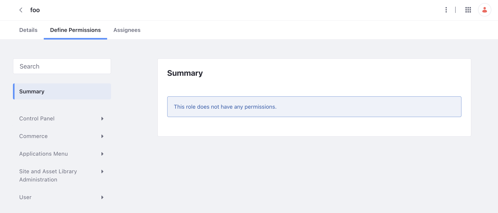

# Setting Permissions and Roles

Now that you have different [users, organizations, and user groups](./understanding-users-organizations-and-user-groups.md), it is time to set appropriate permissions for your different team members. In Liferay, permissions are assigned to roles (as opposed to being assigned to individual users). Therefore, Clarity needs to assign roles to its users to have their team members have the proper permissions.

## Understanding Liferay Roles

Roles in Liferay fall under five categories: regular roles, site roles, organization roles, asset library roles, and account roles. The regular `administrator` role has the highest permissions, and is able to do a anything within Liferay. The other roles have lower permissions and less access to do things within Liferay. See the [default roles reference](https://learn.liferay.com/w/dxp/users-and-permissions/roles-and-permissions/default-roles-reference) to see a description of the different roles available.

Custom roles can also be created to meet your business needs. To create a role, navigate to _Control Panel_ &rarr; _Roles_. Click the add button to create a new role. After creating a new role, click the _Define Permissions_ tab to set the different permissions the role will have.

The permissions fall under different categories:

* __Control Panel__ - The different areas of the control panel the role has access to and what they can modify (i.e. changing configuration settings)
* __Commerce__ - The different areas of commerce the role has access to (e.g. managing products)
* __Applications Menu__ - The different areas of the application menu the role has access to (e.g. access to workflow)
* __Site and Asset Library Administration__ - The various tools in Liferay related to assets and site building the role has access to
* __User__ - The various tools related to managing users the role has access to

See [creating and managing roles](https://learn.liferay.com/w/dxp/users-and-permissions/roles-and-permissions/creating-and-managing-roles) to learn more.

## Assigning Permissions through Roles

As mentioned above, permissions follow roles. Therefore, to set permissions for users, they must be assigned specific roles. If Clarity wants to limit what their team members can or cannot access in Liferay, their users must be assigned specific roles. To assign a role,

1. Navigate to _Control Panel_ &rarr; _Users & Organizations_.

1. Click on the user you want to assign a role to.

1. In the left navigation, click on _Roles_.

   

   Add the role you wish to assign to the user and save your changes.
 
 !!! note
   To assign a user to an organization role, they must first be added to the organization. See [assigning users to organization roles](https://learn.liferay.com/w/dxp/users-and-permissions/roles-and-permissions/assigning-users-to-roles#organization-roles). To assign a user to a site role, they must first be a member of the site. See [assigning users to site roles](https://learn.liferay.com/w/dxp/users-and-permissions/roles-and-permissions/assigning-users-to-roles#site-roles). [Account roles](https://learn.liferay.com/w/dxp/users-and-permissions/accounts/account-roles) are assigned from within editing an account and not from within editing a user.

Next: [Working with Accounts](./working-with-accounts.md)
