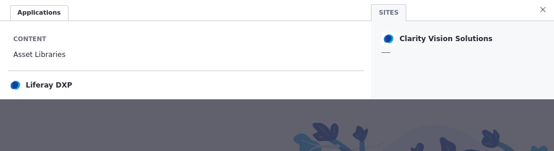
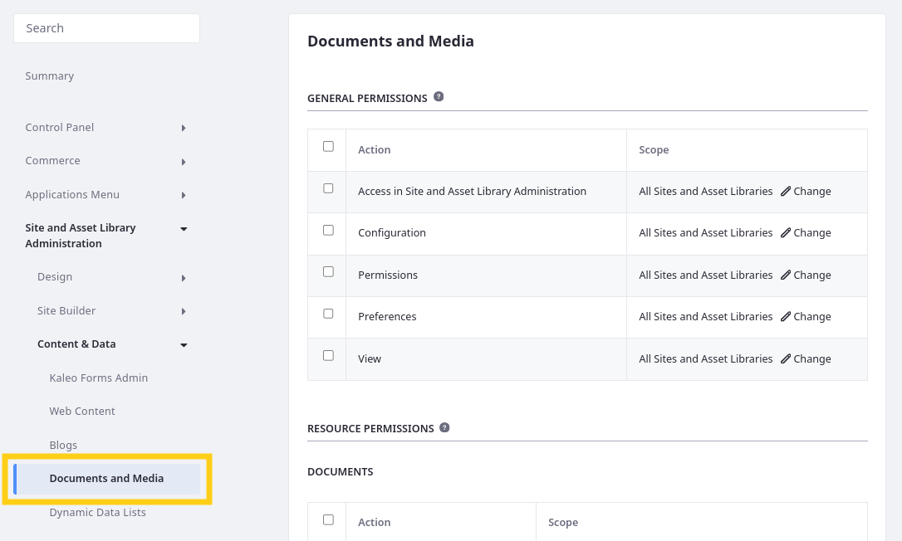

# Setting Permissions and Securing Clarity Content

At Clarity, each user has different responsibilities in developing the enterprise website. The primary concern of user management is controlling access to content and platform features. When done right, users are granted access only to the resources and applications necessary for their responsibilities. So far, Clarity's team members have been created, but their roles and permissions need to be set.

In Liferay, permissions are assigned to roles instead of individuals. Each permission grants the ability to perform a specific action and falls into one of two categories: application permissions or resource permissions. Application permissions pertain to different parts of Liferay's UI (e.g. visibility to certain sections of the applications menu or control panel). <!--Alt: "Application permissions grant access to an application itself and do not include resource-related permissions."--> On the other hand, resource permissions pertain to the data itself (e.g. read or write privileges for Liferay blogs). <!--Alt: "Resource permissions grant access to view, create, and act on application data. Some of these permissions relate to creating data entries, while others are for performing actions on existing data entries."-->

Liferay uses an additive permissions model. This means users only inherit permissions explicitly assigned to their role, helping ensure that content stays secure and access is granted only to those who need it.

## Exercise One: Defining Role Permissions

<!-- Exercise 3d: Defining Role Permissions -->

Let's set specific permissions for the Marketing Coordinator role created in the previous lesson.

Throughout this process, we'll impersonate Christian Carter to see the practical effect of granting the Marketing Coordinator role additional permissions.

To do this,

1. Open the *Global Menu* (), go to the *Control Panel* tab, and click *Users and Organizations*.

1. Click *Actions* () for Christian Carter and select *Impersonate User*.

   

   This opens a new tab where you can view the Liferay instance using Christian Carter's permissions.

   Notice how he doesn't have access to any of the applications or resources he needs as a marketing coordinator.

   

   Clarity needs all Marketing Coordinators to have access to assets in the team's asset library.

1. Return to the Clarity Admin tab, go to the *Roles* application and click the *Marketing Coordinator* role to begin editing as the Clarity Admin user.

1. Go to the *Define Permissions* tab.

1. In the left menu, go to *Applications Menu* &rarr; *Content* &rarr; *Asset Libraries*.

   **Tip**: Enter "Asset Libraries" into the search bar to quickly locate this section.

   

1. Select these permissions:

   | Section                                    | Permission                                      |
   |:-------------------------------------------|:------------------------------------------------|
   | Application Permissions                    | Access in Control Panel                         |
   | Application Permissions                    | View                                            |
   | Resource Permissions > Asset Library Entry | View Site and Asset Library Administration Menu |

1. Click *Save*.

   This updates the Marketing Coordinator role's permissions.

   **Note**: Liferay automatically assigns the `Portal: View Control Panel Menu` permission when you grant the `Access in Control Panel` permission.

1. Refresh the tab where you're impersonating Christian Carter.

   Notice that he can now access the Asset Libraries application in the Global Menu.

   

   Marketing Coordinators also need to access files in the Documents and Media application.

1. Return to the Clarity Admin tab.

1. In the left menu, go to *Site and Asset Library Administration* &rarr; *Content & Data* &rarr; *Documents and Media*.

   **Note**: If you search "Documents and Media" two options appear with the same name. Select the option under Content & Data.

   

1. Select these permissions:

   | Section                                 | Permission                                      |
   |:----------------------------------------|:------------------------------------------------|
   | General Permissions                     | Access in Site and Asset Library Administration |
   | General Permissions                     | View                                            |
   | Resource Permissions > Documents        | View                                            |
   | Resource Permissions > Documents Folder | View                                            |

1. Click *Save*.

1. Refresh the tab where you're impersonating Christian Carter.

   Notice that he can now access the Documents and Media application in the Site Menu.

   

   Marketing Coordinators also need the ability to update pages.

1. Return to the Clarity Admin tab.

1. In the left menu, go to *Site and Asset Library Administration* &rarr; *Site Builder* &rarr; *Pages*.

   

1. Select this permission.

   | Section                     | Permission |
   |:----------------------------|:-----------|
   | Resource Permissions > Page | Update     |

1. Click *Save*.

1. Refresh the tab where you're impersonating Christian Carter.

   Notice that he can now access edit tools for site pages.

   

Well done! Now all members of the Marketing user group have the correct base permissions. Clarity can assign additional roles to individual users or user groups to grant the ability to access more data or perform other actions.

## Exercise Two: Fine Tuning Manager Permissions (Bonus)

<!-- Exercise 3e: Fine Tuning Manager Permissions (Bonus) -->

So far you've been using the Clarity Admin user to make changes. This user is the omni-administrator and has all Liferay permissions. In real world scenarios, companies should strictly guard access to this user and greatly restrict which users have full admin privileges. Companies like Clarity should set up manager roles that only have the permissions necessary for their responsibilities.

Here you'll set up a management group that has authority to configure permissions for their team members, without granting them full admin privileges as Clarity Admin.

To do this,

1. Go to the *User Groups* application in the Global Menu.

1. Create a `Marketing Managers` user group.

1. Add Clara Murphy to the group.

1. Go to the *Roles* application in the Global Menu.

1. Create a `Marketing Manager` role.

1. While editing the *Marketing Manager* role, go to the *Define Permissions* tab.

1. In the left menu, go to *Control Panel* &rarr; *Users* &rarr; *User Groups*.

1. Select this permission:

   | Section                 | Permission              |
   |:------------------------|:------------------------|
   | Application Permissions | Access in Control Panel |

1. Click *Save*.

1. In the left menu, go to *Control Panel* &rarr; *Users* &rarr; *Users and Organizations*.

1. Select this permission:

   | Section         | Permission |
   |:----------------|:-----------|
   | Resource > User | View       |

1. Click *Save*.

1. Go to the *Assignees* tab and assign this role to the *Marketing Managers* user group.

   These permissions grant the ability to view the User Groups application and view users. Next, you'll give the Marketing Manager role permission to view and add members for the Marketing user group.

1. Go to the *User Groups* application in the Global Menu.

1. Click *Actions* () for Marketing and select *Permissions*.

1. For the Marketing Manager role, select these permissions and click *Save*:

   | Permission     |
   |:---------------|
   | Assign Members |
   | View Members   |
   | View           |

   

1. Go to the *Users and Organizations* application in the Global Menu.

1. Impersonate Clara Murphy to verify the Marketing Manager role permissions.

   Clara should see the Marketing user group. She should also be able to view members of the user group and add new members to the group.

   

   **Note**: This is just an example of the types of permissions you can assign to manager roles.

## Conclusion

Congratulations! You've completed Module 5: Users and Permissions. Throughout this module, you learned the essentials for Liferay user management, including roles, permissions, and user groups.

Now you can move on to the next module where you'll start building Clarity's enterprise website.

Next Up: [Module 6: Site Building](../module-6-site-building.md)
