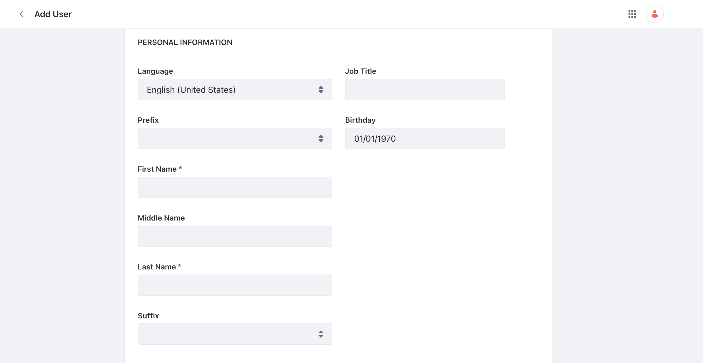

# Understanding Users, Organizations and User Groups

As visitors come to your Liferay site, they have access to any public facing content you have. For example, a visitor who comes to Clarity's website can view various pages without logging in. However, other parts of your site may require access as a logged in user. For example, Clarity's employees or Clarity's B2B customers would need login privileges to access parts of Liferay that are not public facing.

In Liferay, a user is someone who can log in and interact with content on the platform. Liferay has different tools to help you manage your users and organize them. Put users into organizations and user groups. Use roles and permissions to delegate administrative responsibility and organize users in the way that reflects your company.

<!-- ## Importing Users through Client Extension

We'll have here the steps to download, unzip and deploy the client extension. -->

## Adding and Managing Users

Liferay offers different ways to add and manage users. [Add and manage users](https://learn.liferay.com/w/dxp/users-and-permissions/users/adding-and-managing-users) right from Liferay's UI. Add and mange users with Liferay's [headless APIs](https://learn.liferay.com/w/dxp/users-and-permissions/developer-guide/user-account-api-basics). Or import users from a [user directory](https://learn.liferay.com/w/dxp/users-and-permissions/connecting-to-a-user-directory) that you manage separately. 

To create a user from the UI,

1. Navigate to _Control Panel_ &rarr; _Users and Organizations_. Click the add button to add a new user.

   

1. Input the details of the user. For example, create a user account for Walter Douglas, one of Clarity's web developers:

   * Screen Name: `walter`
   * Email Address: `walter@clarityvisionsolutions.com`
   * First Name: `Walter`
   * Last Name: `Douglas`
   * Job Title: `Web Developer`

   Click _Save_. If your [mail server is configured](https://learn.liferay.com/w/dxp/installation-and-upgrades/setting-up-liferay/configuring-mail), the user will receive a welcome email to log in to Liferay. Alternatively, you can set a temporary password and share the login with them.

   See our documentation on [adding and managing Users](https://learn.liferay.com/en/w/dxp/users-and-permissions/users/adding-and-managing-users) to learn more. 

In reality, since Clarity chose to use Okta, once their provisioned team members login with SSO, their user account will automatically be created in Liferay.

## Organizations

Use Liferay's organizations tool to model your company's hierarchy. As users are assigned to different organizations they receive different permissions and access. For example, an organization administrator has the permissions to manage users within an organization but does not have the permissions to make changes to users outside of the organization. 

[Add and manage organizations](https://learn.liferay.com/w/dxp/users-and-permissions/organizations/creating-and-managing-organizations) from the UI, or [headless APIs](https://learn.liferay.com/w/dxp/users-and-permissions/developer-guide/organizations-api-basics) or through your [user directory](https://learn.liferay.com/w/dxp/users-and-permissions/connecting-to-a-user-directory/connecting-to-an-ldap-directory). 

<!-- We could add a screenshot of the organization tab (Global Menu > Control Panel > Users and Organizations > Organizations tab), showing all three organizations that the user deployed using client extensions -->

Create a sample organization and add Walter to it.

1. Navigate to _Control Panel_ &rarr; _Users and Organizations_.

1. Click on the _Organizations_ tab and click the add button.

1. Input `IT Department` as the organization name and click _Save_.

1. Navigate out to the list of users. Click on *Walter Douglas*. Click *Organizations* in the left navigation.

1. Click *Select* and a new window pops up. Click on the checkbox for `IT department`. Click *Add*. Walter is now part of the IT department organization.

See our documentation about [organizations](https://learn.liferay.com/web/guest/w/dxp/users-and-permissions/organizations) to learn more.

## User Groups

A user group is a collection of users created for a specific purpose. User groups can cut across the hierarchical boundaries of organizations. For example, if Clarity's marketing department wanted to collaborate with a few of their B2B customers on an affiliate site, a user group could be used to grant access and permission to a common site.

To create a user group, 

1. Navigate to _Control Panel_ &rarr; _Users Groups_. Click the add button.

1. Input a name for the new user group and click _Save_.

1. Click on the user group you just created. Click the add icon to add users to the user group. The users are added to the user group.

Note, user groups can be created and managed from the Liferay UI, or they can also be created and managed with [headless APIs](https://learn.liferay.com/w/dxp/users-and-permissions/developer-guide/user-groups-api-basics).

See our documentation on [user groups](https://learn.liferay.com/web/guest/w/dxp/users-and-permissions/user-groups) to learn more.

Next: [Setting Permissions and Roles](./setting-permissions-and-roles.md)
