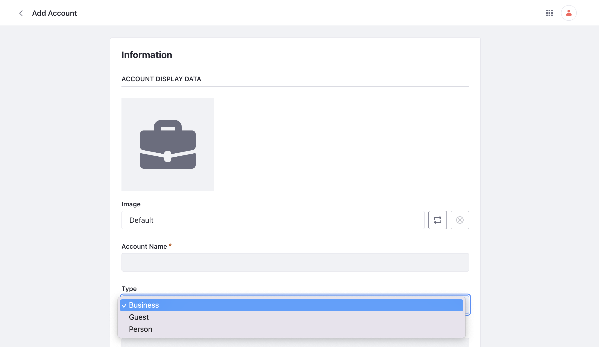

# Working with Accounts

Accounts in Liferay can represent individual customers in a business to consumer (B2C) context. Or they can represent a business to business (B2B) context. As a B2B manufacturer, Clarity sells to various businesses and retailers. See how Liferay accounts and its various features can help Clarity work efficiently with their various B2B customers.

## Creating Accounts

To create an account or manage existing accounts, navigate to _Control Panel_ &rarr; _Accounts_. The new page will show a list of all existing accounts. Click the add icon to create a new account.

Select the type of account you wish to create. For example, select `business` type for a B2B type account. Select `Person` for a B2C type account. `guest` type accounts are also available if you need an unregistered user to interact with your site.

## Managing Accounts

