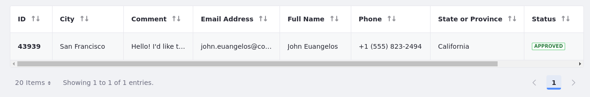

# Building Forms with Objects
<!--TASK: Consider naming article 'Building Business Forms'-->

Most digital experience solutions require the development of custom business functions that drive user interaction and engagement. Clarity wants a very common example of this type of business function: a Contact Us form that will collect data from site visitors and make that data available to the appropriate internal users. Traditionally, even a straightforward process like this requires a significant time investment from a development team to produce and iterate on code that will be expensive to maintain. To avoid the pain points of traditional development, Clarity wants to leverage Liferay Objects and fragments to build a Contact Us form without touching a single line of code.

<!--TASK: Reframe intro to focus on forms as a type of content, not as a developer activity. Forms are a type of content that gathers valuable information, enables interactions, and fosters engagement. In Liferay, you can build forms using Liferay objects and page fragments.-->

## Objects

With Liferay Objects, you can define the schema of your data models with specific attributes, create relationships between objects, and implement logic to determine how objects should behave. You can use objects to iterate rapidly without the need to write or deploy code, which translates directly to increased business agility. Liferay comes with a centralized interface to define, manage, and store application data from custom structures, so that you can provide end users with tailored, streamlined experiences.

One of the true strengths of objects is their integration with Liferay's core frameworks and functionalities, such as permissions, security, workflows, and more. This creates a cohesive user experience where your custom-built solutions feel and act like native parts of the Liferay platform.  Not only does this let you achieve faster time to value, but it also means that any Liferay practitioner can maintain your solution, eliminating the need for technical developer resources.

<!--TASK: Reframe above Objects overview to focus on Objects as a way to build business forms (whether simple or complex)-->

<!--TASK: Add H2 on form fragments.-->

## Exercise: Creating an Object Definition
<!--Exercise 19a-->

Clarity wants to create a user-friendly contact form to streamline communication with non-employee users. Liferay Objects provides the tools to build and seamlessly integrate this form with their Contact Us page.

<!-- TASK: This exercise is using Clarity Admin due to Walter Douglas missing permissions in the baseline. Clarity Admin will be replaced by Walter Douglas after it's fixed. -->

Here you'll create the `Contact Us` object and configure its fields for storing relevant information as the Clarity Admin user.

To do this,

1. Sign in as the Clarity Admin user.

   * Username: `admin@clarityvisionsolutions.com`
   * Password: `learn`

1. Open the *Global Menu* (), go to the *Control Panel* tab, and click *Objects*.

1. Click *Add* ().

1. Enter these details:

   | Field        | Value      |
   |:-------------|:-----------|
   | Label        | Contact Us |
   | Plural Label | Contact Us |
   | Object Name  | ContactUs  |

1. Click *Save*.

   This creates a draft object definition with some default system fields. You can now configure the definition to determine how its data is stored and which features you want to enable.

1. From the Objects overview page, begin editing the *Contact Us* object definition.

1. In the Details tab, configure these settings:

   | Field                                                   | Value          |
   |:--------------------------------------------------------|:---------------|
   | Scope > Scope                                           | Site           |
   | Scope > Panel Link                                      | Content & Data |
   | Configuration > Show Widget in Page Builder             | False          |
   | Configuration > Enable Entry History in Audit Framework | True           |

1. Click *Save*.

   Now that you’ve configured the object definition, you can add custom fields to determine the type of information you want to gather with the form.

1. Go to the *Fields* tab.

1. Click *Add* (), enter these details, and click *Save*:

   | Field                     | Value      |
   |:--------------------------|:-----------|
   | Label                     | Full Name  |
   | Field Name                | `fullName` |
   | Type                      | Text       |
   | Mandatory                 | Yes        |
   | Accept Unique Values Only | No         |

1. Repeat the previous step to create the remaining fields:

   | Label             | Field Name        | Type      | Mandatory | Unique Values Only |
   |:------------------|:------------------|:----------|:----------|:-------------------|
   | Email Address     | `emailAddress`    | Text      | Yes       | No                 |
   | Phone             | `phone`           | Text      | Yes       | No                 |
   | State or Province | `stateOrProvince` | Text      | No        | No                 |
   | City              | `city`            | Text      | No        | No                 |
   | Comment           | `comment`         | Long Text | No        | N/A                |

1. Return to the *Details* tab and click *Publish*.

   This creates the database tables for storing form submissions.

Next, you'll add the form to Clarity's Contact Us page.

## Exercise: Building the Form
<!--Exercise 19b-->

<!-- TASK: This exercise is using Clarity Admin due to Walter Douglas missing permissions in the baseline. Clarity Admin will be replaced by Walter Douglas after it's fixed. -->

Liferay Objects generates a basic user interface automatically, but you can design and add forms to Clarity’s pages.

Previously, you added and wireframed the Contact Us page. Here you’ll add the form to the page as the Clarity Admin user.

To do this,

1. Go to Clarity’s public enterprise website and begin editing the *Contact Us* page.

1. Drag and drop a *form container* fragment into the Contact Form container.

1. Click the drop-down menu and select the *Contact Us* object.

   This populates the form with fields from the object automatically.

1. Select the form container and configure these settings:

   | Tab             | Setting       | Value                |
   |:----------------|:--------------|:---------------------|
   | General > Frame | Width         | 400px                |
   | Styles          | Padding       | Spacer 4 (all sides) |
   | Styles          | Background    | #FFFFFF              |
   | Styles          | Border Radius | 15px                 |

1. Drag and drop the field fragments into this order:

   * Full Name
   * Email Address
   * Phone
   * State or Province
   * City
   * Comment

1. Select each of these field fragments and configure this setting:

   | Tab    | Setting | Value             |
   |:-------|:--------|:------------------|
   | Styles | Padding | Spacer 3 (bottom) |

1. Click *Publish*.

   

1. Test the form by submitting an entry.

1. Go to *Site Menu* (), expand *Content & Data*, and click *Contact Us*. The entry you created should appear here.

   

Great! You've fully set up the Contact Us page and made it available for Clarity's users.

Next, you can learn how to create a multi-step form or move on to the next lesson to learn about Liferay's capabilities for analytics and personalized user experiences.

## Exercise: Creating a Multi-Step Form (Bonus)
<!--Exercise 19c-->

<!-- TASK: This exercise is using Clarity Admin due to Walter Douglas missing permissions in the baseline. Clarity Admin will be replaced by Walter Douglas after it's fixed. -->

Using objects, form fragments, and display page templates, you can develop multi-step forms to enable users to fill a form in different display pages, which are connected to the same object entry.

Here you'll create a display page for the second step and link the Contact Us form container to it as the Clarity Admin user.

To do this,

1. Open the *Global Menu* (), go to the *Control Panel* tab, and click *Objects*.

1. Begin editing the *Contact Us* object definition.

1. In the Details tab, configure this setting:

   | Field                                                | Value |
   |:-----------------------------------------------------|:------|
   | Configuration > Allow Users to Save Entries as Draft | True  |

   **Note**: When creating a multi-step form using objects, you must enable draft mode for the object definition.

1. Click *Save*.

1. Open the *Site Menu* (), expand *Design*, and click *Page Templates*.

1. Go to the *Display Page Templates* tab and click *New*.

1. Select the *Primary Master Page* template.

1. Enter `Contact Us - Step 2` for the name and select *Contact Us* for content type.

1. Click *Save*.

1. Drag and drop the *Contact Us Page* fragment composition into the template.

1. Repeat steps 2-5 from Exercise 19b to create the form.

1. Select the form container and configure these settings:

   | Tab     | Setting                                  | Value      |
   |:--------|:-----------------------------------------|:-----------|
   | General | Success Interaction                      | Go to Page |
   | General | Page                                     | Home       |
   | General | Show Notification when Form is Submitted | Yes        |

   

1. Click *Publish*.

1. Return to the *Contact Us* page and begin editing it.

1. Select the form container and configure these settings:

   | Tab     | Setting             | Value                    |
   |:--------|:--------------------|:-------------------------|
   | General | Success Interaction | Go to Entry Display Page |
   | General | Display Page        | Contact Us - Step 2      |

1. Remove these fields from the container:

   * State or Province
   * City
   * Comment

1. Select the *Submit Button* fragment and configure this setting:

   | Tab     | Setting                | Value |
   |:--------|:-----------------------|:------|
   | General | Submitted Entry Status | Draft |

   **Note**: Now when users click this button, Liferay saves their entry as a draft and directs them to the next step to complete the form.

1. Double-click the *Submit Button* fragment to edit its text and enter `Next`.

1. Click *Publish*.

   

1. Test out the form.

Great! You've created a multi-step form using objects, form fragments, and display page templates.

## Conclusion

Congratulations! You've completed *Module 6: Content Authoring and Management*. Throughout this module, you've learned best practices for creating, storing, organizing, and displaying content in Liferay DXP. You also learned about setting up publishing workflows for facilitating and streamlining content collaboration.

In the next module, you'll learn about using Liferay analytics and personalization features to create and improve user experiences.

[Module 7: Analytics and Personalization](../module-7-analytics-and-personalization.md)

## Additional Resources

See our documentation to learn more about Liferay Objects:

* [Objects](https://learn.liferay.com/w/dxp/liferay-development/objects)
* [Using Fragments to Build Forms](https://learn.liferay.com/w/dxp/liferay-development/objects/using-fragments-to-build-forms)
