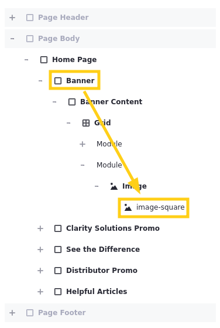

# Creating and Mapping Clarity's Content

*Content Management* is a broad term that can apply to a range of feature sets in the data lifecycle. We're going to focus specifically on Liferay's Web Content application, a tool for creating and managing content. With it, users can define structures for different types of content and then design templates for rendering them in site pages. You can also render content items by mapping their fields directly to page fragments. 

!!! note
    While Liferay provides other applications for creating content, you can address most use cases for an enterprise website with the Web Content application.

Clarity can use Web Content for the flexibility of implementing custom structures and the efficiency of rendering content with fragments and templates. With Web Content, Clarity can rapidly produce dynamic, versatile assets without limiting the creativity of their writers and editors.

## Web Content Structures

Web content structures define generic content types. Each structure determines the fields available to creators when creating content items (e.g., title, body, image). Liferay includes a Basic Web Content structure out of the box, but you can create your own.

Clarity Vision Solutions needs these types of web content for their enterprise website:

* Announcement
* Blog Post
* FAQ
* Helpful Article
* Job Listing
* Leadership Profile
* Legal Article

Using these custom structures, Clarity can enforce a consistent format for content across their site, reducing effort for writers, editors, and designers alike.

## Web Content Templates

Once you've defined a structure, you can create a template for it. Web content templates use FreeMarker (FTL) to determine how specific types of content items render in site pages. This means different types of web content can have different visual presentations, providing designers with an extra layer of configuration and customization.

!!! caution
   While FreeMarker is a powerful tool in the right hands, it can produce unexpected behavior if you aren't sure how to use it. Stick to rendering web content with fragments whenever possible, and if you must use FreeMarker, avoid adding your own logic.

<!--TASK: Add a section or note that compares when to use web content vs. manually entering inline fragment text-->

<!--TASK: Add section on AI, or relocate exercise to separate article on AI (I recommended the latter)-->

## Exercise: Creating Web Content Structures
<!--Exercise 10a-->

The training workspace includes most of the custom web content structures Clarity needs. Here you'll add the Announcements structure as Christian Carter.

To do this,

1. Sign in as Christian Carter.

   * Email: `christian.carter@clarityvisionsolutions.com`
   * Password: `learn`

1. Open the *Global Menu* (), go to the *Applications* tab, and click *Asset Libraries*.

1. Select the *Marketing Assets* library and *Web Content*.

1. Go to the *Structures* tab and click *New*.

1. Enter `Announcements` for the title.

1. From the *Builder* sidebar, drag and drop a *Text* field into the structure.

1. Select the *Text* field and configure these options:

   | Tab      | Field           | Value     |
   |:---------|:----------------|:----------|
   | Basic    | Label           | `Message` |
   | Basic    | Required Field  | Yes       |
   | Advanced | Field Reference | `message` |

1. Click the *back arrow* () to return to the Builder sidebar menu.

1. Drag and drop another *Text* field just below the first one.

1. Select the *Text* field and configure these options:

   | Tab      | Field           | Value       |
   |:---------|:----------------|:------------|
   | Basic    | Label           | `Link Text` |
   | Basic    | Required Field  | Yes         |
   | Advanced | Field Reference | `linkText`  |

1. Return to the Builder sidebar menu.

1. Drag and drop a *Link to Page* field on top of the *Link Text* field.

   This creates a *Fields Group* that contains both *Link Text* and *Link to Page*.

1. Select the *Link to Page* field and configure these options:

   | Tab      | Field           | Value      |
   |:---------|:----------------|:-----------|
   | Advanced | Field Reference | `linkPage` |

1. Click *Save*.

Users can now create web content articles using the Announcements structure. Next, you'll create some web content articles.

## Exercise: Creating Web Content Articles
<!--Exercise 10b-->

The training workspace includes some web content articles. However, Clarity also needs some FAQ and announcement articles. Here you'll create them as Christian Carter.

To do this,

1. Open the *Global Menu* (), go to the *Applications* tab, and click *Asset Libraries*.

1. Select the *Marketing Assets* library and click *Web Content*.

1. Click *New*, select *Folder*.

1. Enter these values:

   | Field       | Value                                               |
   |:------------|:----------------------------------------------------|
   | Name        | `Announcements`                                     |
   | Description | `Stores announcement articles for the page header.` |

   !!! tip 
      It's best practice to organize your web content into folders instead of adding it to the home folder.

1. Click *Save*.

1. Click the *Announcements* folder.

1. Click *New* and select *Announcements*.

1. Enter these values:

   | Field        | Value                                       |
   |:-------------|:--------------------------------------------|
   | Title        | `Product Innovations`                       |
   | Message      | `See Clarity's latest eyewear innovations!` |
   | Link Text    | `Learn more`                                |
   | Link to Page | Products                                    |

   !!! note 
      When selecting the page, click the *Sites and Libraries* in the breadcrumb menu and select *Clarity Public Enterprise Website*.

   

1. Click *Publish*.

   Next, you'll add some missing web content articles.

1. Click *Web Content* in the breadcrumb menu.

1. Go to *FAQ* folder &rarr; *Retail Partners* subfolder.

1. Create these FAQ articles:

   | Title (Question)                                             | Answer                                                                                                                                                                                  |
   |:-------------------------------------------------------------|:----------------------------------------------------------------------------------------------------------------------------------------------------------------------------------------|
   | Can I become a retail partner?                               | Yes, we are always looking to expand our network of retail partners. If you are interested in stocking our eyewear, please contact our sales team for more information.                 |
   | Do you have retail partners where I can try on your eyewear? | Yes, we have partnered with various optical shops where you can try on our eyewear. Please visit our website to find the nearest location.                                              |
   | What types of eyewear do you offer?                          | We offer a wide range of eyewear including prescription glasses, sunglasses, and contact lenses. We also have a collection of designer frames to suit different styles and preferences. |

Great! You should have all the web content Clarity needs for their pages. Next, you'll map content to fragments on Clarity's pages.

## Exercise: Mapping Content to Fragments
<!--Exercise 10c-->

Many fragments include sub-elements with their own configuration options, which depend on the sub-element's type. Available types include

* Simple Text Element
* Rich Text Element
* Link Element
* HTML Element
* Image Element

You can set each sub-element's content directly, or you can map them to existing content items so that they update dynamically. Here you'll map some image elements in the Home page to asset library images as Walter Douglas.

To do this,

1. Sign in as Walter Douglas.

   * Email: `walter.douglas@clarityvisionsolutions.com`
   * Password: `learn`

1. Begin editing Clarity's *Home* page.

   <!--TASK: Improve the following instructions.-->

1. In the Browser side panel (), select the *Banner* container.

1. Select the *Image* fragment in the *Banner* container. Notice that the fragment includes an image-square sub-element.

1. Select the fragment's *image-square* sub-element to access its mapping options.

   

1. For Source Selection, select *Mapping*.

1. For Item, click *Select Item* ().

1. Go to the *Documents and Media* tab and click *Sites and Libraries* in the breadcrumb menu.

   

1. Go to the *Asset Library* tab, select *Marketing Assets*, and select the image named `home-banner-narrow-no-background`.

1. For Field, select *File URL*. The image should appear in the Home page banner.

   

1. Repeat steps 4-9 for the *Image* fragment in the Clarity Solutions Promo container and select the `sunglasses-on-shelves` image from the Marketing Assets asset library.

1. In the Browser side panel (), select the *Content Wrapper* container in the Clarity Solutions Promo container.

   Here you'll use a background image instead of an image sub-element.

1. In the configuration side panel, go to the *Styles* tab.

1. Under Background, set Image Source to *Mapping* and select the `gradient-overlay` image from the Marketing Assets asset library.

1. For Field, select *File URL*. The texture should overlay the gradient promotion.

   

1. Repeat steps 12-14 for the *Distributor Promo* container and select the `home-promotion` image from the Marketing Assets asset library.

   Once you've finished, you may notice that the image dimensions don't match [Clarity's Home page design](https://www.figma.com/design/vLkKooAPBSwVzQ8QDqJ7NM/Clarity---Public-Enterprise-Website?node-id=1-3449&t=kMamr3HMnej3CvB0-1). Let's fix this.

1. Select the *Banner Content* container and configure this setting:

   | Tab     | Setting         | Value       |
   |:--------|:----------------|:------------|
   | General | Container Width | Fixed Width |

   

1. Repeat the previous step for these containers

   * *Clarity Solutions Promo*
   * *Content Container* (under See the Difference)
   * *Helpful Articles*

   

   Now the contents of these containers should be fixed and the dimensions should better resemble Clarity's designs.

You have now mapped content from Clarity's asset libraries to the image fragments on their Home page. In later lessons, you'll map content fields to additional types of fragment sub-elements. But for now, you've completed all exercises for day one of Building Enterprise Websites!

Next, you'll learn about how you can use AI to assist in content creation and tagging.

## Exercise: Generating Content with ChatGPT (Optional)
<!--Exercise 11a-->

You may have noticed that web content articles include the *AI Creator* button for generating content using ChatGPT. Using this feature requires a valid API key.

Here you'll add a temporary API key to your instance as the Clarity Admin user.

To do this,

1. Sign in as the Clarity Admin user.

   * Username: `admin@clarityvisionsolutions.com`
   * Password: `learn`

1. Open the *Global Menu* (), go to the *Control Panel* tab, and click *Instance Settings*.

1. Click *AI Creator*.

1. Enter the API key provided for this training.

   **Note**: This key is temporary.

1. Ensure these options are checked:

   * *Enable ChatGPT to Create Content*
   * *Enable DALL-E to Create Images*

1. Click *Save*.

1. Go to the *Marketing Assets* library and select *Web Content*.

1. Click *New* and select *Basic Web Content*.

1. Click the *AI Creator* button () to generate content.

   

1. Enter your desired description, tone, and word count.

1. Click *Create*.

   This generates a text response.

1. Click *Add* to copy the response into your web content.

   Alternatively, click *Try Again* to generate a new response.

Great! You've used ChatGPT to generate web content.

## Conclusion

Great! You've learned about creating structured content with Liferay's Web Content application and mapping content for display with fragments. Now let's take a look at how you can organize your content in Liferay.

Next Up: [Organizing Clarity's Content](./organizing-claritys-content.md)

## Additional Resources

See official documentation to learn more about Liferay's Web Content application and fragment mapping:

* [Web Content](https://learn.liferay.com/web/guest/w/dxp/content-authoring-and-management/web-content)
* [Mapping and Linking Fragment Elements](https://learn.liferay.com/w/dxp/site-building/creating-pages/page-fragments-and-widgets/using-fragments/mapping-and-linking-fragment-elements)
