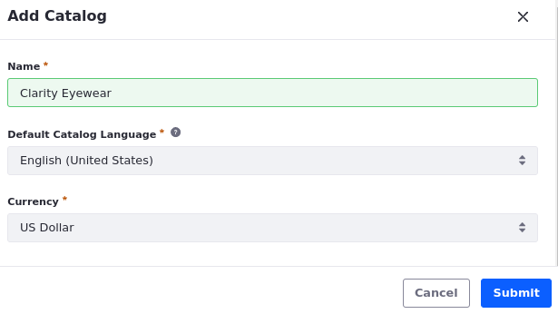
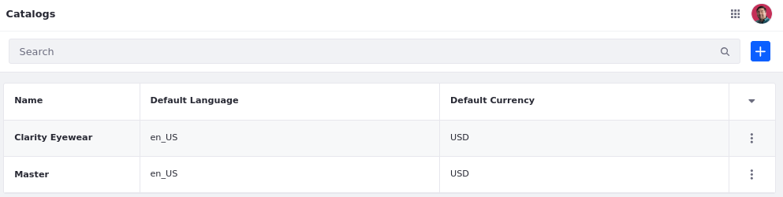
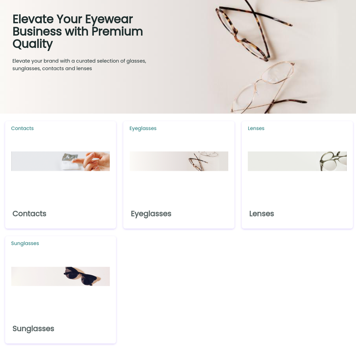
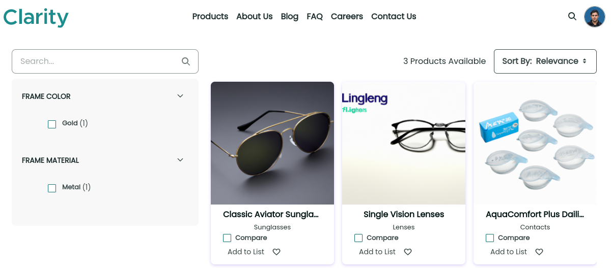

# Creating Clarity’s Commerce Content

Although they are not yet building an e-commerce storefront, Clarity wants to leverage some Liferay commerce capabilities to create product content. While it is feasible to build Clarity's product material using web content structures, Liferay’s commerce features provide an additional layer of future-proofing to the website. In this section, we'll cover the following commerce features:

- Catalogs
- Products
- Channels

<!-- TASK: Make a separate article for understanding Liferay Commerce and how to leverage their features as content; then have separate articles for different exercises, since this article is over 2700 words. -->

## Catalogs

A catalog is a group of related products. Liferay catalogs provide a highly flexible way to organize your product offerings in the most sensible way for your business. There is no limit to the number of catalogs you can create, although maintenance effort should be a factor in how many you choose to have. Catalogs also enable you to define permissions for the products they contain, so that different product teams can manage different product groupings.

In addition, catalogs capture important commerce attributes like language, currency, and price lists, along with a placeholder image for products without an associated image. As useful as catalogs are, they are just empty containers without the products to populate them. Let's take a look at products next.

## Products

Like any manufacturer, Clarity has variants of their products designed to achieve different goals and target different customer profiles. Liferay Commerce supports four product types out of the box:

- **Simple Product**: Any physical product for which inventory is tracked.

- **Virtual Product**: Any non-tangible product, such as music files, electronic publications, services, and warranties.

- **Grouped Product**: Two or more products from a Catalog that are packaged together and sold as a single item. Grouped products are tracked in your inventory and can contain simple products, virtual products, or other grouped products.

- **Shop by Diagram**: Component parts belonging to a Bill of Materials (BOM) diagram that references products in the store.

Products offer more than just a predefined type of content--they offer many additional features that together create a first-class commerce experience with minimal effort:

- Product details
- Product options
- Units of measure
- Configurable products
- Product media (images, videos, etc.)
- Related products
- Downloadable product documents
- Product availability
- Product variants

While Clarity could model all of these product types and attributes with web content structures, Liferay commerce provides an intuitive solution that you can implement with ease.

<!--TODO: Consider adding content for Product Listing and Product Display pages-->

## Channels

Once their products and catalogs are configured, Clarity needs to think about how they will display their products to customer and website visitors. Channels are the storefront where products are displayed and sold to customers. They come with several useful features:

- Store administrators can create multiple channels, each representing a different customer experience (B2B, B2C, B2X)

- Channels can be linked to Liferay sites

- You can use Liferay's headless APIs to creative native mobile applications with channels or integrate channels with external marketplaces

- Channels define default display languages and currencies, as well as default product display pages and category pages

- For transactional sites, channels offer payment, shipping, and tax information

While e-commerce isn’t Clarity’s main focus right now, setting up these features will set them up for success in the future.

## Exercise: Creating Clarity’s Products Catalog
<!--Exercise 14a-->

A catalog is a group of related products. Liferay catalogs provide a highly flexible way to organize your product offerings in the most sensible way for your business.

Here you'll create a catalog for Clarity's products as Ian Miller.

To do this,

1. Sign in as Ian Miller.

   * **Username**: `ian.miller@clarityvisionsolutions.com`
   * **Password**: `learn`

1. Open the *Global Menu* (), go to the *Commerce* tab, and click *Catalogs*.

1. Click *Add* ().

1. Enter the following:

   | Field                    | Value                   |
   |:-------------------------|:------------------------|
   | Name                     | `Clarity Eyewear`       |
   | Default Catalog Language | English (United States) |
   | Currency                 | US Dollar               |

   

1. Click *Submit* to finish creating the catalog.

Great! Now that you've created the catalog, you can start adding products to it. But first, let's add specifications that you can add to Clarity's products when you create them.

## Exercise: Defining Product Specifications
<!--Exercise 14b-->

Product specifications store information about products, like size, material, and color. To improve organization, you can also save them into specification groups.

Here you'll add product specifications as Ian Miller.

To do this,

1. Open the *Global Menu* (), go to the *Commerce* tab, and click *Specifications*.

1. Click the *Specification Groups* tab.

1. Click *New* to add a new specification group.

1. Enter the following:

   | Field    | Value               |
   |:---------|:--------------------|
   | Title    | `Frame Description` |
   | Priority | `10.0`              |
   | Key      | `frame-description` |

1. Click *Save* to finish creating your product specification group.

   You can now add product specifications to it.

1. Return to the *Specification Groups* overview and go to the *Specification Labels* tab.

1. Click *New* to add a new specification.

1. Enter the following:

   | Field                       | Value                        |
   |:----------------------------|:-----------------------------|
   | Label                       | `Frame Material`             |
   | Description                 | `The material of the frame.` |
   | Use in Faceted Navigation   | Yes                          |
   | Default Specification Group | Frame Description            |
   | Key                         | `frame-material`             |

1. Click *Save* to finish creating your specification label.

1. Create two more specifications with these values:

   * **Frame Color**

      | Field                       | Value                     |
      |:----------------------------|:--------------------------|
      | Label                       | `Frame Color`             |
      | Description                 | `The color of the frame.` |
      | Use in Faceted Navigation   | Yes                       |
      | Default Specification Group | Frame Description         |
      | Key                         | `frame-color`             |

   * **Frame Size**

      | Field                       | Value                                       |
      |:----------------------------|:--------------------------------------------|
      | Label                       | `Frame Size`                                |
      | Description                 | `The size of the frame (in default units).` |
      | Use in Faceted Navigation   | No                                          |
      | Default Specification Group | Frame Description                           |
      | Key                         | `frame-size`                                |

1. Return to the *Specification Labels* page.

Now that you've added some specifications, you can apply them to products as you create them.

## Exercise: Creating Products
<!--Exercise 14c-->

Products represent the items sold by a company. Like any manufacturer, Clarity has a wide variety of products designed to achieve different goals and target different customer profiles.

Here you'll add products to Clarity's catalog, apply specifications and more as Ian Miller.

To do this,

1. Open the *Global Menu* (), go to the *Commerce* tab, and click *Products*.

1. Click *Add* () and select *Simple*.

   **Note**: A simple product is any physical product for which inventory is tracked.

1. Enter the following:

   | Field   | Value                        |
   |:--------|:-----------------------------|
   | Name    | `Classic Aviator Sunglasses` |
   | Catalog | Clarity Eyewear              |

1. Click *Submit* to finish creating your product.

   Now you can configure the product. First, add a product description using ChatGPT.

1. In the Full Description field editor, click on the *AI Creator* button ().

1. Enter a description, tone, and word count. 

   For example,

   | Field       | Value                                                                               |
   |:------------|:------------------------------------------------------------------------------------|
   | Description | A product description for a pair of classic aviator sunglasses made for sunny days. |
   | Tone        | Friendly                                                                            |
   | Word Count  | `200`                                                                                |

1. Click *Create*. This generates your content.

1. Click *Add* to copy the response into the Full Description field.

   Alternatively, click *Try Again* to generate a new response.

   Now that you've added a long description, let's categorize the product.

1. In the Categorization section, click *Select* for Clarity Products.

1. Select *Sunglasses* and click *Done* to apply the category to this item.

   Now that the product is categorized, add some specifications.

1. Scroll down and type `Frame` in the Add Specifications field.

   This lists available specifications.

1. Select *Frame Material*, *Frame Color*, and *Frame Size* specifications, and close the modal window.

1. In the Specifications section, click *Frame Material* to begin editing it.

1. Enter the following:

   | Field    | Value   |
   |:---------|:--------|
   | Value    | `Metal` |
   | Position | `10`    |

1. Click *Save*.

1. Repeat steps 7-9 for the other specifications and enter these values:

   * **Frame Color**:

      | Field    | Value  |
      |:---------|:-------|
      | Value    | `Gold` |
      | Position | `20`   |

   * **Frame Size**:

      | Field    | Value   |
      |:---------|:--------|
      | Value    | `54-20` |
      | Position | `30`    |

   Now that your product has specifications, let's add an image for the product.

1. Click *Save as Draft* to save your changes.

1. Go to the *Media* tab.

1. For Images, click *Add* () and click *Select File*.

1. Select the *classic-aviator-sunglasses* image from the Product Images asset library.

1. Enter these details for the image:

   | Field    | Value                      |
   |:---------|:---------------------------|
   | Title    | Classic Aviator Sunglasses |
   | Priority | 10.0                       |

1. Click *Publish* to save the product image.

   

   <!--TASK: Add attachment-->

1. Click *Publish* to finish creating the product.

1. Repeat the above steps to create two more products: *AquaComfort Plus Dailies* and *Single Vision Lenses*. Tags should be typed directly into the Tags field in the Details screen.

   | Product                    | Specifications | Categories | Tags  | Image                    |
   |:---------------------------|:---------------|:-----------|:------|:-------------------------|
   | `AquaComfort Plus Dailies` | N/A            | Contacts   | daily | aquacomfort-plus-dailies |
   | `Single Vision Lenses`     | N/A            | Lenses     | daily | biofinity-toric-lenses   |

   **Note**: To add the tag, type `daily` into the Tags field.

   

Great! Now that you've added products, you can set up a channel to display them in Clarity's site.

## Exercise: Creating a Commerce Channel
<!--Exercise 14d-->

Channels determine the storefront where products are displayed and sold to customers.

Here you'll create a channel and link it to Clarity's public enterprise website as Ian Miller.

To do this,

1. Open the *Global Menu* (), go to the *Commerce* tab, and click *Channels*.

1. Click *Add* ().

1. Enter the following:

   | Field    | Value            |
   |:---------|:-----------------|
   | Name     | `Clarity Public` |
   | Currency | US Dollar        |
   | Type     | Site             |

1. Click *Add* to finish creating your channel.

   **Note**: To display products in a site, you must link it to a channel.

1. Go to the *Type* tab and click *Select Site*.

1. Choose *Clarity Public Enterprise Website*.

1. Click *Save*.

With the channel created, let's return to Clarity's site and finish setting up their product pages.

## Exercise: Setting Up the Product Pages
<!--Exercise 14e-->

The training workspace includes three pages for displaying Clarity's products: Products, Product List, and Product Details. Each page is already wireframed.

Here you'll finish setting up each page as Walter Douglas.

### Updating the Products Page

The Products page is a marketing page intended to showcase the product categories defined in the *Clarity Products* vocabulary. By selecting a category, users are directed to the *Product List* page where they'll only see products from the selected category.

To implement this,

1. Sign in as Walter Douglas.

   * Email: `walter.douglas@clarityvisionsolutions.com`
   * Password: `learn`

1. Go to the *Products* page and begin editing it ().

1. Open the *Fragments and Widgets* panel ().

1. Go to the *Widgets* tab.

1. Drag and drop the *Commerce Categories Navigation* widget into the Commerce Categories container.

1. Hover over the widget, click the *Actions* button () in the top right corner of the widget, and select *Configuration*.

1. For Vocabulary, select *Clarity Products*.

   **Note**: Do not enable the Use Root Category option.

1. Click *Save* and close the modal window.

   

1. Click *Publish* to view the updated page.

   Currently, you have a list of categories, but this is a long way from Clarity's designs. The content of this widget is dynamically updated, so it's easier to maintain as new categories are added and old categories are updated or retired. Now let's do something about the design.

1. Open the *Site Menu* (), expand *Design*, and select *Templates*.

1. Go to the *Widget Templates* tab.

1. Click *New* and select *Commerce Categories Navigation Template*.

1. Enter `Clarity Category Cards` as the template name.

1. From the training workspace, go to the `[repository-folder]/exercises/lesson-14/` folder and open the `commerce-category-navigation-cards.ftl` file.

1. Copy and paste the contents of this file into the editor.

1. Click *Save*.

1. Return to the *Products* page and begin editing it ().

1. Hover over the *Commerce Categories Navigation* widget, click the *Actions* button () in the top right corner of the widget, and select *Configuration*.

1. For Display Template, select *Clarity Category Cards*.

1. Click *Save* and close the window.

1. Click *Publish* to view the page.

Great! You can see we are a lot closer to the final design requested by Clarity. Now that you've finished the Products page, let's complete the Product List page.

### Creating the Product Listing Page (PLP)

As you’ve probably noticed, while the Commerce Categories Navigation widget looks better and provides us links to each category, the links aren’t working. That’s because Liferay doesn’t know which page to display for each category. For Liferay to recognize a page as a category display page, we can either assign it in the Channel settings or add the Category Content widget to it.

Currently, the Product List page includes most of the necessary widgets to display lists of products, but it's not connected to Liferay's category display feature.

To fix this,

1. Go to the *Product List* page.

1. Click *Edit* () to begin editing the page.

1. From the *Fragments and Widgets* panel (), drag and drop the *Category Content* widget just above the Search Results container.

1. Click *Publish*.

1. Return to the *Products* page and click one of the category cards to confirm it is working properly.

   The Category Navigation should be working. However, the Search Results widget is blank, as it has no display template set to it. To fix that, let's create a new template for that widget.

1. Open the *Site Menu* (), expand *Design*, and select *Templates*.

1. Go to the *Widget Templates* tab.

1. Click *New* and select *Search Results Template*.

   **Important**: There are two "Search Results Template" options. One is for general search results while the other one is for Commerce products. Try selecting the second option first. If it's the right one, you will see some commerce specific variables in the Elements menu (i.e., *Commerce Product Search Result Display Context* and *Commerce Product Catalog Entries*). If you do not see these variables, try using the other template.

1. Enter `Clarity Search Results Cards` as the template name.

1. From the training workspace, go to the `[repository-folder]/exercises/lesson-14/` folder and open the `commerce-search-results-cards.ftl` file.

1. Copy and paste the contents of this file into the editor.

1. Click *Save*.

1. Go to the Product List page and begin editing it ().

1. Hover over the Search Results widget, click *Actions* () in the top right corner of the widget, and select *Configuration*.

   **Note**: The Search Results widget should look blank, towards the bottom right side of the layout.

   

1. For Render Selection, select *Use Application Display Template*.

1. For *Display Template*, select *Clarity Search Results Cards*.

   **Note**: If you don’t see the template here, return to step 8 and try the other Search Results template.

1. Click *Save* and close the window.

1. Click *Publish*.

1. Return to the *Products* page and click one of the category cards to confirm it is working properly and you are seeing your new template.

   

### Creating the Product Display Page

Finally, when you click a product in the Product List page, it doesn't work as expected. This is because Liferay doesn't know which page to use to display product details.

To fix this,

1. In the *Page Templates* application, go to the *Display Page Templates* tab, and click *New*.

1. Select *Primary Master Page*.

1. Enter these values and click *Save*:

   | Field        | Value             |
   |--------------|-------------------|
   | Name         | `Product Details` |
   | Content Type | *Product*         |

   This creates a new display page template for products.

1. Drag and drop the *Product Details Page* fragment composition into the drop area.

   

1. In the Product Details container, map these fragments with their corresponding product fields.

   | Fragment     | Fragment Sub-Element | Mapping                           |
   |--------------|----------------------|-----------------------------------|
   | Product Name | element-text         | *Name* (Basic Information)        |
   | SKU          | element-text         | *SKU* (Basic Information)         |
   | Description  | element-html         | *Description* (Basic Information) |

1. Select the button's *link* sub-element and configure these settings:

   | Tab     | Field | Value        |
   |:--------|:------|:-------------|
   | Link    | Link  | *Page*       |
   | Link    | Page  | *Contact Us* |

1. Double click the *Button* fragment and change its text to `Contact Sales`.

1. In the Specifications container, double click the *Heading* fragment and change its text to `Specifications`.

1. Map fragments in the Specifications container to their fields:

   | Fragment            | Fragment Sub-Element | Mapping                     |
   |---------------------|----------------------|-----------------------------|
   | Specification Name  | element-text         | *Name* (Basic Information)  |
   | Specification Value | element-text         | *Value* (Basic Information) |

1. In the Attachments container, double click the *Heading* fragment and change its text to `Attachments`.

1. Map fragments in the Attachments container to their fields:

   | Fragment        | Fragment Sub-Element | Mapping                     |
   |-----------------|----------------------|-----------------------------|
   | Attachment Name | element-text         | *Title* (Basic Information) |

1. Select the Download button and configure these settings in the configuration side panel:

   | Tab     | Field | Value   |
   |---------|-------|---------|
   | General | Style | *Link*  |
   | General | Size  | *Small* |

1. Select the Download button's link sub-element and configure these settings:

   | Tab  | Field | Value          |
   |------|-------|----------------|
   | Link | Link  | *Mapped URL*   |
   | Link | Field | *Download URL* |

1. Double click the *Download* button and change its text to *Download*.

1. Click *Publish*.

1. Click *Actions* () for the Product Details template and select *Mark as Default*.

1. Return to the *Category Display* page and select one of the products to confirm it is working.

   <!--TASK: Update Img once working,
   -->

## Conclusion

Congratulations! You've finished setting up Clarity's product pages. Next, lest's explore how Clarity can set up publishing workflows in Liferay DXP.

Next Up: [Publishing Content with Workflows](./publishing-content-with-workflows.md)

## Additional Resources

See official documentation to learn more about using Liferay Commerce features:

* [Introduction to Liferay Commerce](https://learn.liferay.com/w/commerce/starting-a-store/introduction-to-liferay-commerce)
* [Catalogs](https://learn.liferay.com/w/commerce/product-management/catalogs)
* [Creating and Managing Products](https://learn.liferay.com/w/commerce/product-management/creating-and-managing-products)
* [Channels](https://learn.liferay.com/web/guest/w/commerce/store-management/channels)