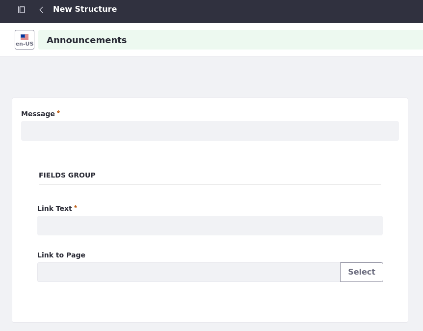

# Creating Clarity's Web Content
<!-- TASK: Reconsider article title and scope; the exercises include steps for 'displaying' content. -->

*Content Management* is a broad term that can apply to a range of feature sets in the data lifecycle. We're going to focus specifically on the bread-and-butter Liferay features used to create content for web pages. Using structures and templates, you can build and display articles of web content through content pages, display pages, widgets, or fragments, which you learned about in the previous module. Web content articles are dynamic, versatile assets, in large part because they are made up of web content structures. 

<!--TASK: At this point of the course, it is not clear that Web Content is an application in Liferay--to the uninitiated, it sounds like a generic term. The same is true for 'structures' and 'templates'. I'd suggest revising the above paragraph for clarity and focus. For example:

"Liferay's Web Content application is a tool for creating and managing content. With it, users can define structures for different types of content and then design templates for rendering them in site pages. You can also render content items by mapping their fields to page fragments. Clarity..."
-->

<!--TASK: Add note or section that explains there are other applications besides Web Content... but that Web Content can really address most use cases.-->

## Web Content Structures

Web content structures define generic content types. Each structure determines the fields available to creators when creating content items (e.g., title, body, image). Liferay includes a Basic Web Content structure out of the box, but you can create your own.

Clarity Vision Solutions needs these types of web content for their enterprise website:

* Announcement
* Blog Post
* FAQ
* Helpful Article
* Job Listing
* Leadership Profile
* Legal Article

Using these custom structures, Clarity can enforce a consistent format for content across their site, reducing effort for writers, editors, and designers alike.

## Web Content Templates

Once you've defined a structure, you can create a template for it. Web content templates use FreeMarker (FTL) to determine how specific types of content items render in site pages. This means different types of web content can have different visual presentations, providing designers with an extra layer of configuration and customization.

<!--TASK: Add note that recommends using fragments; Also suggest a principle that avoids FreeMarker abuse: When possible, use fragments; and if you must use FreeMarker, avoid adding logic. -->

<!--TASK: Add a section or note that compares when to use web content vs. manually entering inline fragment text-->

<!--TASK: Add section on AI, or relocate exercise to separate article on AI (I recommended the latter)-->

## Exercise: Creating Web Content Structures
<!--Exercise 10a-->

The training workspace already includes most of the custom web content structures Clarity needs. In this exercise, you'll add the Announcements structure as Christian Carter.

To do this,

1. Sign in as Christian Carter.

   * Email: `christian.carter@clarityvisionsolutions.com`
   * Password: `learn`

1. Open the *Site Menu* (), expand *Content & Data*, and select *Web Content*.

1. Go to the *Structures* tab and click *New*.

1. Enter `Announcements` for the title.

1. From the *Builder* sidebar, drag and drop a *Text* field into the structure.

1. Select the *Text* field and configure these options:

   | Tab      | Field           | Value       |
   |:---------|:----------------|:------------|
   | Basic    | Label           | `Message`   |
   | Basic    | Required Field  | Yes         |
   | Advanced | Field Reference | `message`   |

1. Click the *back arrow* () to return to the Builder sidebar menu.

1. Drag and drop another *Text* field just below the first one.

1. Select the *Text* field and configure these options:

   | Tab      | Field           | Value       |
   |:---------|:----------------|:------------|
   | Basic    | Label           | `Link Text` |
   | Basic    | Required Field  | Yes         |
   | Advanced | Field Reference | `linkText`  |

1. Return to the Builder sidebar menu.

1. Drag and drop a *Link to Page* field on top of the *Link Text* field.

   This creates a *Fields Group* that contains both *Link Text* and *Link to Page*.

1. Select the *Link to Page* field and configure these options:

   | Tab      | Field           | Value       |
   |:---------|:----------------|:------------|
   | Advanced | Field Reference | `linkPage`  |

1. Click *Save*.

Users can now create web content articles using the Announcements structure. You should now have eight web content structures implemented in Clarity’s website. Next, you'll create some web content articles.

## Exercise: Creating Web Content Articles
<!--Exercise 10b-->

The training workspace already includes some web content articles. However, Clarity also needs some FAQ and announcement articles. Here you'll create them as Christian Carter.

To do this,

1. Open the *Site Menu* (), expand *Content & Data*, and select *Web Content*.

1. Click *New*, select *Folder*.

1. Enter these values:

   | Field       | Value                                               |
   |:------------|:----------------------------------------------------|
   | Name        | `Announcements`                                     |
   | Description | `Stores announcement articles for the page header.` |

   **Tip**: It's best practice to organize your web content into folders instead of adding it to the home folder.

1. Click Save.

1. Click the *Announcements* folder.

1. Click *New* and select *Announcements*.

1. Enter these values:

   | Field        | Value                                       |
   |:-------------|:--------------------------------------------|
   | Title        | `Product Innovations`                       |
   | Message      | `See Clarity's latest eyewear innovations!` |
   | Link Text    | `Learn more`                                |
   | Link to Page | `Products`                                  |

   

1. Click *Publish*.

   Next, you'll add some missing web content articles.

1. Go to the *Home* web content folder.

1. Go to *FAQ* &rarr; *Retail Partners*.

1. Create these FAQ articles:

   | Title (Question)                                             | Answer                                                                                                                                                                                  |
   |:-------------------------------------------------------------|:----------------------------------------------------------------------------------------------------------------------------------------------------------------------------------------|
   | Can I become a retail partner?                               | Yes, we are always looking to expand our network of retail partners. If you are interested in stocking our eyewear, please contact our sales team for more information.                 |
   | Do you have retail partners where I can try on your eyewear? | Yes, we have partnered with various optical shops where you can try on our eyewear. Please visit our website to find the nearest location.                                              |
   | What types of eyewear do you offer?                          | We offer a wide range of eyewear including prescription glasses, sunglasses, and contact lenses. We also have a collection of designer frames to suit different styles and preferences. |

Great! You should have all the web content Clarity needs for their pages. Next, you'll map some of this content to fragments on Clarity's pages.

## Exercise: Mapping Content to Fragments
<!--Exercise 10c-->

Many fragments include sub-elements with their own configuration options, which depend on the sub-element’s type. Available types include

* Simple Text Element
* Rich Text Element
* Link Element
* HTML Element
* Image Element

You can set each sub-element's content directly, or you can map them to existing content items so that they update dynamically. Here you'll map some image elements in the Home page to asset library images as Walter Douglas.

1. Begin editing Clarity's *Home* page.

1. In the Browser side panel (), select the *Banner* container.

1. Select the *Image* fragment in the *Banner* container. Notice that the fragment includes an image-square sub-element.

1. Select the fragment's *image-square* sub-element to access its mapping options.

1. For Source Selection, select *Mapping*.

1. For Item, click the *Plus* button ().

1. In the Documents and Media tab, click *Sites and Libraries* in the breadcrumb menu.

1. Go to the *Asset Library* tab, select *Marketing Assets*, and select the image named `home-banner-narrow-no-background`.

1. For Field, select *File URL*. The image should appear in the Home page banner.

1. Repeat steps 4-9 for the *Image* fragment in the Clarity Solutions Promo container and select the `sunglasses-on-shelves` image named from the Marketing Assets asset library.

1. In the Browser side panel (), select the *Content Wrapper* container in the Clarity Solutions Promo container.

   Here you'll use a background image instead of an image sub-element.

1. In the configuration side panel, go to the *Styles* tab.

1. Under Background, set Image Source to *Mapping* and select the `gradient-overlay` image from the Marketing Assets asset library.

1. For Field, select *File URL*. The texture should overlay the gradient promotion.

1. Repeat steps 13-15 for the *Distributor Promo* container and select the `home-promotion` image from the Marketing Assets asset library.

   Once you've finished, you may notice that the image dimensions don't match Clarity's design. Let's fix this.

1. Select the *Banner Content* container and configure this setting:

   | Tab     | Setting         | Value       |
   |:--------|:----------------|:------------|
   | General | Container Width | Fixed Width |

1. Repeat this step for *Content Container* and *Clarity Solutions Promo*.

   Now the contents of these containers should be fixed and the dimensions should better resemble Clarity's designs.

You have now mapped content from Clarity's asset libraries to the image fragments on the Home page.  Next, let's explore how you can create content in Liferay with ChatGPT.

## Exercise: Generating Content with ChatGPT (Optional)
<!--Exercise 11a-->

You may have noticed that web content articles include the *AI Creator* button for generating content using ChatGPT. Using this feature requires a valid API key.

Here you'll add an API key to your instance as the Clarity Admin user so that you can generate content.

To do this,

1. Sign in as the Clarity Admin user.

   * Username: `admin@clarityvisionsolutions.com`
   * Password: `learn`

1. Open the *Global Menu* (), go to the *Control Panel* tab, and click *Instance Settings*.

1. Click *AI Creator*.

1. Enter your API key.

   !!! note
       Bootcamp participants are provided a temporary key.

1. Ensure *Enable ChatGPT to Create Content* is checked.

1. Click *Save*.

1. Return to Clarity's site, begin creating a web content article, and click the *AI Creator* button to generate content.

Great! You've used ChatGPT to generate web content articles.

## Conclusion

This concludes *Creating Clarity’s Web Content*. Now let’s take a look at how you can organize your content in Liferay.

<!--TASK: Revise conclusion to avoid "This concludes Creating Clarity’s Web Content." Recap the article's core concepts/exercises. Apply to other articles.-->

Next Up: [Organizing Clarity’s Content](./organizing-claritys-content.md)

## Additional Resources

See our documentation to learn more about Liferay's Web Content application and its content management features:

* [Web Content](https://learn.liferay.com/web/guest/w/dxp/content-authoring-and-management/web-content)
* [Mapping and Linking Fragment Elements](https://learn.liferay.com/w/dxp/site-building/creating-pages/page-fragments-and-widgets/using-fragments/mapping-and-linking-fragment-elements)
