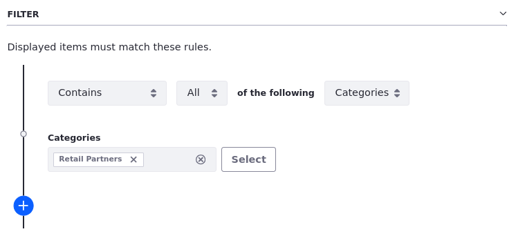

# Displaying Clarity's Content

Effectively showcasing content is crucial for engaging users and improving content visibility. Whether it's blog posts, news articles, or related media, organizing and presenting these elements in a cohesive manner can significantly enhance the user experience. One way to achieve this is using Liferay Collections. Building on the previous lesson about content organization, you'll learn how to leverage collections to display sets of content for Clarity.

## Collections

Collections define sets of content for rendering in site pages. Once defined, you can use the collection multiple times as the data source for fragments and widgets. Any changes to a collection automatically propagate to page elements using the collection. By decoupling asset selection from rendering, collections provide a centralized place for managing groups of content. Collections provide the following benefits:

* **Group Diverse Content**: You can create collections to bring together different content types, like blog posts, documents, web content articles, and custom object entries, under a single theme or category. Group content items manually or dynamically by either selecting individual items or defining selection criteria for choosing items automatically.

* **Filter and Personalize Content**: You can define specific criteria, such as tags, categories, or publication dates, to filter and display only relevant items within a collection. This enables you to personalize the content experience for different user groups.

* **Simplify Content Presentation**: You can easily embed collections into your Liferay pages using dedicated out-of-the-box fragments like *Collection Display*. This streamlines the process of showcasing curated content within website layouts. 

For most use cases, you should use fragments to render collection items, but you can use the asset publisher widget with FreeMarker templates for use cases that require complex templating.

## Asset Publishers and Collections

In addition to fragments, you can use the Asset Publisher widget to render collections in site pages. Asset publishers are self-contained widgets, meaning each instance includes its selection criteria, display settings, and user interactive functionality. Though you can define an asset publisher's select criteria without collections, this approach creates overhead, requiring users to manage each widget's data source individually, even if they use the same selection criteria. For this reason, you should always use collections for asset selection. Doing this helps future-proof your solution while laying the groundwork for leveraging capabilities like segmented data.

## Exercise: Creating a Manual Collection
<!--Exercise 13a-->

Liferay Collections are lists of content items that you can showcase in your site pages. You can group different content types together, making it easier to find and display related items. Each list can be defined manually or dynamically.

Here you'll add web content articles to a manual collection and map them to Clarity's home page as Walter Douglas.

To do this,

1. Sign in as Walter Douglas.

   * Email: `walter.douglas@clarityvisionsolutions.com`
   * Password: `learn`

1. Open the *Site Menu* (), expand *Site Builder*, and select *Collections*.

1. Click *New* and select *Manual Collection*.

1. For Title, enter `Helpful Articles` and click *Save*.

1. For Item Type, select *Web Content Article*.

1. For Item Subtype, select *Article*.

1. Click *Save*.

1. In the Collection Items section, click *Select* and select *Article*.

1. Go to the *Articles* folder, select these three articles:

   * *Embracing Innovation: Key Trends Shaping Eyewear Manufacturing*
   * *Revolutionizing the Eyewear Industry: How Innovative Materials Make a Difference*
   * *Enhancing Efficiency in Eyewear Manufacturing: A Comprehensive Approach*

1. Click *Add*.

   

   The manual collection is now populated with content and ready to use in site pages.

1. Go to the *Home* page and click *Edit* ().

1. Select the *Collection Display* fragment in the Helpful Articles container.

1. In the configuration side panel, click *Plus* () for Collection and select the *Helpful Articles* collection.

   

   The fragment now sources its content from the Helpful Articles collection. The provided composition already applies the Clarity Card fragment to the collection display for rendering each item. To display article content from the collection, you'll need to map the card's sub-elements to fields in the articles. But before mapping the card's sub-elements to content fields, let's change the collection display's pagination.

1. For Pagination, select *None*.

   Now let's map the card's sub-elements to their corresponding fields in the articles.

1. Select the *Clarity Card* fragment and note the sub-elements included:

   * card-image
   * category
   * card-title
   * summary
   * card-link

1. Select each of the following elements, set its Source Selection to *Mapping*, and select the corresponding field:

   * card-image: *Image* under Content (Article)
   * category: *Articles* under Categorization
   * card-title: *Title* under Basic Information
   * summary: *Headline* under Content (Article)

1. Select the *card-link* sub-element, go to the *Link* tab.

1. For Link, select *Mapped URL*.

1. For Field, select *Default*.

1. Click *Publish* to save your changes to the Home page.

   The *Helpful Articles* section of the Home page should now display web content from the collection you created. However, two elements aren't working as expected: category and card-link. This is because the articles do not have categories assigned to them and because the articles do not have a default display page template. Let's fix these issues.

1. Go to the *Web Content* application and assign one category to each article.

1. Go to the *Page Templates* application, go to the *Display Page Templates* tab, and set the *Article* display page template as the default for its type.

1. Return to the Home page and verify all mappings work.

Great! You created a manual collection and displayed it in Clarity's Home page. Next, you'll learn how to create a dynamic collection.

## Exercise: Creating a Dynamic Collection
<!--Exercise 13b-->

Having categorized your FAQ web content articles earlier, here you'll use those categories to build dynamic FAQ collections as Walter Douglas.

To do this,

1. Open the *Site Menu* (), expand *Site Builder*, and select *Collections*.

1. Click *New* and select *Dynamic Collection*.

1. For Title, enter `FAQ - Retail Partners` and click *Save*.

1. For Item Type, select *Web Content Article*.

1. For Item Subtype, select *FAQ*.

   This limits the collection to FAQ web content articles. Next, you'll define the collection's scope and filter to limit which FAQs are included in the collection.

1. Under Scope, click *Select* and select *Other Site or Asset Library*.

1. Go to the *Asset Libraries* tab and click *Marketing Assets*.

   This ensures the collection uses FAQ articles from the Marketing Assets library. 

1. Under Filter, set the rule to `Contains *All* of the following Categories`.

1. In the Categories field, search for `Retail Partners` and select it.

   

1. Click *Save* to create the collection.

1. Repeat the above steps to create these collections:

   * `FAQ - Products & Services`
   * `FAQ - Pricing & Ordering`
   * `FAQ - Returns & Exchanges`

   

   For each collection, filter results using its corresponding category.

You now have four FAQ collections. Next, you'll use them to display content in Clarity's FAQ page.

## Exercise: Displaying Content on the FAQ Page
<!--Exercise 13c-->

Using what you have learned in the previous exercises, let’s map content to the FAQ page as Walter Douglas.

To do this,

1. Begin editing the *FAQ* page.

1. Double click the *Image* fragment to configure its image-square sub-element.

1. Set the image to `glasses-vertical-banner-with-text-lg` from the Marketing Assets library.

   <!--TASK: Revise the following steps.-->

1. The block on the right contains a page title and four FAQ Section compositions. Each FAQ Section contains a heading and a Collection Display fragment. Each Collection Display contains a custom fragment called FAQ Question and Answer Pair. First map the collection displays to the FAQ collections you built earlier. Make sure each collection corresponds to the heading for that section.

   

1. For Pagination, select *None*.

1. Check *Display All Collection Items*.

1. Map the correct fields for each FAQ Question and Answer Pair so that the content renders properly in the collection displays.

1. In the Promoted Articles container, map the collection display to the Helpful Articles collection.

1. Configure this setting for the *FAQ Content* and *Promoted Articles* containers:

   | Tab     | Setting         | Value         |
   |:--------|:----------------|:--------------|
   | General | Container Width | *Fixed Width* |

1. Click *Publish* to save your changes to the FAQ page.

Using collection displays and custom fragments, you have rendered FAQ web content onto Clarity's FAQ page. Next, let's add content to the header announcement bar.

## Exercise: Adding Announcements to the Header
<!--Exercise 13d-->

Here you'll apply what you've learned about web content, collections, and page templates to add an announcement to Clarity's header bar as Walter Douglas.

To do this,

1. Open the *Site Menu* (), expand *Site Builder*, and select *Collections*.

1. Create a new dynamic collection titled `Announcements`.

1. In the collection configuration menu, set Item Type to *Web Content Article* and Item Subtype to *Announcements*.

1. For scope, select the *Marketing Assets* library.

1. Click *Save* to publish the collection.

   Now that you've created the collection, let's add it to the Primary Master Page template.

1. Open the *Site Menu* (), expand *Design*, and select *Page Templates*.

1. Begin editing the *Primary Master Page* template.

   **Note**: You may notice the styles applied to the master page are different from those applied in site pages. This is because you've applied the theme and theme CSS client extension to site pages and not to master pages. If desired, you can apply the theme and client extension to the master page directly. Make sure you uncheck all theme properties (e.g., Show Footer, Show Header, etc.).

1. Toggle the *visibility* () of the *Header Announcement Bar* container.

1. Select the *Header Announcement Bar* container and configure this setting:

   | Tab    | Field              | Value                 |
   |:-------|:-------------------|:----------------------|
   | Styles | Background > Color | *Color Brand Primary* |

   

   **Note**: Color options are defined by the theme's style book. Unless you've applies the theme CSS client extension to the master page template, the Color Brand Primary option appears purple. This value is overridden in site pages by the Theme CSS client extension.

1. Add a *Collection Display* fragment to the container, select it, and configure these settings:

   | Tab     | Field                              | Value           |
   |:--------|:-----------------------------------|:----------------|
   | General | Collection                         | *Announcements* |
   | General | Pagination                         | *None*          |
   | General | Maximum Number of Items to Display | *1*             |

1. Add a *Container* fragment to the collection display, rename it `Announcement`, and configure these settings:

   | Tab     | Field           | Value      |
   |:--------|:----------------|:-----------|
   | General | Content Display | *Flex Row* |
   | General | Align Items     | *Center*   |
   | General | Justify Content | *Center*   |

1. Add a *Paragraph* fragment to the container, select it, and configure these settings:

   | Tab    | Field        | Value             |
   |:-------|:-------------|:------------------|
   | Styles | Text > Color | *Color Neutral 0* |

   

1. Select the paragraph's *element-text* sub-element and configure this setting:

   | Tab     | Field | Value     |
   |:--------|:------|:----------|
   | Mapping | Field | *Message* |

1. Add a *Clarity Button* fragment to the Announcement container after the paragraph, select it, and configure these settings:

   | Tab     | Field    | Value        |
   |:--------|:---------|:-------------|
   | General | Type     | *Borderless* |
   | General | Style    | *Primary*    |
   | General | Size     | *Small*      |
   | General | Inverted | *Yes*        |

1. Select the button's *link* sub-element and configure these settings:

   | Tab     | Field | Value          |
   |:--------|:------|:---------------|
   | Mapping | Field | *Link Text*    |
   | Link    | Link  | *Mapped URL*   |
   | Link    | Field | *Link to Page* |

1. Adjust the margins and padding for the announcement bar elements until you are satisfied with it.

   

1. Click *Publish Master* to save your changes.

The Header Announcement Bar is now visible on all pages that use the Primary Master Page template.

## Conclusion

Great! You've used both manual and dynamic collections to display content on Clarity's website. Next, let's explore how Clarity can leverage Liferay's Commerce features to create content for their products catalog.

Next Up: [Creating Clarity’s Commerce Content](./creating-claritys-commerce-content.md)

<!-- TODO: Add Additional Resources section. -->
