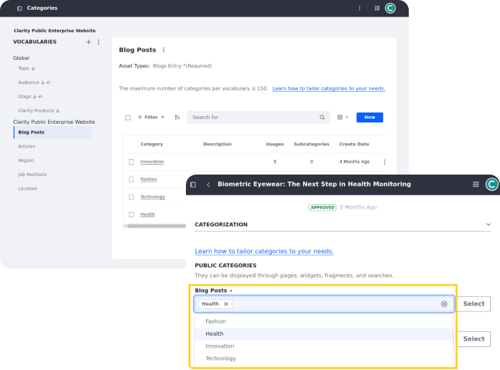
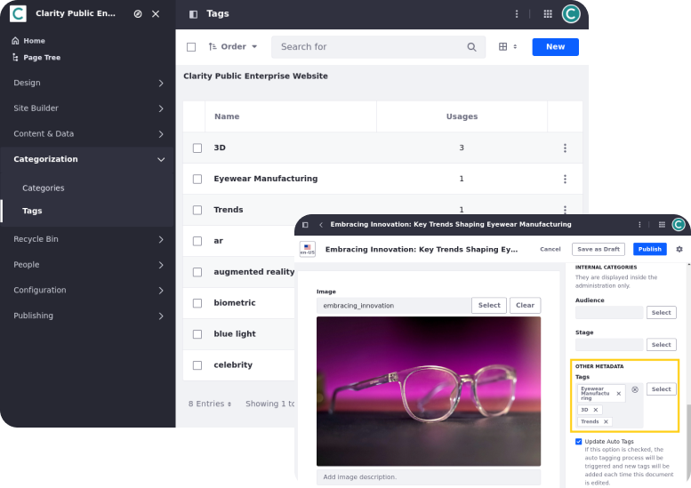

# Organizing Clarity’s Content

In the previous section, you learned about the different types of content that Clarity wants to employ for their enterprise marketing website. This section covers categories and tags, two vital tools for organizing content in Liferay.

Categories are rigid and hierarchical, while tags are flat and freeform. Use categories when you need a formal, top-down structure that integrates with your site's architecture (e.g., navigation and display pages) and helps you enforce content standards and requirements. Use tags when you need flexible, user-driven organization to highlight keywords and enhance your site's search experience. Often, as in Clarity's case, your solution will require a combination of the two features.

## Categories

You can use categories to group assets with similar content or information. Categories support hierarchical organization of your content with nesting and subcategories so that you can classify your content in as much or as little detail as you wish. This makes it easier for users to find relevant information through search or navigation.

Categories themselves are grouped into vocabularies, which can be public or private. A vocabulary defines the type of asset for the categories it contains. For example, Clarity's Blog Posts vocabulary contains four categories: Innovation, Fashion, Technology, and Health. Content creators can only apply these categories to blog posts. Liferay includes some basic vocabularies out of the box, but you can create your own.

Together, categories and vocabularies form a taxonomy, a structured classification system for content. Implementing a robust taxonomy is critical for effectively managing content in Liferay.

## Tags

Tags are keywords for organizing your assets. While categories provide broader classification based on theme or topic, tags describe more specific information about individual content items. Tags are not hierarchical and cannot be nested within one another. However, because they are not constrained by a vocabulary, tags make it possible to find related assets even if they are different types. Both administrators and regular users can create tags for content.

## Exercise: Auto-Tagging Content
<!--Exercise 11b-->

You can manually tag most Liferay assets, but manually tagging content can be time consuming. Liferay also provides auto tagging features and integrations to simplify this process. By default, auto tagging is disabled.

Here you'll enable text and image auto-tagging as the Clarity Admin user.

To do this,

1. Open the *Global Menu* (), go to the *Control Panel* tab, and click *Instance Settings*.

1. Under Content and Data, click *Assets*.

1. Click *Asset Auto Tagging* in the left menu.

1. Ensure these options are checked

   * *Enable Auto Tagging of Assets*
   * *Update Auto Tags*

1. Set the max number of tags to `3`.

   **Note**: Leaving the field blank disables auto-tagging. Setting the value to 0 removes any auto limit.

1. Click *Update*.

   Now that it's enabled, we need to set up our tagging providers for web content articles and images.

1. Click *OpenNLP Text Auto Tagging* in the left menu.

1. Select *Web Content Article* in the drop-down menu.

   If the drop-down menu does not appear, enter `com.liferay.journal.model.JournalArticle`.

   **Note**: You can also click the plus button to enable OpenNLP auto tagging for additional types of text content (i.e., blog entries = `com.liferay.blogs.model.BlogsEntry`; documents = `com.liferay.document.library.kernel.model.DLFileEntry`).

1. Click *Update*.

1. Click *TensorFlow Image Auto Tagging* in the left menu.

1. Check *Enable TensorFlow Image Auto Tagging*.

1. Click *Update*.

   **Tip**: You can double check that all the settings are correct for the Clarity site by going to *Site Menu* &rarr; *Configuration* &rarr; *Site Settings* &rarr; *Assets* and validating that auto tagging is enabled.

1. Go to the *Marketing Assets* library and select *Web Content*.

1. Click *New* and select *Basic Web Content*.

1. Enter a *title* and use the *AI Creator* () to generate article content with over 500 words. 

   For example,

   | Field       | Value                                                                                       |
   |:------------|:--------------------------------------------------------------------------------------------|
   | Description | Write a compelling article on the importance of annual eye exams is for ongoing eye health. |
   | Tone        | Friendly                                                                                    |
   | Word Count  | `2000`                                                                                      |

   **Important**: The article's title and content must be meaningful for auto-tagging to work. Do not use "Lorem Ipsum."

1. Click *Publish*.

1. Begin editing the article. In the right side panel, you should see tags set for the content.

   **Note**: If you don't see any tags, add more content to the article and click *Update*.

## Exercise: Creating a Vocabulary
<!--Exercise 12a-->

Liferay provides vocabularies for categorizing content, making it easier to find and display the content you need.

Here you'll define a vocabulary with categories for the FAQ web content as Christian Carter.

To do this,

1. Sign in as Christian Carter.

   * Username: `christian.carter@clarityvisionsolutions.com`
   * Password: `learn`

1. Open the *Global Menu* (), go to the *Applications* tab, and click *Asset Libraries*.

1. Select the *Marketing Assets* library and click *Categories*.

1. Click *Add* () next to *Vocabularies* to create a new vocabulary.

1. Enter these details:

   | Field                     | Value                          |
   |:--------------------------|:-------------------------------|
   | Name                      | `FAQ`                          |
   | Description               | `Categories for FAQ articles.` |
   | Allow Multiple Categories | Yes                            |
   | Visibility                | Public                         |
   | Asset Types               | Web Content Article            |
   | Subtype                   | FAQ                            |
   | Required                  | Not Required                   |

   

1. Click *Save* to create the vocabulary.

You now have a vocabulary to contain FAQ categories.

## Exercise: Adding Categories to a Vocabulary
<!--Exercise 12b-->

After creating a vocabulary, you can add categories and subcategories to establish the desired organizational schema for your content.

Here you'll add categories to the FAQ vocabulary you created in the previous exercise as Christian Carter.

To do this,

1. In the Categories application, select the *FAQ* vocabulary in the Vocabularies sidebar.

1. Click *New* and enter `Retail Partners` for Name.

1. Click *Save* to add the category.

1. Repeat the above steps to add three more categories to the FAQ vocabulary:

   * `Products & Services`
   * `Pricing & Ordering`
   * `Returns & Exchanges`

   

1. **(Challenge)** Assign the correct category to each FAQ web content article. The FAQs are sorted into folders corresponding to their categories.

   **Hint**: Look in the Properties sidebar for each FAQ.

You have now defined and assigned categories to your FAQ web content.

## Conclusion

Great! You've used tags and categories to organize Clarity's content. Next, let's learn how to display Clarity's content with collections.

Next Up: [Displaying Clarity's Content](./displaying-claritys-content.md)

## Additional Resources

See official documentation to learn more about Liferay's content organization features:

* [Tags and Categories](https://learn.liferay.com/w/dxp/content-authoring-and-management/tags-and-categories)
* [Using Collections](https://learn.liferay.com/w/dxp/site-building/displaying-content/using-collections)
