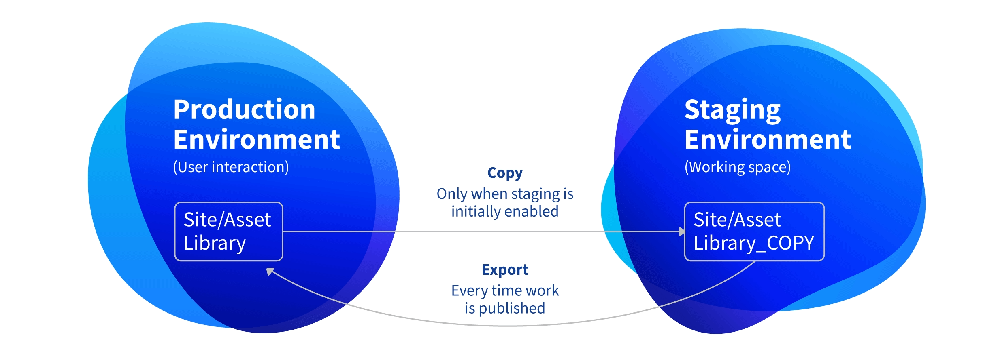
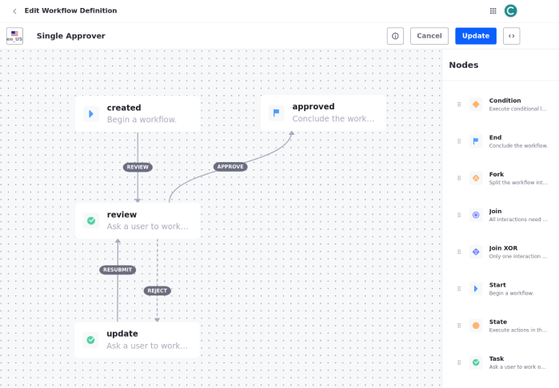
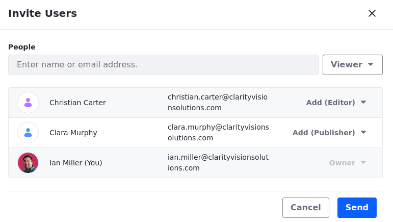
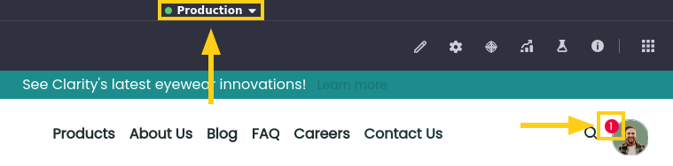
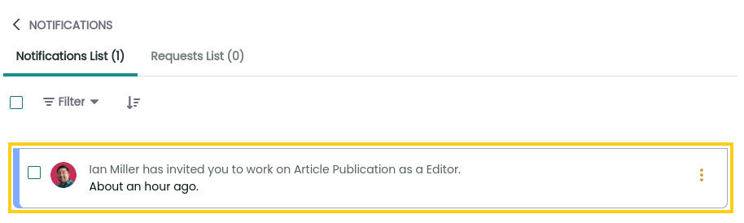
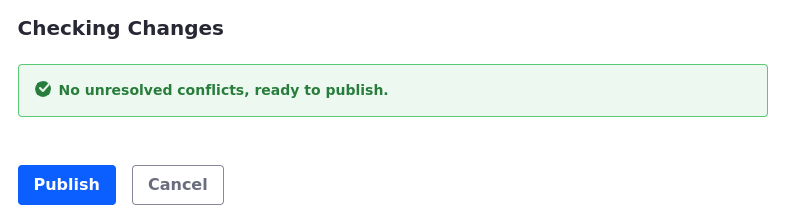
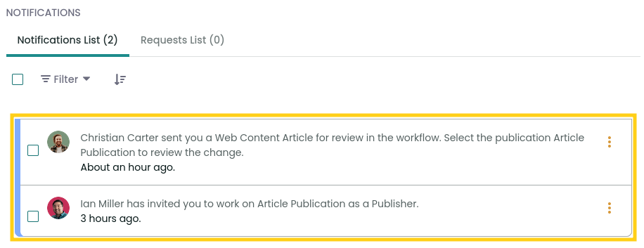
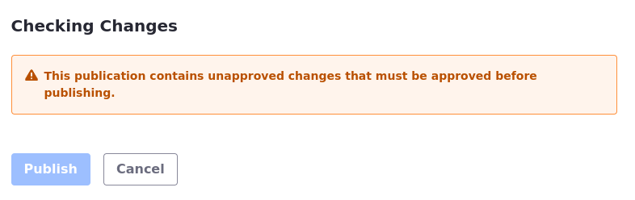

# Publishing Content with Workflows
<!-- TASK: Reconsider Title; maybe "Setting Up a Content Publishing Workflow" or "Collaborating with Publications and Workflow" would be more apt. -->

In the previous sections, you learned about the tools Liferay provides for managing digital assets and web content, and you put some of them to use in enhancing Clarity's enterprise marketing website. However, content creation and management isn't a one person operation. In reality, this process usually involves multiple team members across departments. Each contributor is expected to collaborate, create content in parallel, and send content through a review process before publishing.

Here you'll learn how teams can use Liferay's publishing tools and workflow to effectively collaborate on content creation and coordinate campaign roll outs. This includes reviewing, previewing, and approving content before publishing it to the live site.

## Publishing Tools

Liferay provides two publishing tools for content creation and site building: Staging and Publications. With each tool, you can edit sites and content in a working environment without affecting end users. However, these tools achieve this in different ways, using different frameworks that have varying integration with other Liferay features.

## Staging

Liferay Staging provides a shared working environment for making changes to individual sites and asset libraries before publishing these changes to your live environment. When enabled, Liferay creates a separate copy of the original site or library and hosts them on either the same server ([Local Live](https://learn.liferay.com/w/dxp/site-building/publishing-tools/staging/configuring-local-live-staging)) or on separate servers ([Remote Live](https://learn.liferay.com/w/dxp/site-building/publishing-tools/staging/configuring-remote-live-staging)).

All editing is then restricted to the staged site or asset library. When ready, you can publish your changes manually or schedule them to publish at a later time. Then the staged changes are copied to the live environment. 

## Publications

Like Staging, Publications is a change-tracking tool for editing sites and content. However, under the hood, Publications is very different from Staging. Rather than duplicating all content and keeping two separate datasets in sync, Publications works with versioned records. Essentially, it uses a database column to keep track of changes and determine which version of the content is displayed.

When enabled, contributors can create working environments called 'publications' where they make edits without affecting the production environment’s published site. Each publication is company-scoped and can group changes across multiple sites and asset libraries. Also, while Staging provides a single working environment for all team members, Publications users can create as many working environments as they need. And since these working environments are independent of each other, contributors can work on their own timelines and publish their changes without impacting other projects.

During the publishing process, Liferay checks for conflicts with production and prompts the user to review and resolve them. Some conflicts can be resolved automatically, while others require manual resolution. In case you need to roll back your changes, Publications maintains a detailed history of published changes, so you can quickly revert changes if needed.

By default, access to a publication is limited to its creator. However, creators can invite other members and assign them roles specific to each publication. Since publications are independent, contributors can make and publish their changes without affecting one another. Contributors to a publication can work on their own timelines and publish their changes when ready.

!!! note "Staging vs. Publications"
    Publications is recommended over Staging in nearly all use cases because it provides a superior collaboration experience and greater integration with other Liferay features. The one exception is if your production and working environments must be hosted on separate  servers. Currently, this is only possible with [Remote Live](https://learn.liferay.com/w/dxp/site-building/publishing-tools/staging/configuring-remote-live-staging) staging.

## Workflows

Liferay Workflow defines approval processes for Liferay entities. These processes can help improve task visibility, eliminate bottlenecks in business processes, and reduce the time and resources required to complete tasks. By default, Liferay includes a Single Approver workflow, but you can define your own workflows using a visual designer.

Once you’ve defined a workflow, you can associate it with different content types and folders. This flexibility enables you to fine-tune approval processes for different individuals or teams within your organization. For example, you may require multiple team members across multiple departments to approve new products, while only requiring a one approver single manager approval for blog posts.

Workflows are supported by both Staging and Publications.

These are some of the features that make workflows a critical part of publishing and governing content with Liferay:

- Automate repetitive tasks like approvals, notifications, and content routing to save time

- Reduce the risk of human error from manual processes with automated steps and rules

- Assign specific tasks and approvals to designated users, clarifying roles and responsibilities and creating transparency throughout the process

- Improve communication by automating notifications that keep stakeholders informed about progress and status

- Improve review processes with structured feedback loops

- Build flexible solutions by customizing workflows for your specific needs

- Integrate workflows seamlessly with other Liferay features, including headless APIs

## Exercise: Configuring Publications and Workflow for Content
<!--Exercise 16a-->

You can leverage Publications with Workflow to implement robust publishing processes for site and content changes. Here you'll enable publications and configure a single approver workflow for any new articles published to Clarity’s website as Ian Miller.

To do this,

1. Sign in as Ian Miller.

   * Username: `ian.miller@clarityvisionsolutions.com`
   * Password: `learn`

1. Open the *Global Menu* (), go to the *Applications* tab, and click *Publications*.

1. Toggle *Enable Publications* and click *Save*. This redirects to the publications page.

1. Click *Add* () to create a new publication.

   Alternatively, you can click the *Publications* drop-down menu at the top of the page and select *Create New Publication*.

1. Enter the name `Article Publication` and click *Create*.

1. Return to *Clarity Public Enterprise Website*.

1. Open the *Site Menu* (), expand *Content & Data*, and click *Web Content*.

1. In the Web Content tab, click *Actions* () for the Articles folder and select *Edit*.

1. Navigate to the Structure Restrictions and Workflow section and select *Set the default workflow for the folder’s content (Articles)*.

1. Select the *Single Approver* option and click *Save*.

   

You have set up a publication for tracking changes to Clarity's article web content, along with a workflow for approving new articles before they are published to the production site.

Next, let's learn how to invite other users to work on the publication you created.

### Inviting Users and Assigning Roles in a Publication

The Publications application has an option to invite users to collaborate in a publication. These users can be invited even if they don't have Publications permissions assigned to them.

Here you'll invite Christian Carter and Clara Murphy to work on the Article Publication process as Ian Miller.

To do this,

1. Go to the *Publications* application in the Global Menu.

1. Click *Actions* () for Article Publication and select *Invite Users*.

1. In the Invite Users panel, enter the email `christian.carter@clarityvisionsolutions.com`.

1. Use the roles drop-down to add Christian Carter as an Editor.

1. Repeat steps 3-4 to invite Clara Murphy using these values:

   | Email                                     | Role      |
   |-------------------------------------------|-----------|
   | `clara.murphy@clarityvisionsolutions.com` | Publisher |

   

1. Click *Send* and click *OK* when prompted.

Great! Now Christian Carter and Clara Murphy can contribute to the publication. Next, you'll impersonate them and go through the publishing workflow.

## Exercise: Managing Changes with a Content Publishing Workflow
<!--Exercise 16b-->

Publications provides a convenient way to manage changes to your Liferay instance. With it, you and your team can create and collaborate on blocks of changes called ‘publications’. You can then publish those changes to production when ready.

In this exercise you'll add a new article as Christian Carter, then review it with the single approver workflow and push the changes to production as Clara Murphy. These changes will be done in the Article Publication process.

### Creating and Submitting a New Article to the Workflow

Here you'll create a new article and submit it for approval as Christian Carter.

To do this,

1. Sign in as Christian Carter.

   * Username: `christian.carter@clarityvisionsolutions.com`
   * Password: `learn`

   Note that the publications menu now appears at the top of the page and a new notification for the publication invitation was received.

   

1. Click the user profile icon, go to *Notifications*, and select the publications invitation.

   

   This opens the details menu for the Article Publication.

1. Click the *Publications* drop-down menu at the top of the page, click *Select a Publication*, and choose *Article Publication*.

1. Back in your Clarity website, open the *Site Menu* (), expand *Content & Data*, and click *Web Content*.

1. Click into the *Articles* folder and click *New* &rarr; *Article*.

1. Enter these values:

   | Field    | Value                                                                                                                  |
   |:---------|:-----------------------------------------------------------------------------------------------------------------------|
   | Title    | Clarity x Warby Parker                                                                                                 |
   | Image    | *Asset Library* &rarr; *Marketing Assets* &rarr; `revolutionizing_industry`                                            |
   | Headline | Summer 2024 Collaboration                                                                                              |
   | Content  | Eyewear enthusiasts rejoice! Fan favorites Clarity and Warby Parker have joined forces for a collaborative collection. |

1. Click *Submit for Workflow*.

Great! You just created a new article and submitted it for review in the Article Publication. Next, you'll learn how to approve and publish changes.

### Reviewing Content in a Workflow and Publishing a Publication

Here you'll finish reviewing the article and pushing all changes to production as Clara Murphy, Christian Carter's manager.

To do this,

1. Sign in as Clara Murphy.

   * Username: `clara.murphy@clarityvisionsolutions.com`
   * Password: `learn`

   The publications menu now appears at the top of the page and two new notifications for the publication invitation and review request were received.

   

1. Click the *Publications* drop-down menu at the top of the page, click *Select a Publication*, and choose *Article Publication*.

1. Click the *Article Publication* menu at the top of the page and select *Review Changes*. You will be redirected to the publication page with a log of changes.

   Alternatively, you can navigate to *Global Menu* () &rarr; *Applications* &rarr; *Publications*.

1. Click *Publish* to try and save the changes. This action will fail because the workflow that you implemented as Ian Miller requires an approval before publication.

   

1. Click the user profile icon and go to *My Workflow Tasks*.

1. Switch to the *Assigned to My Roles* tab to see the pending workflow task.

1. Click *Actions* () for the workflow task and select *Assign to Me*. You may optionally add a message before confirming the approval.

1. Click *Done* in the pop-up window to assign the task to yourself. This redirects you to the *Assigned to Me* tab.

1. Click *Actions* () again and select *Approve*. You can also add a message before confirming.

1. Click *Done* to approve the article.

1. Return to *Review Changes* for the publication. The status of the change is now `Approved`.

1. Click *Publish*, verify there are no conflicts, and click *Publish* again to add the changes to production.

   

## Conclusion

Great! You've successfully used workflow with publications to review and publish web content. Next, let's explore how you can create business forms in Liferay.

Up Next: [Building Forms with Objects](./building-forms-with-objects.md)

## Additional Resources

See our documentation to learn more about Liferay's publishing tools and the workflow application:

* [Publishing Tools](https://learn.liferay.com/w/dxp/site-building/publishing-tools)
* [Workflow](https://learn.liferay.com/web/guest/w/dxp/process-automation/workflow)