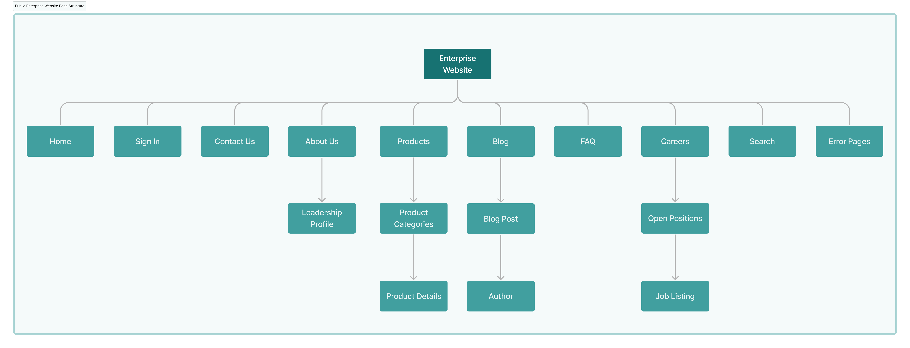
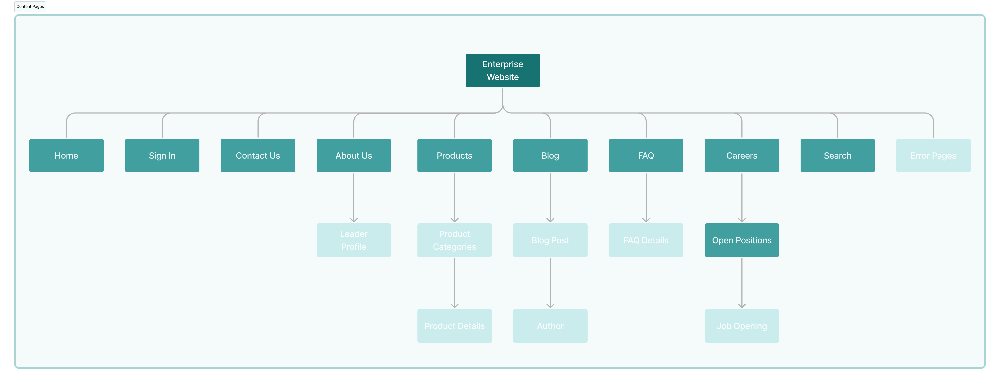
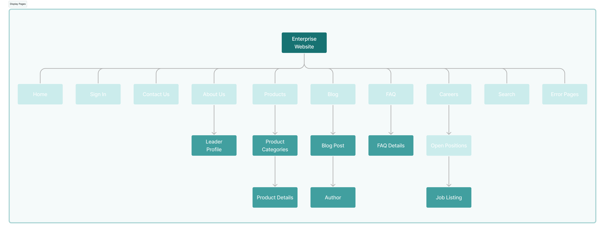
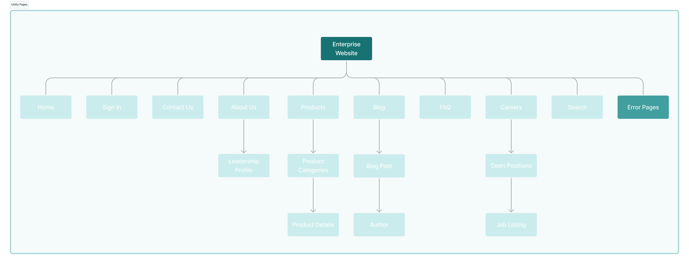

# Adding Pages to Clarity's Site

Pages are the fundamental building blocks of website structures. Each page is a canvas for designing engaging layouts with content (e.g., text, images, videos) and interactive elements (e.g., forms, widgets). Liferay's WYSIWYG editor and drag-and-drop elements provide an intuitive and user-friendly experience, so you can implement your vision without writing code. For advanced use cases, you can also create custom page elements using HTML, CSS, and JavaScript. To help you implement your solution, Liferay provides a variety of page types.

In this lesson, you’ll use different page types to implement Clarity’s site map introduced in the first module:

This site structure includes content pages, display pages, and utility pages.

## Content Pages

Content pages are used to create content-rich, visually engaging experiences. With an intuitive visual editor and drag-and-drop elements, you can quickly design page layouts, display content, and integrate functionality. Personalize content for specific audiences, manage localized translations, and optimize for all devices with the responsive layout editor. When integrated with Analytics Cloud, you can track content performance metrics and conduct A/B testing, creating page variants and track visitor data (e.g., bounce rate, clicks) to continuously improve engagement. Together, these features make content pages ideal for landing pages, marketing campaigns, and any scenario where presentation and user engagement are crucial.

!!! tip “Content Pages vs. Widget Pages”
    Liferay also provides widget pages, but this course focuses on building user experiences with content pages. Content pages provide superior flexibility and integration with Liferay’s latest content and personalization features, including fragments, collections, segmentation, and client extensions. Widget pages do not support these features.

## Display Pages

Display page templates define structures for displaying content at a dedicated URL. When you create or upload content items, Liferay generates a unique friendly URL for accessing it. However, you can only use this URL to view the content if you create one of these templates for displaying it. Display pages are built using the same UI and features as content pages. With these templates, you can establish a consistent visual style for different types of content.

## Utility Pages

Utility pages handle specific functions within a site. Currently, you can use them to create your site’s default 404 and 500 error pages. They are designed using the same tools and features as content pages. With them, you can ensure that even the errors returned to users maintain corporate branding while being easily maintained. Each site includes out-of-the-box error pages, which you can use or modify as needed.

## Exercise: Adding Content Pages

While logged in as Walter Douglas,

1. Open the *Site Menu*, expand *Site Builder*, and click *Pages*.

1. In the Static Pages tab, click *New* and select *Page*.

1. Select the *Blank* template.

   !!! note
       This applies a basic header and footer to an empty content page.

1. For name, enter Home and click *Add*.

   This creates a blank content page, from which you can access Liferay’s page builder tools and configuration options.

1. Click *Publish*.

1. Repeat this process for these pages:

   * Sign In
   * Contact Us
   * About Us
   * Products
   * Blog
   * FAQ
   * Careers
   * Open Positions
   * Search

With these pages in place, create the remaining parts of Clarity's site structure as display page templates.

## Exercise: Adding Display Page Templates

While logged in as Walter Douglas,

1. Open the *Site Menu*, expand *Design*, and click *Page Templates*.

1. Go to the *Display Page Templates* tab.

1. Click *New*.

1. Select *Blank*.

1. For name, enter Leader Profile.

1. For content type, select *Web Content Article*

1. For subtype, select *Basic Web Content*.

1. Click *Save*.

   This creates a blank display page template that’s linked to the selected content type. Each template has the same page building tools and configuration options as content pages.

1. Click *Publish*.

1. Repeat this process for these pages:

   * Eyeglasses
      * Content Type: Category

   * Sunglasses
      * Content Type: Category

   * Contacts
      * Content Type: Category

   * Lenses
      * Content Type: Category

   * Product Details
      * Content Type: Product

   * Blog Post
      * Content Type: Web Content Article > Basic Web Content

   * Blog Author
      * Content Type: Web Content Article > Basic Web Content

   * Job Opening
      * Content Type: Web Content Article > Basic Web Content

We'll revisit these templates in Module 7 to update some of their content types, but for now the site structure is complete. There's no need to create Clarity's utility pages since all Liferay sites include default error pages.

## Conclusion

Congratulations! You’ve laid the foundational page structure for Clarity’s site. Next, you’ll take these blank pages and start designing their layout. But before that, let's take a moment to review some core concepts for Liferay page design.

Next Up: [Understanding Page Design](./understanding-page-design.md)
