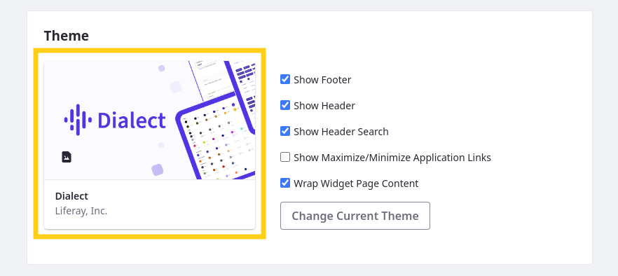
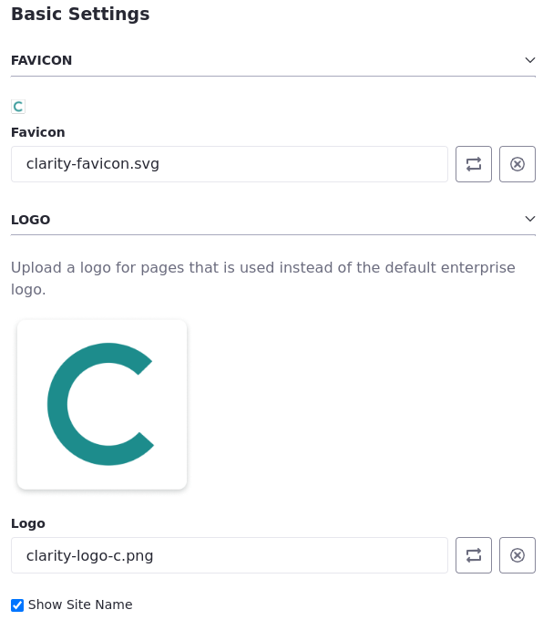

# Applying Clarity's Brand Styling

Liferay empowers users with a set of powerful styling tools for both technical and non-technical users, ensuring a consistent visual identity and user experience across your website. As previously explained, these tools, including themes, style books, frontend client extensions, and page element configurations. Together, they can streamline development and integrate existing styles.

So far, we've used the classic theme's default styling options. In this lesson, you'll use the Theme CSS client extension to overwrite these options. You'll also update the site's favicon and logo to make the platform align more closely with Clarity's branding.

<!--TASK: Expand instruction.

Address Favicons: Favicons are images used to identify sites in browser tabs.

Address Logos: The logo determines the image used to identify the site in the Liferay UI.

Address The Theme: Themes determine the baseline look and feel for your website, including color schemes, typography, spacing, and other styling options. They serve as the starting point for additional configurations that you can make using style books and frontend client extensions.

Address Client Extensions.

Also, should we use the JavaScript client extension? -->

## Exercise: Updating Clarity's Default Theme, Favicon, and Logo

<!-- Exercise 8e -->

Here you'll use the Theme CSS client extension to overwrite these options as Walter Douglas. You'll also update the site's favicon and logo to make the platform align more closely with Clarity's branding.

To do this,

1. Open the *Site Menu* (), expand *Site Builder*, and click *Pages*.

1. Click *Actions* () in the Application Bar and select *Configuration*.

1. Click *Change Current Theme* and select *Dialect*.

   

1. Under Basic Settings, click *Select Favicon* () and add the `clarity-favicon.svg` file found in the `[repository-folder]/exercises/lesson-8/` folder.

1. Click *Change Logo* () and select the `clarity-logo-c.png` file.

   

1. Scroll down to the bottom and click *Save*.

You can now explore site pages to see how these configurations have affected the site. Next, you'll deploy a client extension to apply Clarity's styling on top of the Dialect theme.

## Exercise: Deploying and Applying Clarity's Theme CSS Client Extension

<!-- Exercise 8f -->

Liferay offers frontend client extensions to provide a flexible and secure way to customize the appearance of your website. With them, you can inject design assets directly into your site pages, empowering you to achieve the desired look and feel without modifying Liferay’s core code.

The training workspace includes a theme CSS client extension for overriding the current theme's CSS files. Here you'll deploy it as Walter Douglas.

To deploy Clarity's theme CSS client extension:

1. Open a new terminal window and go to the `liferay-clarity-theme-css` folder in your local copy of the training workspace (i.e., `[repository-folder]/client-extensions/liferay-clarity-theme-css`)

1. Run this command to build and deploy the client extension:

   **Blade**:

   ```bash
   blade gw clean deploy
   ```

   **Unix-based systems**:

   ```bash
   ../../../../gradlew clean deploy
   ```

   **Windows**:

   ```bash
   ..\..\gradlew.bat clean deploy
   ```

1. Verify the command executes successfully in your instance logs.

   ```bash
   2024-05-09 16:17:41.233 INFO  [fileinstall-directory-watcher][BundleStartStopLogger:68] STARTED liferayclaritythemecss*7.4.13 [1449]
   ```

   Now that you've deployed the client extension, you can apply it to your pages.

1. In Clarity's site, open the *Site Menu* (), expand *Site Builder*, and click *Pages*.

1. Click *Actions* () in the Application Bar and select *Configuration*.

1. Under Customization, click *Plus* () for Theme CSS and select *Liferay Clarity Theme CSS*.

   

1. Click *Save*.

   This applies the theme to all of Clarity's pages.

   !!! note
       After applying the client extension, you may need to clear your browser cache for the pages to appear as intended.

You can now explore Clarity's site to see how applying the theme has updated the styling of page elements.


## Conclusion

Congratulations, you've completed Module 6: Site Building. Throughout this module, you've finished setting up Clarity's site architecture and styling. Next, you'll learn about content authoring and management.

Up Next: [Module 7: Content Authoring and Management](../../module-7-content-authoring-and-management.md)
