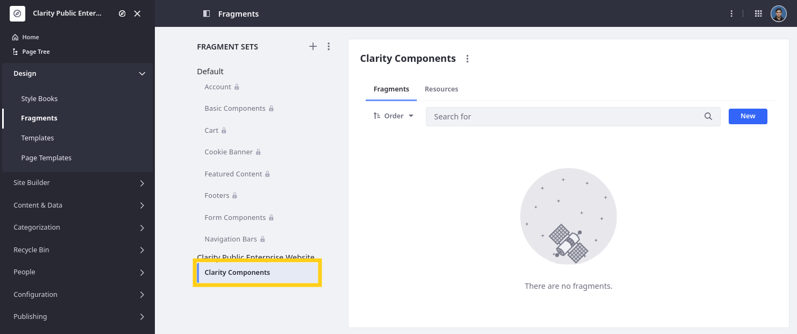
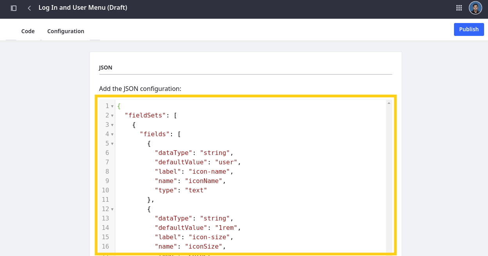
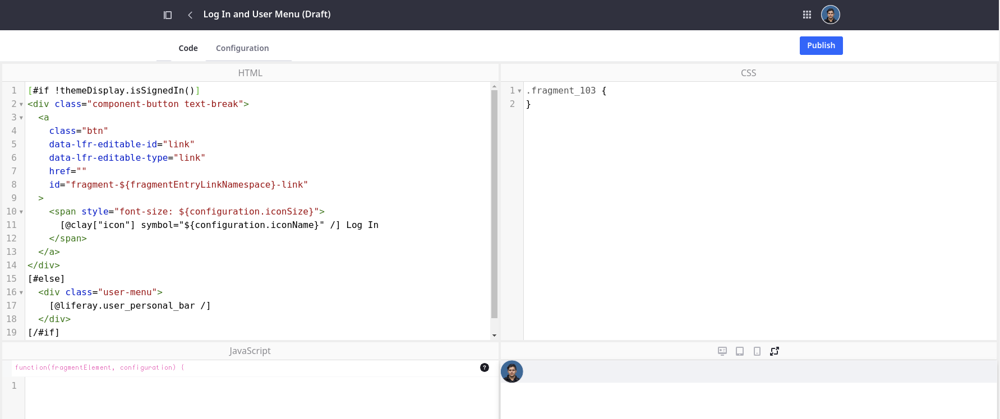

# Creating Custom Fragments for Clarity

Liferay offers a wide range of out-of-the-box fragments and configurations to help streamline website development. However, when these options don't satisfy your design requirements, you can quickly create custom fragments using HTML, CSS, and JavaScript. In addition to these core web development languages, you can leverage Clay utilities<!--w/c? Styles?-->, define configuration options using JSON, and add Liferay-specific tags and attributes. These elements empower you to define editable sections, embed widgets, reuse available classes, and more.

<!--TASK:  -->

Liferay DXP includes the fragments editor UI for creating and managing fragments in your site. You can also export fragment sets to work locally and them import them back into Liferay. You can also instantiate a React component in a fragment using static JS imports. Additionally, you can export fragment sets and work on them locally, using your preferred tools. Then, once your local work is complete, you can import the set back into Liferay. Furthermore, you can instantiate React components within your page fragments using static JavaScript imports, expanding the range of functionalities you can integrate into your custom fragments.

Here you'll use the Fragments Editor UI to create and import Clarity's custom fragments.

!!! tip “When to Use Custom Fragments”
    Liferay recommends using out-of-the-box fragments and configuration options whenever possible. Also, when you do need custom fragments, Liferay recommends leveraging available style tokens to simplify fragment code, which promotes design consistency across your website elements and improved maintainability.

<!--TASK: Explain how to add configurations. -->

## Exercise One: Creating the Clarity Fragment Set

Liferay organizes fragments into sets to improve management and create an additional level of resource control. These sets can group fragments by functionality, team, or any other relevant characteristic. You can also add resources to fragment sets, making them accessible only to fragments within that set.

Clarity wants a fragment set for storing custom master page fragments. While logged in as Walter Douglas,

1. Open the *Site Menu* (), expand *Design*, and click *Fragments*.

1. Click the *Add* button ().

1. For name, enter `Clarity Master Pages`.

1. Click *Save*.

   

Now that you have the Clarity fragment set, you can start adding custom fragments to it.

## Exercise Two: Creating Custom Fragments

When creating a fragment, you can copy and modify existing fragments or start from scratch. You can also create custom fragments by saving container compositions in the page editor. Saving container compositions offers a convenient way to recreate specific arrangements of fragments on other pages. However, you cannot edit compositions via the Fragments Editor UI.

Clarity needs three custom fragments for their master pages:

* Log In and User Menu
* Search Bar
<!-- * Legal Bar -->

To create the Login and User Menu fragment,

1. Click *New*, select Basic Fragment, and click *Next*.

1. Enter `Login and User Menu` and click *Add*.

1. Go to the *Configuration* tab and enter this code:

   ```json
   {
      "fieldSets": [
         {
            "fields": [
               {
                  "dataType": "string",
                  "defaultValue": "user",
                  "label": "icon-name",
                  "name": "iconName",
                  "type": "text"
               },
               {
                  "dataType": "string",
                  "defaultValue": "1rem",
                  "label": "icon-size",
                  "name": "iconSize",
                  "type": "select",
                  "typeOptions": {
                     "validValues": [
                        {
                           "value": "1rem"
                        },
                        {
                           "value": "1.5rem"
                        },
                        {
                           "value": "2rem"
                        },
                        {
                           "value": "2.5rem"
                        },
                        {
                           "value": "3rem"
                        }
                     ]
                  }
               }
            ]
         }
      ]
   }
   ```

   

1. Return to the *Code* tab and enter copy this into the HTML window:

   ```html
   [#if !themeDisplay.isSignedIn()]
   <div class="component-button text-break">
      <a
         class="btn"
         data-lfr-editable-id="link"
         data-lfr-editable-type="link"
         href=""
         id="fragment-${fragmentEntryLinkNamespace}-link"
      >
         <span style="font-size: ${configuration.iconSize}">
            [@clay["icon"] symbol="${configuration.iconName}" /] Log In
         </span>
      </a>
   </div>
   [#else]
      <div class="user-menu">
         [@liferay.user_personal_bar /]
      </div>
   [/#if]
   ```

   

1. Click *Publish*.

<!--TASK:
## Exercise Three: Importing Fragments

__.

## Exercise Four: Adding Custom Fragments to Master Pages

__. -->

## Conclusion

Congratulations! You've created and imported custom fragments and compositions for Clarity's pages. Next, you’ll use them to wireframe the content area for each content page, display page, and utility page.

Next Up: [Wireframing Clarity’s Pages](./wireframing-claritys-pages.md)
