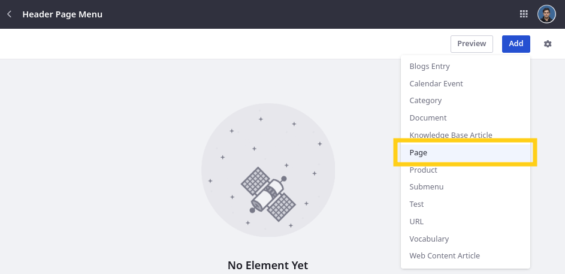
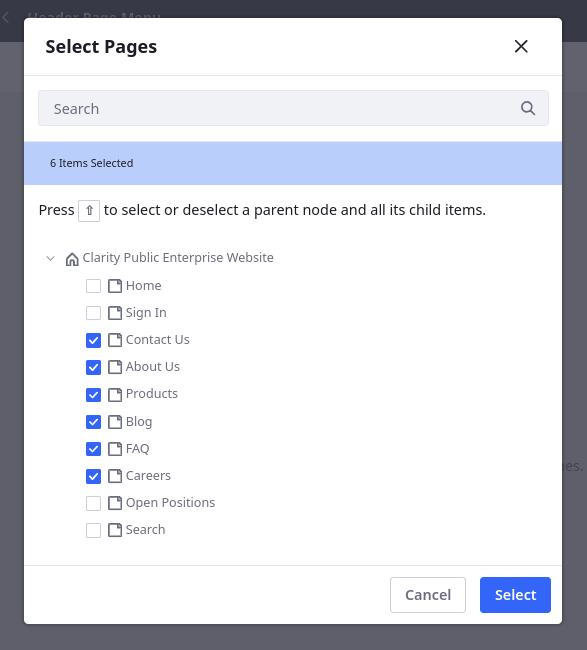
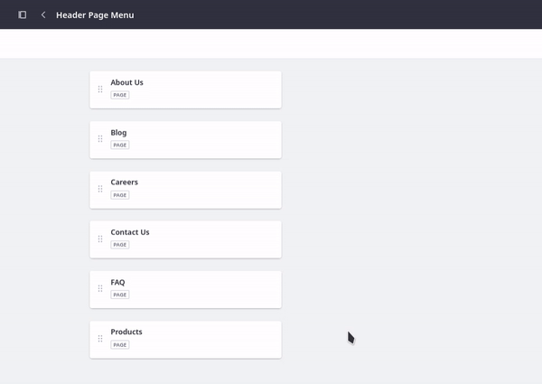
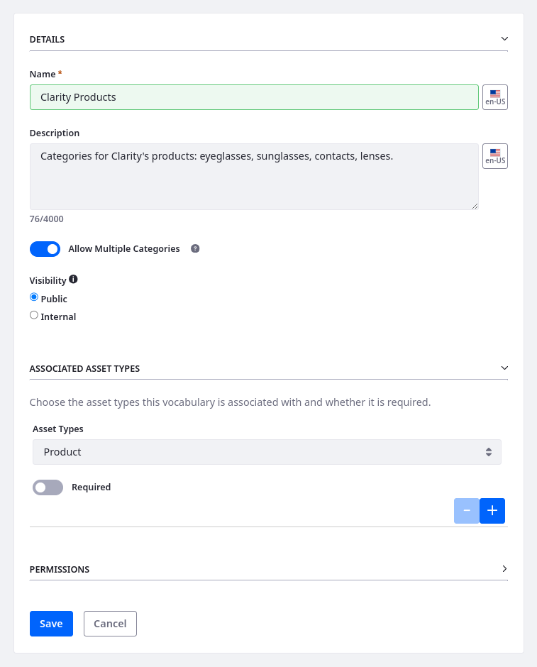
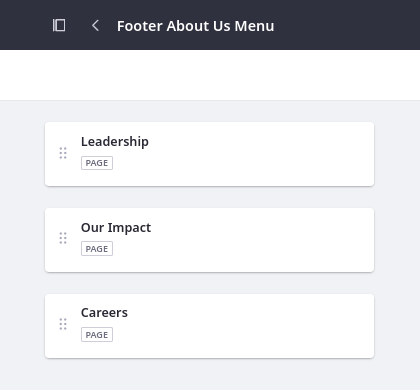
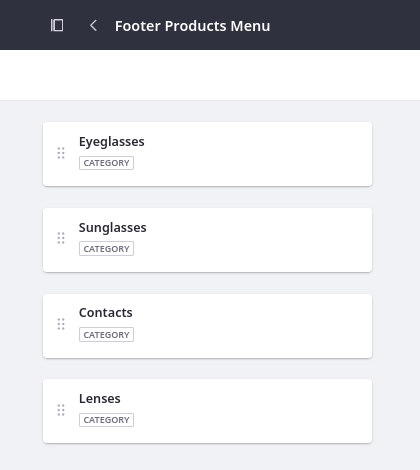
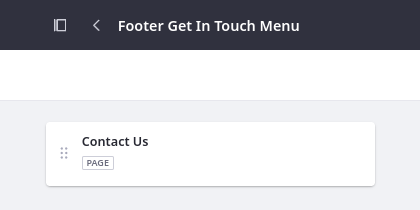
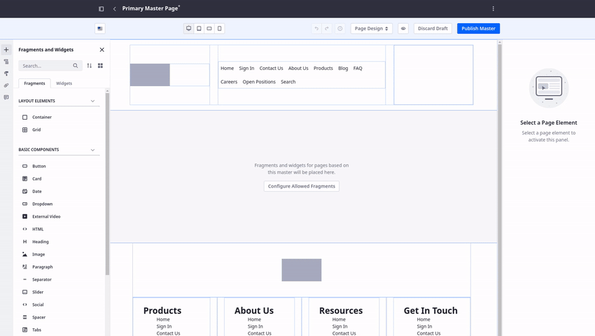

# Creating Navigation Menus for Clarity’s Master Pages

Navigation is an integral part of designing a clear and intuitive user experience. In Liferay, setting up navigation involves creating menus and then adding them to pages using widgets or fragments. Each menu can include links to both internal and external pages or content. Since pages and navigation are decoupled, you can organize your pages and content without worrying about how it will affect navigation. You can also customize the look and feel of your menus and even tailor navigation based on user roles, preferences, or location, to deliver personalized experiences. In these ways, Liferay’s flexible navigation menus can help ensure users easily find what they need.

As seen in the previous exercises, Clarity’s header and footer designs include multiple navigation menus. When wireframing the master pages, you used the default menu, which includes all site content pages. Now it is time to create custom menus that only include the desired pages. Then you can update the master pages to use them instead of the default menu.

## Exercise One: Creating the Header Navigation Menu

Clarity wants to focus visitor attention on their values and products. They also want to make sure users can find promotional content, FAQs, and career opportunities. To do this, they want to update their header navigation to only include these pages: Products, About Us, Blog, FAQ, Careers, and Contact Us.

While logged in as Walter Douglas,

1. Open the *Site Menu* (), expand *Site Builder*, and click *Navigation Menus*.

1. Click *New*.

1. For name, enter `Header Page Menu`.

   

1. Click *Save*.

This creates a blank menu and directs you to its edit page. Now you can add pages to it.

## Exercise Two:  Adding Pages to the Menu

While editing the menu,

1. Click *Add*. This displays a list of available types of items you can add to the menu.

1. Select the *Page* item type.

   

1. Check these pages:

   * About Us
   * Blog
   * Careers
   * Contact Us
   * FAQ
   * Products

   

1. Click *Select*. This saves your changes to the menu.

1. Click the *Actions* button () for one of the menu items and select *View Info*. This opens a side panel where you can update its display name if desired.

   

1. Drag and drop the pages into this order:

   * Products
   * About Us
   * Blog
   * FAQ
   * Careers
   * Contact Us

   

   <!--TASK: Update gif-->

These changes are saved automatically, so the menu is ready for use in the master pages.

## Exercise Three: Creating Categories for the Products Menu

Before creating the footer Products menu, you must add the product categories (e.g., Eyeglasses, Sunglasses). This is because the menu links to the display page for each categories. Here, we'll cover this material quickly as a prerequisite for making the navigation menu. Module 7 will revisit and explore categorization in greater detail.

1. Open the *Global Menu* () and go to the *Global* site.

   !!! important "Using the Global Site"
       The Global Site shares content to all sites, but with significant limitations. To begin with, you cannot limit which sites can access the Global Site's content. Additionally, managing permissions and content organization within the Global Site can be overly complex and burdensome. Therefore, reserve the Global Site for non-sensitive content requiring universal availability. For content sharing across sites, use Asset Libraries when possible. You'll revisit this topic in Module 7.

1. Open the *Site Menu* (), expand *Categorization*, and click *Categories*.

1. Click the *Add* button () to create a vocabulary and enter these details:

   | Field                     | Value                                                                        |
   |:--------------------------|:-----------------------------------------------------------------------------|
   | Name                      | Clarity Products                                                             |
   | Description               | Categories for Clarity's products: eyeglasses, sunglasses, contacts, lenses. |
   | Allow Multiple Categories | Yes                                                                          |
   | Visibility                | Public                                                                       |
   | Asset Types               | Product                                                                      |
   | Required                  | No                                                                           |

   

1. Click *Save*.

1. Click *New* and add these categories:

   | Name       | Description                                                                                                                   |
   |:-----------|:------------------------------------------------------------------------------------------------------------------------------|
   | Eyeglasses | Elevate your style with precision-crafted eyeglasses that seamlessly merge high quality with sustainability.                  |
   | Sunglasses | Make a bold statement with our stylish and sustainable sunglasses, combining cutting-edge design with uncompromising quality. |
   | Contacts   | Explore our range of contact lenses for a seamless blend of comfort and clarity.                                              |
   | Lenses     | Experience unparalleled clarity with our premium lenses, meticulously engineered for optimal vision and lasting performance.  |

   !!! tip
       Click *Save and Add a New One* to create another category.

   

Great! Now that you've added these categories, you can return to *Clarity Public Enterprise Website*, open the *Navigation Menus* application, and create the footer navigation menus.

## Exercise Four: Creating the Footer Navigation Menus

Repeat the steps from exercises one and two to create these four menus for the page footer.

### Footer Products Menu

**Name**: Footer Products Menu

**Menu Items**: Eyeglasses, Sunglasses, Contacts, Lenses

To create this menu, select the URL type for each entry and enter these values:

| Menu Item  | Type | Value                                                 |
|:-----------|:-----|:------------------------------------------------------|
| Eyeglasses | URL  | `/web/clarity/g/eyeglasses` |
| Sunglasses | URL  | `/web/clarity/g/sunglasses` |
| Contacts   | URL  | `/web/clarity/g/contacts`   |
| Lenses     | URL  | `/web/clarity/g/lenses`     |

### Footer About Us Menu

**Name**: Footer About Us Menu

**Menu Items**: Leadership, Our Impact, Careers

The Leadership and Our Impact links should direct users to the About Us page. To do this, just add the page twice and use custom names for each menu item.

| Menu Item  | Type | Value    |
|:-----------|:-----|:---------|
| Leadership | Page | About Us |
| Our Impact | Page | About Us |
| Careers    | Page | Careers  |

### Footer Resources Menu

**Name**: Footer Resources Menu

**Menu Items**: Blog, FAQ

| Menu Item | Type | Value |
|:----------|:-----|:------|
| Blog      | Page | Blog  |
| FAQ       | Page | FAQ   |

### Footer Get In Touch Menu

**Name**: Footer Get In Touch Menu

**Menu Items**: Contact Us

| Menu Item  | Type | Value      |
|:-----------|:-----|:-----------|
| Contact Us | Page | Contact Us |

### Footer Legal Menu

**Name**: Footer Legal Menu

**Menu Items**: N/A

For now, leave this menu empty. You'll return to it in Module 7.

Now that the menus are defined, you can update the existing menu displays in the master pages to use them.

## Exercise Five: Updating the Master Pages

When you add a menu display fragment or widget to a page, you can determine which menu to display. To do this,

1. Begin editing the primary master page.

1. Select the menu display fragment in the header.

1. In the configuration side panel, set the source to Header Page Menu.

   

   <!--TASK: Update gif -->

1. Repeat the above process for the menu displays in the footer.

1. Click *Publish Master*.

1. Repeat the above process to update the secondary master page’s menus.

Once finished, navigate to the Home page to see how your changes to the template were automatically applied to the connected pages.

<!-- TASK:  -->

## Conclusion

Congratulations! You’ve finished setting up the navigation menus for Clarity’s master pages. Next you'll create custom fragments to finish Clarity's page headers.

Next Up: [Creating Custom Fragments for Clarity](./creating-custom-fragments-for-clarity.md)
