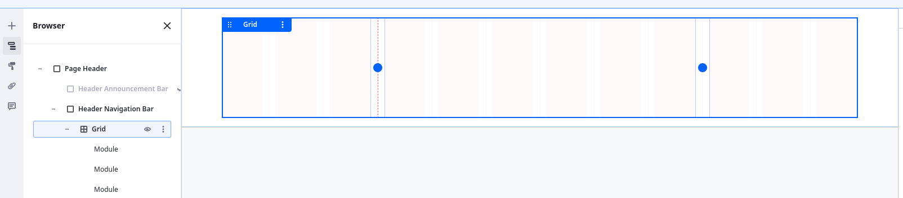
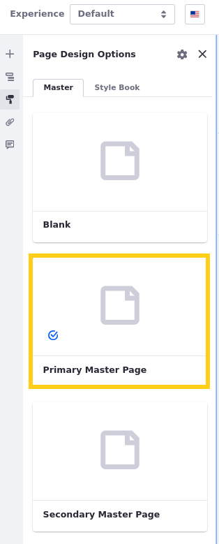

# Designing Clarity’s Master Pages

The first step in designing pages is to determine their fundamental structure. In Liferay, this means designing master page templates. Built with the same tools and elements as pages, these templates establish the fundamental layout inherited by all pages that use them. This includes a header, footer, and central content area. The content area determines the body of the page that users can edit when building pages from the template, while anything outside this central area cannot be edited, ensuring consistency across the site. Furthermore, edits made to the master template automatically propagate to connected pages, streamlining maintenance.

Given their site designs, Clarity needs two master page templates: a primary template that includes a detailed header and footer, and a secondary template with a simplified header and footer. Before creating and wireframing the master pages, let’s review Clarity’s designs.

## Primary Master Page

Clarity’s primary header and footer include navigation, branding, and search elements. Most pages in Clarity’s site map should use this master page.

### Primary Header

The primary header consists of two rows, with the second row divided into three columns.

| Row        | Page Elements                                       |
|:-----------|:----------------------------------------------------|
| First Row  | Header Announcement Bar                             |
| Second Row | Image, Navigation Menu, Search Button, Login Button |

### Primary Footer

The primary footer consists of three rows, with the second row divided into four columns.

| Row        | Page Elements                       |
|:-----------|:------------------------------------|
| First Row  | Image                               |
| Second Row | Four Headers, Four Navigation Menus |
| Third Row  | Text, Three Links                   |

## Secondary Master Page

Clarity needs a simplified header and footer for unique pages where they don’t want to display their announcement banner or footer navigation, like their sign in page and error pages.

### Secondary Header

The secondary header is the same as the second row of the primary header and does not include the announcement bar.

| Row       | Page Elements                                       |
|:----------|:----------------------------------------------------|
| First Row | Image, Navigation Menu, Search Button, Login Button |

### Secondary Footer

The secondary footer is the same as the third row of the primary footer and does not include the first or second rows.

| Row       | Page Elements     |
|:----------|:------------------|
| First Row | Text, Three Links |

## Page Building Elements

To build these designs, you’ll primarily use fragments. As previously explained, Liferay fragments are reusable building blocks for constructing pages. They are essentially flexible page elements made of HTML, CSS, and JavaScript that you can drag and drop into pages.

Some fragments are layout elements that define drop zones within pages and templates. These include Containers, which define a single `
`, and Grids, which can define any number of `
`s in rows and columns. Other fragments are components that add text, images, buttons, menus, forms, and more to your page. You can go to [Default Fragments Reference](https://learn.liferay.com/web/guest/w/dxp/site-building/creating-pages/page-fragments-and-widgets/using-fragments/default-fragments-reference) for a complete list of Liferay's out-of-the-box fragments.

Once added to a page, you configure each fragment’s styling and behavior. For example, when you add a container to a page, you can determine the container’s display behavior (`block`, `flex`), spacing (`margin`, `padding`), dimensions (`width`, `height`), background, and more. You can go to [Configuring Fragments](https://learn.liferay.com/web/guest/w/dxp/site-building/creating-pages/page-fragments-and-widgets/using-fragments/configuring-fragments) for a list of available configuration options.

We’ll revisit these configurations later in this module. But for now, let’s use these page elements to wireframe the primary and secondary master page templates.

## Exercise: Designing Clarity's Master Pages

<!-- Exercise 6c -->

In Liferay, designing page headers and footers involves creating master page templates. These templates are designed using the same tools and elements as pages.

The training workspace provides the *Primary Master Page* template. While this template includes the footer, it does not include a header. Here you'll add the header as Walter Douglas.

To do this,

1. Open the *Site Menu* (), expand *Design*, and click *Page Templates*.

1. In the Masters tab, click the *Primary Master Page* template to begin editing it.

1. Open the *Fragments and Widgets* tab () in the side panel.

1. Add a container to the top of the template. This container is for the page header.

   !!! note
       When designing a page, it’s recommended to always put elements into their own containers. This can help provide more control over styling.

1. Go to the *Browser* tab in the side panel (), double-click the name of the container and rename it `Page Header`.

   !!! note
       Naming fragments adds a custom `data-name` attribute to the `
` that you can use in your JavaScript and CSS. This can help bring clarity to complex page structures and provide more control over your site.

   <!--
   !!! note
       By default, containers and grids automatically adjust to the size of their content, like the Header Navigation container adjusted to the dimensions of the menu display fragment.
   -->

1. Add two separate containers to the Page Header container and name them `Header Announcement Bar` and `Header Navigation Bar`.

   * **Header Announcement Bar**: This container is for displaying Clarity’s announcements.

   * **Header Navigation Bar**: This container is for essential elements, including Clarity's logo, main navigation menu, search bar, and user menu.

   !!! tip
       To duplicate a page element while editing, press CTRL + D.

   

1. Select the *Header Announcement Bar* and configure these settings in the configuration side panel:

   | Tab     | Setting           | Value                     |
   |:--------|:------------------|:--------------------------|
   | General | Content Display   | Flex Row                  |
   | General | Align Items       | Center                    |
   | General | Justify Content   | Center                    |
   | Styles  | Spacing > Padding | Spacer 2 (top and bottom) |

   

   !!! note
       Use the green boxes to add padding. This adds space between the container and its contents.

   You'll see these settings take effect when you add page elements to the container.

   For now, leave this container empty and toggle its visibility (); you’ll revisit it in a later exercise.

1. Select the *Header Navigation Bar* container and configure these settings:

   | Tab     | Setting           | Value                                                    |
   |:--------|:------------------|:---------------------------------------------------------|
   | General | Container Width   | Fixed Width                                              |
   | Styles  | Spacing > Padding | Spacer 3 (top and bottom)   Spacer 6 (left and right) |

   

1. Add a *Grid* element to the Header Navigation Bar container.

1. Widen the center module by dragging the dividers outward one space on each side.

   

1. Select the grid and configure these settings:

   | Tab     | Setting            | Value   |
   |:--------|:-------------------|:--------|
   | General | Vertical Alignment | Middle  |
   | General | Overflow           | Visible |

1. Add a container to each grid area and name them Header Branding, Header Navigation, and Header User Actions.

   * **Header Branding**: This container is for Clarity’s logo.

   * **Header Navigation**: This container is for the page navigation menu.

   * **Header User Actions**: This container is for the search bar and user login/menu.

   

1. Select the *Header Branding* container and configure these settings:

   | Tab     | Setting         | Value    |
   |:--------|:----------------|:---------|
   | General | Content Display | Flex Row |
   | General | Align Items     | Center   |
   | General | Justify Content | Start    |

1. Select the *Header Navigation* container and configure these settings:

   | Tab     | Setting         | Value    |
   |:--------|:----------------|:---------|
   | General | Content Display | Flex Row |
   | General | Align Items     | Center   |
   | General | Justify Content | Center   |

1. Select the *Header User Actions* container and configure these settings:

   | Tab     | Setting         | Value    |
   |:--------|:----------------|:---------|
   | General | Content Display | Flex Row |
   | General | Align Items     | Center   |
   | General | Justify Content | End      |

1. Add these fragments to the containers:

   | Container           | Fragment            |
   |:--------------------|:--------------------|
   | Header Branding     | Image               |
   | Header Navigation   | Menu Display        |
   | Header User Actions | Login and User Menu |

   !!! note
       The "Login and User Menu" fragment is a custom fragment provided in the Clarity Components fragment set. In a later lesson, you'll create a custom fragment for the header's search button.

For now, this completes the wireframing for the primary master page. You'll revisit it again in the following lessons to update its menus and add both the search bar and login button. Next, you'll configure the template's allowed fragments.

## Exercise: Configuring Allowed Fragments

<!-- Exercise 6d -->

When editing a master page template, you can configure which fragments are allowed in pages that use the template. This helps ensure consistent design and prevents users from adding incorrect elements to pages that use the template.

To ensure users only add the appropriate fragments to pages with the Primary Master Page template, Clarity wants to limit the available fragments. Here you'll configure the allowed fragments for the Primary Master Page template as Walter Douglas.

To do this,

1. While editing the Primary Master Page template, click *Configure Allowed Fragments* in the Page Body container.

1. Uncheck these fragments to prevent users from adding them to pages using the template:

   * Account (fragment set)
   * Cart (fragment set)
   * Footers (fragment set)
   * Navigation Bars (fragment set)
   * Knowledge Base Navigation (fragment)
   * Product (fragment set)

   

1. Click *Save*.

1. Click *Publish Master*.

1. Click *Ok* in the popup stating:

   > Changes made to this master are going to be propagated to all page templates, display page templates, and pages using it. Are you sure you want to proceed?

Now when the template is applied to a page, users can only add the allowed fragments to the page. But before we apply the template to any pages, let’s create the secondary master page that Clarity wants to use for their sign in and utility pages.

## Exercise: Creating a Secondary Master Page

<!-- Exercise 6e -->

Clarity needs a simplified master page for pages that shouldn't include the announcement banner and detailed footer. Here you'll create that template as Walter Douglas.

To do this,

1. While in the Masters tab of the Page Templates application, click *Actions* () for the Primary Master Page and select *Make a Copy* &rarr; *Master Page*.

   

1. Click *Actions* () for the copy and select *Rename*.

1. Enter `Secondary Master Page` and click *Save*.

1. Begin editing the template and remove these containers:

   * Header Announcement Bar
   * Footer Branding
   * Footer Navigation

   

1. Click *Publish Master*.

Great! Clarity now has both a primary and secondary master page template. You can now apply both master pages to their respective pages.

## Exercise: Applying the Master Pages

<!-- Exercise 6f -->

When you create a content page or display page template, you must select a master page. While most pages in your training workspace already use the correct master page, several pages do not.

Here you'll configure these pages assigning them the correct master page as Walter Douglas.

To do this,

1. Begin editing one of these pages.

   * Home (Content Page)
   * Sign In (Content Page)
   * 404 Error (Utility Page)
   * 500 Error (Utility Page)
   * Leadership Profile (Display Page Template)

   To access the utility pages, open the *Site Menu* (), expand *Site Builder*, click *Pages*, and go to the *Utility Pages* tab.

   To access the display page template, open the *Site Menu* (), expand *Design*, click *Page Templates* and go to the *Display Page Templates* tab.

1. Go to the *Page Design Options* tab () in the left side panel.

1. Select the appropriate *master page*.

   * **Home**: Primary Master Page
   * **Sign In**: Secondary Master Page
   * **404 Error**: Secondary Master Page
   * **500 Error**: Secondary Master Page
   * **Leadership Profile**: Secondary Master Page

   

1. Click *Publish*.

1. Repeat this process until you've finished applying the master pages.

Once finished, each page should be linked to the correct master page template. Now any changes made to the templates are automatically applied to each page using it.

## Conclusion

Congratulations! You’ve started wireframing Clarity’s headers and footers. Next, you’ll create custom navigation menus and use them for these master page templates so they only include the desired pages.

Next Up: [Creating Navigation Menus for Clarity’s Master Pages](./creating-navigation-menus-for-claritys-master-pages.md)
