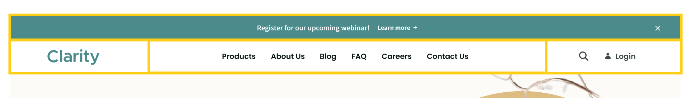
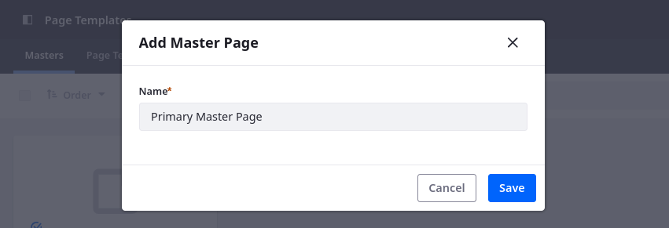
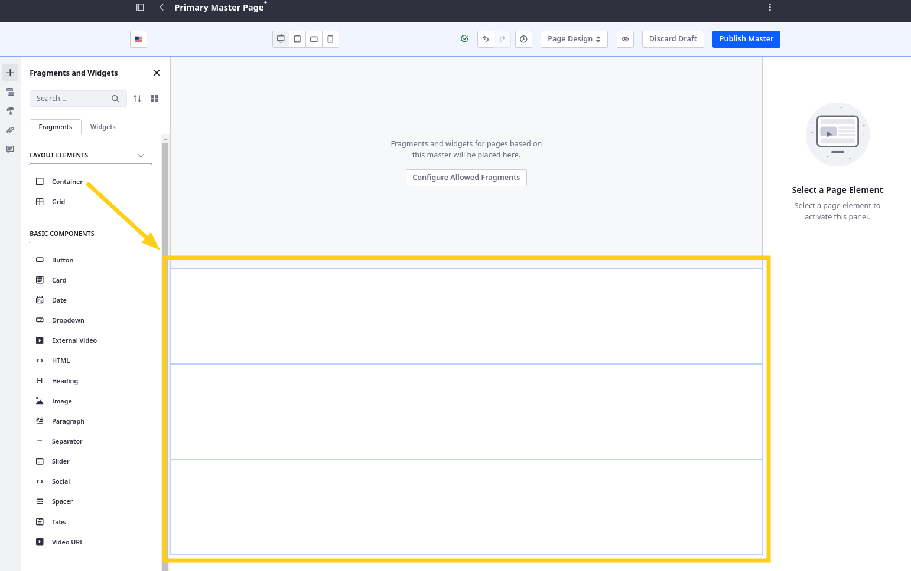
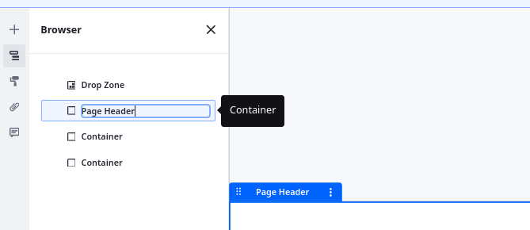
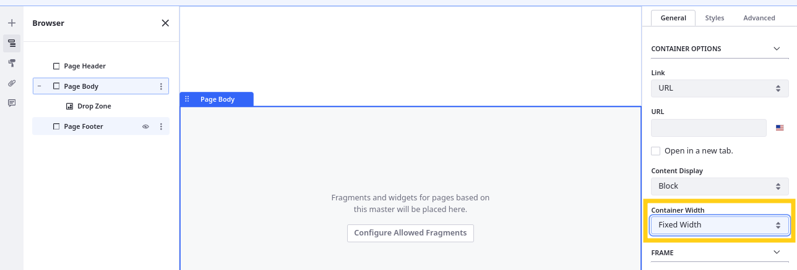
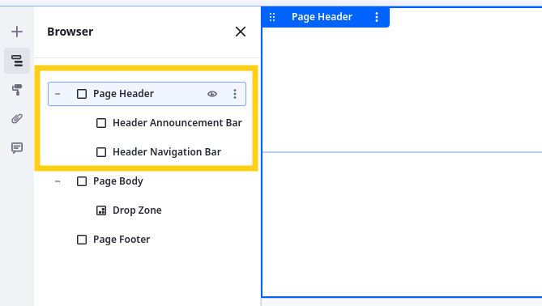
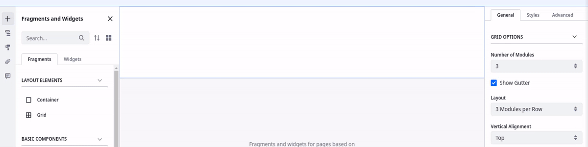
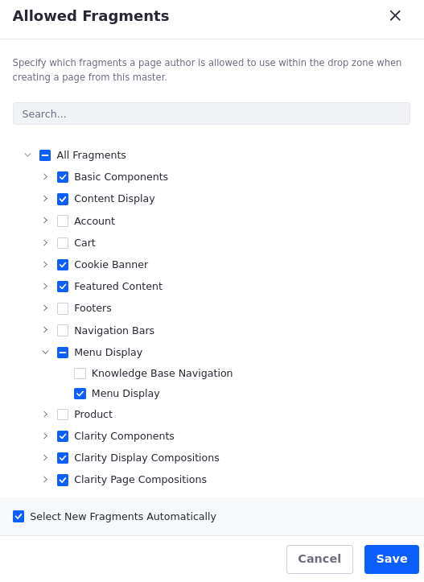
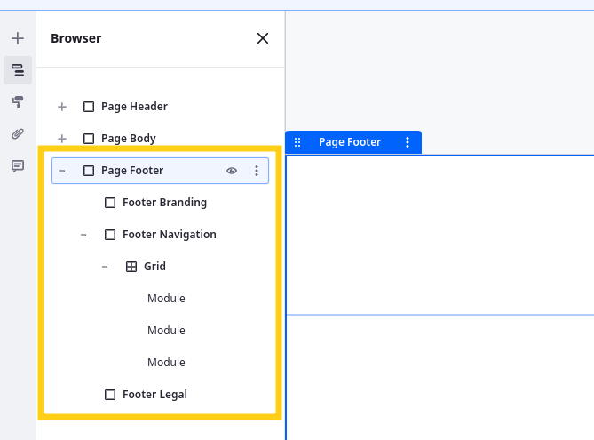

# Designing Clarity’s Master Pages

The first step in designing pages is to determine their fundamental structure. In Liferay, this means designing master page templates. Built with the same tools and elements as pages, these templates establish the fundamental layout inherited by all pages that use them. This includes a header, footer, and central content area. The content area determines the body of the page that users can edit when building pages from the template, while anything outside this central area cannot be edited, ensuring consistency across the site. Furthermore, edits made to the master template automatically propagate to connected pages, streamlining maintenance.

Given their site designs, Clarity needs two master page templates: a primary template that includes a detailed header and footer, and a secondary template with a simplified header and footer. Before creating and wireframing the master pages, let’s review Clarity’s designs.

## Primary Master Page

Clarity’s primary header and footer include navigation, branding, and search elements. Most pages in Clarity’s site map should use this master page.

### Primary Header

The primary header consists of two rows, with the second row divided into three columns.

| Row        | Page Elements                                       |
|:-----------|:----------------------------------------------------|
| First Row  | Header Announcement Bar                             |
| Second Row | Image, Navigation Menu, Search Button, Login Button |

### Primary Footer

The primary footer consists of three rows, with the second row divided into four columns.

| Row        | Page Elements                       |
|:-----------|:------------------------------------|
| First Row  | Image                               |
| Second Row | Four Headers, Four Navigation Menus |
| Third Row  | Text, Three Links                   |

## Secondary Master Page

Clarity needs a simplified header and footer for unique pages where they don’t want to display their announcement banner or footer navigation, like their sign in page and error pages.

### Secondary Header

The secondary header is the same as the second row of the primary header and does not include the announcement bar.

| Row       | Page Elements                                       |
|:----------|:----------------------------------------------------|
| First Row | Image, Navigation Menu, Search Button, Login Button |

### Secondary Footer

The secondary footer is the same as the third row of the primary footer and does not include the first or second rows.

| Row       | Page Elements     |
|:----------|:------------------|
| First Row | Text, Three Links |

## Page Building Elements

To build these designs, you’ll primarily use fragments. As previously explained, Liferay fragments are reusable building blocks for constructing pages. They are essentially flexible page elements made of HTML, CSS, and JavaScript that you can drag and drop into pages.

Some fragments are layout elements that define drop zones within pages and templates. These include Containers, which define a single `
`, and Grids, which can define any number of `
`s in rows and columns. Other fragments are components that add text, images, buttons, menus, forms, and more to your page. You can go to [Default Fragments Reference](https://learn.liferay.com/web/guest/w/dxp/site-building/creating-pages/page-fragments-and-widgets/using-fragments/default-fragments-reference) for a complete list of Liferay's out-of-the-box fragments.

Once added to a page, you configure each fragment’s styling and behavior. For example, when you add a container to a page, you can determine the container’s display behavior (`block`, `flex`), spacing (`margin`, `padding`), dimensions (`width`, `height`), background, and more. You can go to [Configuring Fragments](https://learn.liferay.com/web/guest/w/dxp/site-building/creating-pages/page-fragments-and-widgets/using-fragments/configuring-fragments) for a list of available configuration options.

We’ll revisit these configurations later in this module. But for now, let’s use these page elements to wireframe the primary and secondary master page templates.

## Exercise One: Creating the Primary Master Page

To begin, create the primary master page template for Clarity’s public pages.

While logged in as Walter Douglas,

1. Open the *Site Menu* (), expand *Design*, and click *Page Templates*.

1. In the Masters tab, click *New*.

1. For name, enter `Primary Master Page` and click *Save*.

   

This creates a blank template and directs you to its edit page so you can begin designing it.

## Exercise Two: Wireframing the Header and Footer

Now that the blank template exists, let’s begin wireframing it. A website wireframe is a basic blueprint, focusing on layout and functionality, before integrating styling and content. By default, each master page includes a Drop Zone element. This represents the central content area of a page that is editable to page designers once the template is applied. Here you’ll wireframe the header and footer for the primary master page.

### Creating the Primary Header

While editing the master page template,

1. Open the *Fragments and Widgets* tab () in the side panel.

1. Add three separate containers to the template. These are for the three major areas of the page (i.e., the header, body, and footer).

   !!! tip
       When designing a page, it’s recommended to always put elements into their own containers. This can help provide more control over styling.

   

1. Go to the *Browser* tab () in the side panel, double-click the name of each container and rename them `Page Header`, `Page Body`, and `Page Footer`.

   !!! tip
       Naming fragments adds a custom `data-name` attribute to the `
` that you can use in your JavaScript and CSS. This can help bring clarity to complex page structures and provide more control over your site. <!--IMPROVE-->

   

1. Drag and drop the *Drop Zone* element into the Page Body container.

1. Add two separate containers to the Page Header container and name them `Header Announcement Bar` and `Header Navigation Bar`.

   * **Header Announcement Bar**: This container is for displaying Clarity’s announcements. For now, leave this container blank and toggle the fragment's visibility (); you’ll revisit it in Module 7.

   * **Header Navigation Bar**: This container is for essential elements, including Clarity's logo, main navigation menu, search bar, and user menu.

   

1. Select the *Header Navigation Bar* container and configure these settings:

   | Tab     | Setting         | Value                                                    |
   |:--------|:----------------|:---------------------------------------------------------|
   | General | Content Display | Block                                                    |
   | Styles  | Padding         | Spacer 3 (top and bottom)   Spacer 6 (left and right) |

   <!--
   1rem = Spacer 3
   5rem = Spacer 6/7?
   -->

   

1. Add a grid element to the Header Navigation Bar container and widen the center module by dragging the dividers outward one space on each side.

   

1. Select the grid and configure these settings:

   | Tab     | Setting            | Value  |
   |:--------|:-------------------|:-------|
   | General | Vertical Alignment | Middle |

1. Add a container to each grid area and name them Header Branding, Header Navigation, and Header User Actions.

   * **Header Branding**: This container is for Clarity’s logo.

   * **Header Navigation**: This container is for the page navigation menu.

   * **Header User Actions**: This container is for the search bar and user login/menu.

   

1. Select the *Header Branding* container and configure these settings:

   | Tab     | Setting         | Value    |
   |:--------|:----------------|:---------|
   | General | Content Display | Flex Row |
   | General | Align Items     | Start    |
   | General | Justify Content | Start    |

1. Select the *Header Navigation* container and configure these settings:

   | Tab     | Setting         | Value    |
   |:--------|:----------------|:---------|
   | General | Content Display | Flex Row |
   | General | Align Items     | Center   |
   | General | Justify Content | Center   |

1. Select the *Header User Actions* container and configure these settings:

   | Tab     | Setting         | Value    |
   |:--------|:----------------|:---------|
   | General | Content Display | Flex Row |
   | General | Align Items     | End      |
   | General | Justify Content | End      |

1. Add these fragments to the containers:

   | Container           | Fragment     |
   |:--------------------|:-------------|
   | Header Branding     | Image        |
   | Header Navigation   | Menu Display |
   | Header User Actions | N/A          |

   Leave the Header User Actions container empty for now, since no out of the box fragments fit Clarity’s designs for the search bar or login button. You’ll create these fragments later.

   

Great! You've started defining the structure for Clarity's master page template.

The size of the navigation bar and the contents of the menu don't match Clarity's designs, but these issues will be resolved in future lessons. For now, move on to creating Clarity's primary footer.

!!! note
    By default, containers and grids automatically adjust to the size of their content, like the Header Navigation container adjusted to the dimensions of the menu display fragment.

### Creating the Primary Footer

While editing the primary master page,

1. Add containers and grids to the Page Footer container to create this structure:

   * Page Footer
      * Footer Branding
      * Footer Navigation
         * Grid
      * Footer Legal

   

1. Select these layout elements and configure these settings:

   **Page Footer**

   | Tab     | Setting         | Value                     |
   |:--------|:----------------|:--------------------------|
   | General | Content Display | Block                     |
   | Styles  | Padding         | Spacer 6 (left and right) |

   <!--
   5rem = Spacer 6/7?
   -->

   **Footer Branding**

   | Tab     | Setting         | Value                     |
   |:--------|:----------------|:--------------------------|
   | General | Content Display | Flex Row                  |
   | General | Align Items     | Center                    |
   | General | Justify Content | Center                    |
   | Styles  | Padding         | Spacer 5 (top and bottom) |

   <!--
   3rem = Spacer 5
   -->

   **Footer Navigation**

   | Tab     | Setting         | Value             |
   |:--------|:----------------|:------------------|
   | General | Content Display | Block             |
   | Styles  | Padding         | Spacer 4 (bottom) |

   <!--
   2rem = Spacer 4?
   -->

   **Grid**

   | Tab     | Setting            | Value |
   |:--------|:-------------------|:------|
   | General | Number of Modules  | 4     |
   | General | Show Gutter        | No    |
   | General | Vertical Alignment | Top   |

1. Add a container to each grid area and name them Products Navigation, About Us Navigation, Resources Navigation, and Get In Touch Navigation.

   Each container is for footer navigation menus.

1. Select each container and configure these settings:

   **Products Navigation**

   | Tab     | Setting         | Value                                                    |
   |:--------|:----------------|:---------------------------------------------------------|
   | General | Content Display | Block                                                    |
   | Styles  | Padding         | Spacer 3 (top and bottom)   Spacer 4 (left and right) |
   | Styles  | Margin          | Spacer 2 (right)                                         |

   <!--
   2rem = Spacer 4?
   1.5rem = Spacer 3?
   1.25rem = Spacer 2?
   -->

   **About Us Navigation**

   | Tab     | Setting         | Value                                                    |
   |:--------|:----------------|:---------------------------------------------------------|
   | General | Content Display | Block                                                    |
   | Styles  | Padding         | Spacer 3 (top and bottom)   Spacer 4 (left and right) |
   | Styles  | Margin          | Spacer 2 (left and right)                                |

   <!--
   2rem = Spacer 4?
   1.5rem = Spacer 3?
   1.25rem = Spacer 2?
   -->

   **Resources Navigation**

   | Tab     | Setting         | Value                                                    |
   |:--------|:----------------|:---------------------------------------------------------|
   | General | Content Display | Block                                                    |
   | Styles  | Padding         | Spacer 3 (top and bottom)   Spacer 4 (left and right) |
   | Styles  | Margin          | Spacer 2 (left and right)                                |

   <!--
   2rem = Spacer 4?
   1.5rem = Spacer 3?
   1.25rem = Spacer 2?
   -->

   **Get In Touch Navigation**

   | Tab     | Setting         | Value                                                    |
   |:--------|:----------------|:---------------------------------------------------------|
   | General | Content Display | Block                                                    |
   | Styles  | Padding         | Spacer 3 (top and bottom)   Spacer 4 (left and right) |
   | Styles  | Margin          | Spacer 2 (left)                                          |

   <!--
   2rem = Spacer 4?
   1.5rem = Spacer 3?
   1.25rem = Spacer 2?
   -->

1. Select the Footer Legal container and configure these settings:

   | Tab     | Setting         | Value                     |
   |:--------|:----------------|:--------------------------|
   | General | Content Display | Flex Row                  |
   | General | Align Items     | Center                    |
   | General | Justify Content | Center                    |
   | Styles  | Padding         | Spacer 4 (top and bottom) |

   <!--
   2rem = Spacer 4?
   -->

   <!--TASK:  -->

1. Add these fragments to the footer containers:

   | Container               | Fragments             |
   |:------------------------|:----------------------|
   | Footer Branding         | Image                 |
   | Products Navigation     | Heading, Menu Display |
   | About Us Navigation     | Heading, Menu Display |
   | Resources Navigation    | Heading, Menu Display |
   | Get In Touch Navigation | Heading, Menu Display |

   <!--TASK: | Footer Legal | ??? | -->

1. Double click the headings to update their text to Products, About Us, Resources, and Get In Touch.

1. Select the menu displays and set their Display Style to *Stacked*.

   <!--TASK:  -->

For now, this completes the wireframing for the primary master page. You'll revisit it again in the following lessons to update its menus and add both the search bar and login button. Now you can configure the template's allowed fragments.

## Exercise Three: Configuring Allowed Fragments

When editing a master page template, you can configure which fragments are allowed in pages that use the template. This helps ensure consistent design and prevents users from adding incorrect elements to pages that use the template.

While editing the master page template,

1. Click *Configured Allowed Fragments*.

1. Uncheck these fragments to prevent users from adding them to pages using the template:

   * Product (fragment set)
   * Knowledge Base Navigation (fragment)
   * Header Navigation Bars (fragment set)
   * Footers (fragment set)
   * Cart (fragment set)
   * Account (fragment set)

   <!--TASK:  -->

1. Click *Save*.

1. Click *Publish*.

Now when the template is applied to a page, users can only add the allowed fragments to the page. But before we apply the template to any pages, let’s create the secondary master page that Clarity wants to use for their sign in and utility pages.

## Exercise Four: Creating and Wireframing the Secondary Master Page

Since the secondary master page is a simplified version of the primary master page, you can copy it and subtract the elements you don’t want.

While in the Masters tab of the Page Templates application,

1. Click the *Action* button for the primary master page and select *Make a Copy* &rarr; *Master Page*.

1. Click the *Action* button for the copy and select *Rename*.

1. For name, enter `Secondary Master Page` and click *Save*.

1. Begin editing the template and remove these elements:

   * Header Header Announcement Bar
   * Footer Branding
   * Footer Navigation

   <!--TASK:  -->

1. Click *Publish*.

You can now apply both master pages to their respective pages.

## Exercise Five: Applying the Master Pages

After creating a page, you can always update its master page. To do this,

1. Begin editing a content page, display page, or utility page.

1. Go to the *Page Design Options* tab () in the left side panel.

   <!--TASK:  -->

1. Select the appropriate *master page*:

   * Apply the primary master page to these pages.
      * Content Pages: Contact Us, About Us, Products, Blog, FAQ, Careers, Open Positions
      * Display Pages: Leadership Profile, Product Categories, Product Details, Blog Post, Author, Job Listing

   * Apply the secondary master page to these pages.
      * Content Pages: Sign In
      * Utility Pages: 404, 500

1. Click *Publish*.

1. Repeat this process, editing each content page, display page, and utility page.

Once finished, each page should be linked to the correct master page template. Now any changes made to the templates are automatically applied to each page using it.

## Conclusion

Congratulations! You’ve started wireframing Clarity’s headers and footers. Next, you’ll create custom navigation menus and use them for these master page templates so they only include the desired pages.

Next Up: [Creating Navigation Menus for Clarity’s Master Pages](./creating-navigation-menus-for-claritys-master-pages.md)
