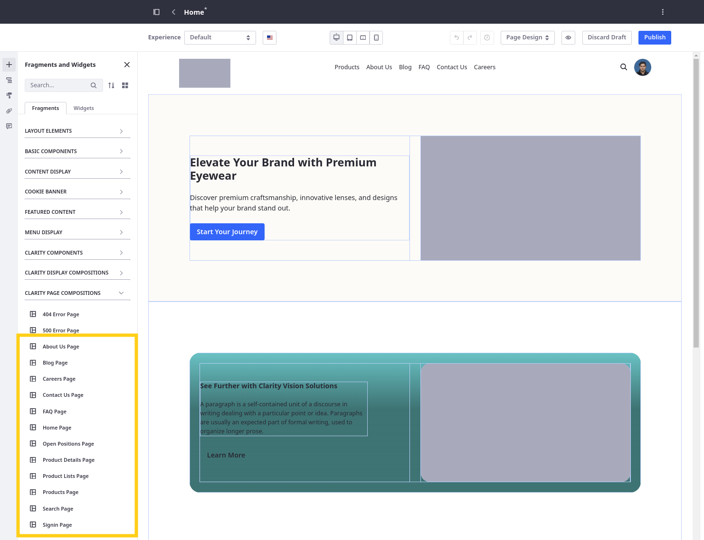
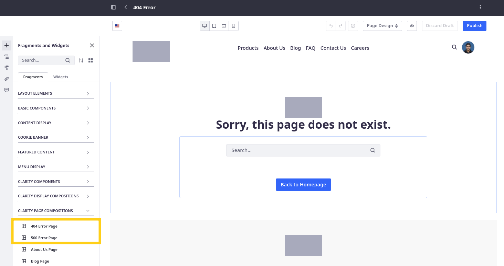
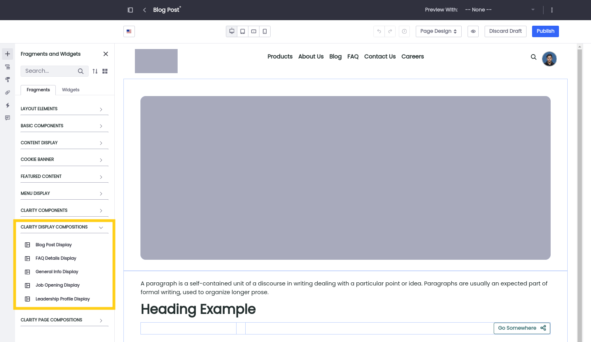

# Wireframing Clarity's Pages

With Clarity's master pages complete, you're ready to begin designing the central content area of each page. This area serves as the primary canvas for creating personalized presentations of Clarity's content. Designing pages structures involves the same tools and page elements as master pages. Here you’ll use the custom fragments and compositions that you imported during the last lesson to wireframe the central content area of Clarity’s pages.

<!-- TASK: Provide breakdowns of each composition and include configuration instructions -->

## Exercise One: Wireframing the Content Pages

1. Open the *Site Menu* (), expand *Site Builder*, and click *Pages*.

1. Begin editing each page and add the corresponding Clarity Page Composition fragment to it.

   

1. Click *Publish*.

## Exercise Two: Wireframing the Utility Pages

1. While in the Pages application, go to the *Utility Pages* tab.

1. Begin editing each page and add the corresponding Clarity Page Composition fragment to it.

   

1. Click *Publish*.

## Exercise Three: Wireframing the Display Pages

1. Open the *Site Menu* (), expand *Design*, and click *Page Templates*.

1. Go to the *Display Page Templates* tab.

1. Begin editing each template and add the corresponding Clarity Display Composition fragment to it.

   

1. Click *Publish*.

## Conclusion

Congratulations! Now that Clarity's pages are framed, let's apply Clarity's styling to finish setting up the site before moving on to managing and displaying Clarity's content in Module 7.

Next Up: [Applying Clarity's Brand Styling](./applying-claritys-brand-styling.md)
