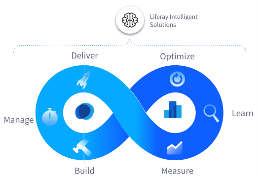

---
toc:
- ./module-7-analytics-and-personalization/claritys-analytics-and-experiences-requirements.md
- ./module-7-analytics-and-personalization/understanding-users-with-analytics-cloud.md
- ./module-7-analytics-and-personalization/personalizing-experiences-for-users.md
uuid: b23dfac8-d7e6-4885-818d-d2936dea6b83
---
# Module 7: Analytics and Personalization

So far you've learned how to manage users, build an enterprise website architecture, and create content. While Clarity now has a viable marketing solution, this is just the starting point. A digitally minded organization needs to be analytics-driven to continually measure and optimize its performance. This means Clarity's site creators, designers, and administrators must be empowered to leverage data as a part of their everyday workflow. With Liferay's Analytics Cloud, Clarity can do just that.

Analytics Cloud is a suite of tools for measuring user engagement data and assessing site performance, providing metrics at the site, page, asset, and user levels. By understanding how your content is performing, you can understand who your audience is and what they're looking for in a digital experience solution.

Once you've identified and classified user personas with Analytics Cloud, you can build user segments in Liferay DXP that are based on user attributes, interests, and behaviors. Then you can deliver personalized site experiences to each segment. Better experiences lead to better engagement, customer retention, and brand loyalty. This type of personalization has the additional benefit of enabling A/B Testing, a powerful tool for improving site experiences in a dynamic, agile fashion.

In this module, you'll learn about the following Liferay features:

- Analytics Cloud
- User Segments
- Personalized Experiences
- A/B Testing

<!--TASK: Turn this list into learning objectives.-->

Up First: [Clarity’s Analytics and Experiences Requirements](./module-7-analytics-and-personalization/claritys-analytics-and-experiences-requirements.md)
