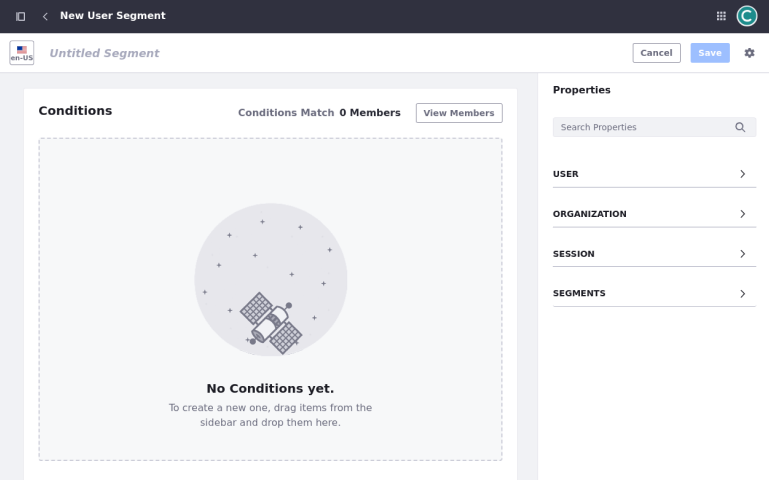

# Personalizing Experiences for Users

Personalized website experiences can help keep Clarity's visitors engaged and ultimately lead to more sales. Liferay provides different tools to help you understand who your customers are and optimize your site to increase engagement. Clarity can use these tools in combination with Analytics Cloud.

This article the following suite of features:

- Segmentation management
- Personalized experiences
- A/B testing

## Segmentation Management

The first step towards personalization is identifying your user segments. Once identified, you can create these segments in Liferay using Liferay's intuitive rule builder that defines segments based on

- User
- Organization Attributes
- Session Properties
- Custom Fields

<!--IMAGE: screenshots of rule builder UI-->

This rule builder uses semantic building blocks, meaning you can define segments by constructing sentences that describe the criteria. There are several predefined segmentation rules that you can use, and Liferay also supports the creation of custom fields that you can build rules around. You can also build new segments by combining existing segments, enabling more specific, focused user experiences.

Segmentation integrates with Liferay Analytics Cloud, which adds support for long-time behavior and third party data (e.g., Salesforce). In addition to the visual user interface, you can also use headless APIs to create custom properties for segmentation.

Once your segments are defined, they are available for use alongside Liferay's page and content management features.

## Personalized Experiences

When designing pages, you can create page variations for different segments. In Liferay, these variations are called experiences. This enables you to customize displays that are more relevant to each group. In fact, you can personalize almost any element of a page, from images and text to fragments and navigation. Additionally, you can create rules that cater to specific breakpoints, such as screen size.

Creating experiences out of segments is an intuitive, non-intrusive part of the site building and content management interfaces that Liferay provides.

Sometimes, we have more than one idea on how to engage a certain audience, but we aren't sure which option is best. This is where A/B testing comes into play.

## A/B Testing

With A/B testing, you can make two variants of a site page and compare the click rate or bounce rate of the two pages. Some visitors see one version, while another group sees the alternative. You can test the performance of the two variants and determine which is better for your customers.

The tight integration between Liferay DXP and Analytics Cloud means setting up A/B tests, tracking results, and publishing variants is simple. Liferay provides a UI for non-technical users to administer A/B tests with granular control over the test configuration and criteria. The tests are automatically synchronized with Liferay Analytics Cloud, which provides you with test history, statistics, variant performance benchmarks, and more.

In the short term, Clarity can use this feature to determine the best content and click-through path for driving distributors to complete the application process. In the long term, considering their plans for B2C, they can use A/B tests to determine the best promotions or product discovery routes to help customers go from interest to purchase as efficiently as possible. These are a few ways in which A/B testing can help you optimize your business.

## Exercise: Tailoring Experiences by User Group and Role
<!--Exercise 21a-->

Segmentation involves grouping website visitors and users into categories based on shared characteristics or behaviors. Segmenting your audience allows you to tailor the website experience, delivering more relevant content and ultimately boosting engagement.

Here, you'll create a segment specifically for Distributor users as the Clarity Admin user.

To do this,

1. Sign in as the Clarity Admin user.

   - Email: `admin@clarityvisionsolutions.com`
   - Password: `learn`

1. Add a new user with the following attributes.

   | Field         | Value                               |
   |:--------------|:------------------------------------|
   | Screen Name   | `terrencewheatley`                  |
   | Email Address | `terrence.wheatley@distributor.com` |
   | Job Title     | `Distributor`                       |
   | First Name    | `Terrence`                          |
   | Last Name     | `Wheatley`                          |
   | Password      | `learn`                             |

   <!--TASK: mail's reference needs to be changed -->

1. Create a new user group called *Distributors*.

1. Add Terrence Wheatley to the group.

1. Create a new regular role called *Distributor*.

1. Assign the role of Distributor to the Distributors User Group.

1. Open the *Site Menu* (), expand *People*, and select *Segments*.

1. Click *New* to create a segment.

1. For title, enter `Distributors`.

1. From the Properties menu, use the User section and drag the *Regular Role* into the main part of the screen.

1. Leave the condition as `equals` and use the Select button to choose the Distributor role.

1. From the Properties menu, use the User section and drag the *User Group* into the main part of the screen.

1. Leave the condition as `equals` and use the Select button to choose the Distributors user group.

1. Change the conjunction to `Or`.

   We cover both scenarios here: users in the user group and those with the directly assigned Distributor role.

   

1. Click *View Members* to validate Terrence Wheatley meets the segment condition.

1. Click *Save*.

1. Go to the home page and click *Edit* ().

1. Click the *Experience* drop down at the top of the page and choose *New Experience*.

1. For the Experience Name enter *Distributor*.

1. For the Audience, choose the *Distributors* option.

1. Click *Save*.

1. Use the up arrow on the Distributor row to position the segment above the Default item so that the Distributor entry shows first.

   *Note:* The experience order determines their priority. Internally, Liferay checks the segments a user belongs to and uses the match with the highest priority.

   Once the Distributor role is re-positioned, the label on the record should now read Active.

1. Modify the title text in the Banner to say `Welcome Back! Elevate Your Inventory with Premium Eyewear`.

1. Hide the `Distributor Promo` container, since distributors don't need to apply.

1. Click *Publish*.

1. You can test the different experiences using the Simulation () menu.

1. Choose to Preview By Segments. Then, use the Segment dropdown menu to toggle between `Anyone` and `Distributor` and view the corresponding changes in the main window.

1. Impersonate Terrence Wheatley to see the changes.

## Conclusion

Congratulations! You've completed *Module 7: Analytics and Personalization*. Throughout this module you've learned how you can leverage Liferay analytics and personalization features to improve user experience.

In the next module, you'll learn about using headless APIs to interact with Liferay applications and resources.

[Back to Building Enterprise Websites with Liferay](../../building-enterprise-websites-with-liferay.md)

<!-- TODO: Add Additional Resources section. -->