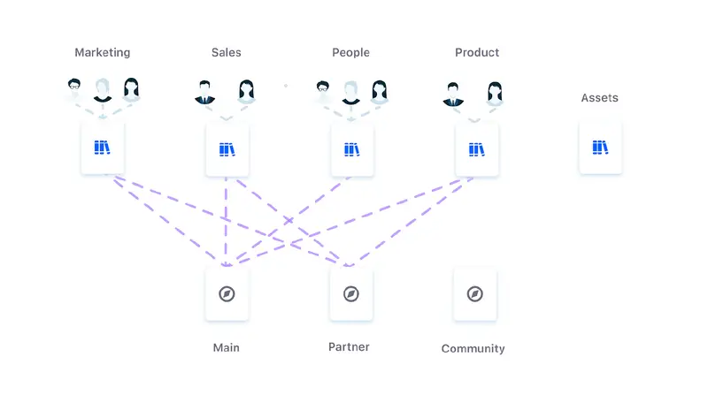
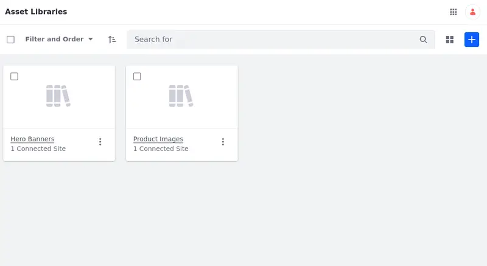
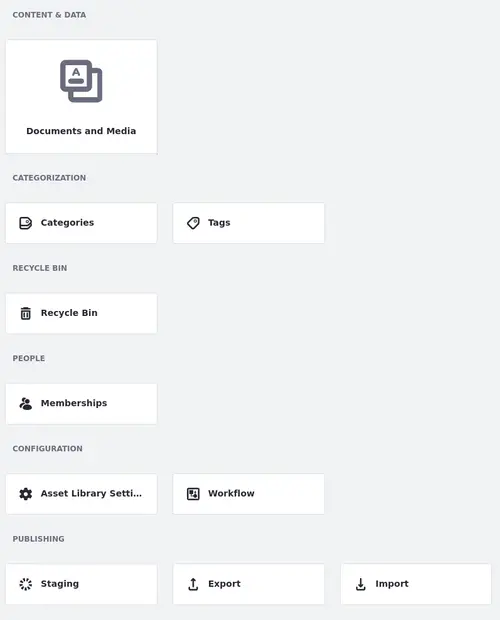
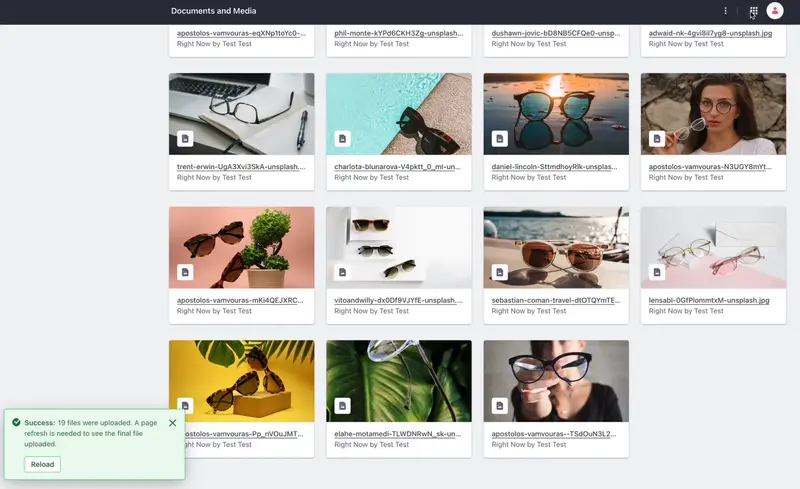
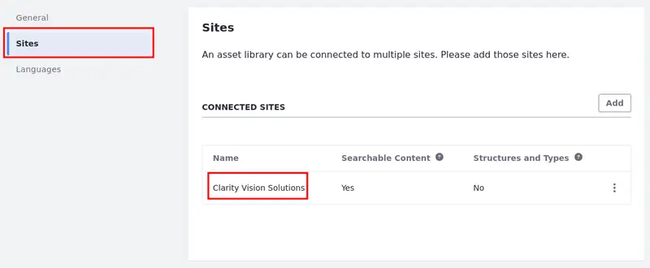
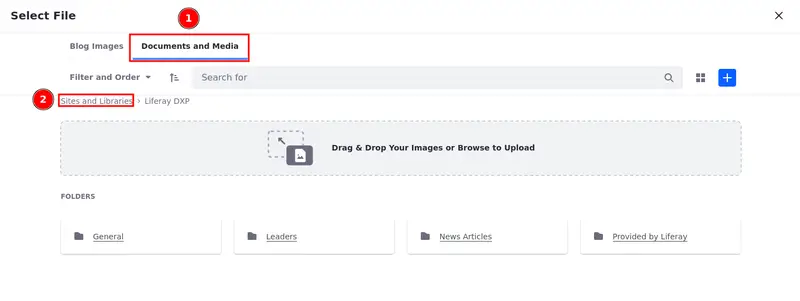
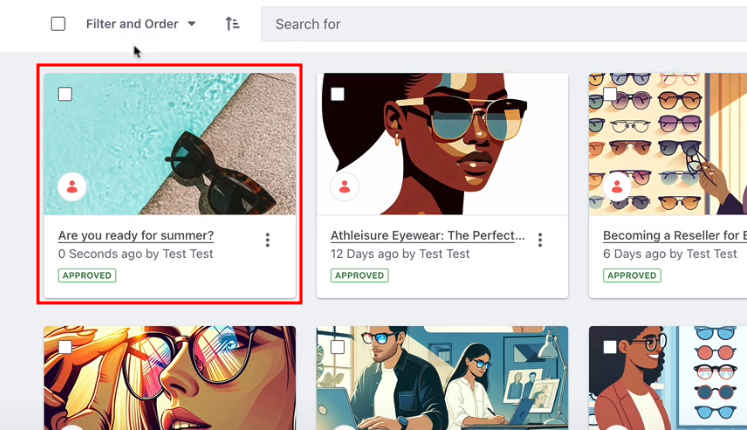

# Managing Clarity’s Digital Assets

In the context of content management, digital assets are any files or media you can use to enrich your content. This article focuses on the asset library, a Liferay feature that Clarity can use to manage their digital assets with low technical effort.

## Asset Libraries

Asset libraries declutter digital asset management by providing a collaborative hub for adding, editing, and sharing assets among multiple sites and users. Permissions and version control ensure that assets are accessible by the right people and kept up to date with the latest changes, all while maintaining security and transparency across the organization. Asset libraries can be structured with folders and tags, and they integrate seamlessly with Liferay’s other content management features.

## Exercise One: Creating an Asset Library

Clarity needs a catalog of images approved by the marketing team for the website designers to use in order to make sure they aren't including unauthorized assets in the web pages. Since you now understand what asset libraries are and how they can be used, let's create one for Clarity and add a set of approved images to it.

1. Navigate to _Global Menu_ () &rarr; _Applications_ &rarr; _Content_ &rarr; _Asset Libraries_.

   

   <!-- TODO: Update screenshot above. The newer versions of Liferay replace the Add button icon. Instead of being a plus sign, it's now a text with the word "New". The Clarity Site Initializer is, as of now, using an older version. -->

1. Click _New_ to create an asset library, then name it `Marketing Images`.

1. Update these fields in the library's configuration menu:

   | Field              | Value                                                                            |
   |:-------------------|:---------------------------------------------------------------------------------|
   | Description        | List of images that have been approved by marketing for use on public websites. |
   | Applications       | Disable all, except `Documents and Media`                                        |
   | Enable Auto Tagging | `disabled`                                                                       |

   

1. Click _Save_.

1. Navigate back to the Asset Libraries menu, then open the library's menu page by selecting `Marketing Images`.

   

   Here you can access the library's active applications to create and manage content. You can also enable staging, implement custom workflows, categorize content using tags and categories, and more.

1. Select the _Documents and Media_ application.

1. Upload some images of your choice into the library.

<!-- TODO: Replace above with "Download the sample images and upload them into the library." and add the link to the sample images -->

   

Content added to an asset library can be accessed from connected sites and used in multiple scenarios, such as displaying content in fragments, adding it to web articles, and more.

## Exercise Two: Linking Asset Library to Site

Having successfully created and populated the Marketing Images library with content (as completed in Exercise 1), the next step is to link it with Clarity's website. This will enable Clarity's website designers to browse and use the library's content in the item selector.

Let's connect the asset library to Clarity's main site, then change a blog's cover image using the library's content.

1. Navigate to _Global Menu_ () &rarr; _Applications_ &rarr; _Content_ &rarr; _Asset Libraries_.

1. Click _Actions_ () under Marketing Images and select _Edit_.

1. Go to _Sites_ at the left-side menu.

1. Click _Add_ and select Clarity's site to connect it with the asset library.

   

1. Navigate back to Clarity website's main page, open the _Product Menu_ (), then go to _Content & Data_ &rarr; _Blogs_.

1. Select a blog of your choice and start editing it.

1. Click _Change Image_ in the cover image panel.

   

1. In the item selector, navigate to the _Document and Media_ tab, then use the breadcrumb to go to _Sites and Libraries_.

   

1. Navigate to the _Asset Library_ tab and select _Marketing Images_.

1. Finally, choose an image in the item selector, then click _Publish_ at the bottom of the editing page.

   

After completing these steps, the blog's cover image will be replaced with your chosen option from the asset library.

## Conclusion

This concludes *Managing Clarity’s Digital Assets*. With your asset library in place, you can learn more about creating content from scratch with Liferay.

Next Up: [Creating Content for Clarity’s Pages](./creating-content-for-clarity’s-pages.md)

## Additional Resources

* [Asset Libraries](https://learn.liferay.com/web/guest/w/dxp/content-authoring-and-management/asset-libraries)
* [Documents and Media](https://learn.liferay.com/web/guest/w/dxp/content-authoring-and-management/documents-and-media)
