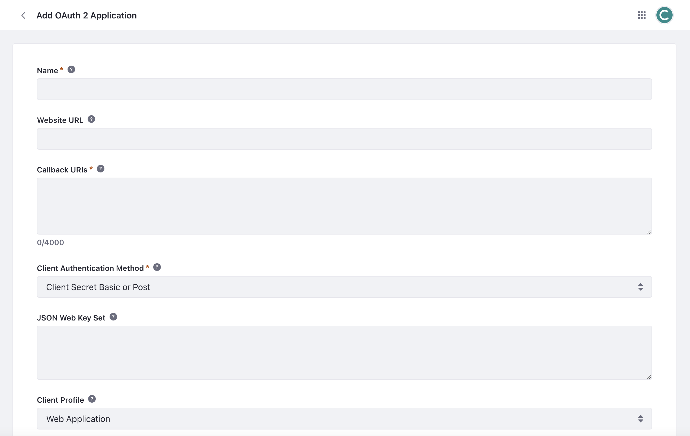
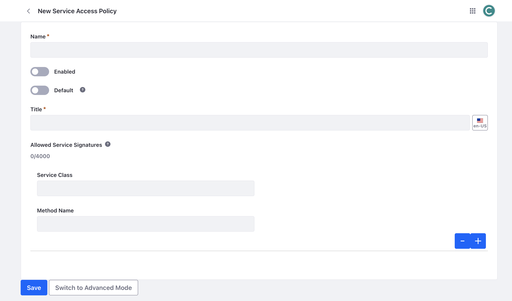

# Headless Security

Whether bringing data out of Liferay or bringing data into Liferay, security is one of the most critical aspects of leveraging APIs. Liferay provides industry standard methods of authorization such as HTTPS and OAuth 2.0 out of the box to secure any transfer of sensitive data with external systems.

!!! note
   Although Liferay supports basic authorization by passing a username and password, this method should be used for testing only and not in a production environment. Use OAuth 2.0 for secure transfer of data.

## Enabling OAuth 2.0 in Liferay

OAuth 2.0 is important for using APIs because it provides a secure way to control who can access your data. You can give specific permissions to web services without the need to share passwords. This helps protect user information and ensures that only authorized users can interact with the API.

At a high level, there are three steps to configure and connect with OAuth 2.0 in Liferay:

First, you must define an OAuth 2.0 application in Liferay. Enter a name for the application and settings about how you plan to connect and authorize to Liferay. Different authorization flows are available for selection including the authorization code flow. See [Authorizing Account Access with OAuth2](https://learn.liferay.com/w/dxp/headless-delivery/using-oauth2/authorizing-account-access-with-oauth2) to learn more.

Second, define the scopes for the application. This is where you configure which headless API endpoints are granted permissions and what type of operations are permitted. For example, a remote application may need read and write access to blog posts. Note, you can perform all of these actions through the Liferay UI.

   

Third, you need to configure your remote application to leverage OAuth 2.0 to connect to Liferay. Make sure that your client application is set up to work with the authorization flow you selected. For example, if you select the authorization code flow, Liferay will exchange an authorization code for a token that can be used for future API calls.

## Guest API Access

By default, Liferay requires authentication for all APIs and does not grant public access to them. However the Service Access Policy tool can be used to set certain endpoints to be publicly accessible. You can configure which service signatures are allowed within each service access policy.

!!! Important
   Proceed with caution when setting guest access and making API endpoints public facing. Provide this type of access only when necessary.

   

See [Setting Service Access Policies](https://learn.liferay.com/w/dxp/installation-and-upgrades/securing-liferay/securing-web-services/setting-service-access-policies) to learn more.

## Conclusion

Now that you understand how Liferay's headless APIs are secured and authorized, let's take a look at how Clarity can actually use these APIs.

Up Next: [Using Headless APIs](./using-headless-apis.md)
