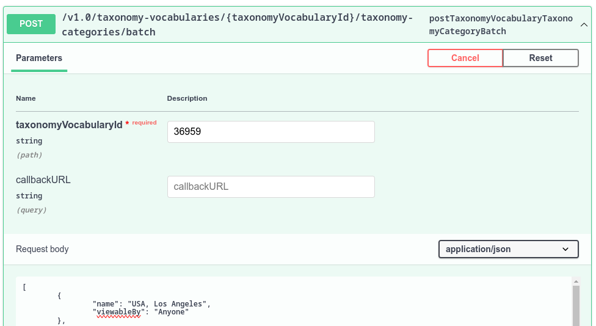

# Using APIs to Import Clarity's Content

Clarity wants to use leverage Liferay's headless APIs to import content from their legacy systems. They also want to leverage headless APIs to import Clarity products from their Product Information Management system (PIM).

## Exercise: Connecting to Headless APIs Using the API Explorer

<!--Exercise 15a-->

Let's see how headless APIs can be used by interacting with it through Liferay's API Explorer. Here you'll add a new blog post as Walter Douglas.

To do this,

1. Open the *Site Menu* (), expand *Configuration*, and select *Site Settings*.

1. Select *Site Configuration* under Platform.

1. Copy down the *Site ID* and save it for a future step.

1. Open the *Site Menu* (), expand *Categorization*, and select *Categories*.

1. Click *Blog Posts* under the Clarity vocabularies.

1. Select one of the categories in the list.

1. In your browser's navigation bar, copy down the category's ID that appears in the page URL. For example, `(...)categories_admin/vocabulary/37819/category/[category-id]`. You'll use this ID in a later step.

1. Open a new browser window and access Liferay's API Explorer at `http://localhost:8080/o/api`.

   <!-- By default, this leads to the *headless-delivery/v1.0* REST application. -->

1. Scroll down to the *Document* section and expand the *postSiteDocument* endpoint.

   **Tip**: To quickly find the endpoint, search the browser page for `postSiteDocument`.

   

1. For the siteId field, enter the site ID for Clarity Public Enterprise Website.

1. For the document field, delete the default JSON content and uncheck *Send empty value*.

1. For file field, click *Choose File* and select `glasses-book.png` from the `[repository-folder]/exercises/lesson-15/` folder.

1. Click *Execute*.

   This uploads a new image file to Clarity's Documents and Media.

1. In the response body, look for the image's ID. For example:

   ```json
   (...)
   "fileExtension" : "png",
   "fileName" : "glasses-book.png",
   "id" : [image-id],
   "keywords" : [ ],
   (...)
   ```

   Copy down the image ID to use in the next step.

1. Scroll up to the *BlogPosting* section and expand the *postSiteBlogPosting* endpoint.

1. For siteId, enter the site ID for Clarity Public Enterprise Website.

1. For Request Body, delete the default JSON content.

1. From the training workspace, open the `blog-entry.json` file in the `[repository-folder]/exercises/lesson-15/` folder.

   This file contains a blog post entry with a custom headline and body content.

1. Copy the contents of `blog-entry.json` into the *Request Body* field.

1. Replace `{image-id}` and `{category-id}` with your image ID and the blog category ID, respectively.

1. Click *Execute*. Make sure the response code is `200`.

1. Return to the Clarity Public Enterprise Website window, open the *Site Menu* (), expand *Content & Data*, and click *Blogs*.

1. Confirm the `Things I Find Interesting in Eyewear` blog post appears.

   

## Exercise: Using Headless APIs to Batch Import Web Content

<!--Exercise 15b-->

Clarity wants to import three legacy web articles from their old portal into their new enterprise website. Here you'll add them using Liferay's Headless APIs as Walter Douglas.

To do this,

1. Return to the browser window for Liferay's API Explorer (`http://localhost:8080/o/api`).

1. Scroll down to the *StructuredContent* section and expand the *postSiteStructuredContentBatch* endpoint.

1. For siteId, enter the site ID for Clarity Public Enterprise Website.

1. For Request Body, delete the default JSON content.

1. From the training workspace, open the `import-web-content-articles-batch.json` file in the `[repository-folder]/exercises/lesson-15/` folder.

1. Copy the contents of `import-web-content-articles-batch.json` into the *Request Body* field. 

1. Click *Execute*.

1. Return to the Clarity Public Enterprise Website window, open the *Site Menu* (), expand *Content & Data*, and click *Web Content*.

1. Open the *Articles* folder and confirm all three articles appear.

   

## Exercise: Using Headless APIs to Batch Import Products

<!--Exercise 15c-->

You can use REST APIs to import Clarity's products from external systems to Liferay DXP, streamlining product management. Here you'll use APIs to create products as Ian Miller.

To do this,

1. Sign in as Ian Miller.

   * Username: `ian.miller@clarityvisionsolutions.com`
   * Password: `learn`

1. Open the *Global Menu* (), go to the *Commerce* tab, and click *Products*.

   Take note of the number of existing products (i.e. 3).

1. Open the *Global Menu* (), go to the *Commerce* tab, and click *Catalogs*.

1. Click *Clarity Eyewear*.

   Copy down the catalog's ID. You'll use it in a later step.

1. Open a new browser window and access Liferay's API Explorer at `http://localhost:8080/o/api`.

1. Click the *REST Applications* drop-down menu and select *headless-commerce-admin-catalog/v1.0*.

1. Scroll down to the *Product* section and expand the *postProductBatch* endpoint.

1. For Request Body, delete the default JSON content.

1. From the training workspace, open the `import-products-batch.json` file in the `[repository-folder]/exercises/lesson-15/` folder.

1. Copy the contents of `import-products-batch.json` into the *Request Body* field and replace `{catalog-id}` for all products with the Clarity Eyewear catalog ID.

1. Click *Execute*.

1. Return to the Clarity Public Enterprise Website window, open the *Global Menu* (), go to the *Commerce* tab, and click *Products*.

1. Confirm eight new products appear.

   

## Exercise: Using Headless to Import Taxonomy Categories

<!--Exercise 15d-->

As a multinational company, Clarity has many business locations around the globe. To better support recruitment efforts, Clarity needs to define categories that they can apply to job openings for each office location. Some categories already exist, but others are still missing.

Here you'll add the missing location categories as Clarity Admin.

To do this,

1. Sign in as the Clarity Admin user.

   * Username: `admin@clarityvisionsolutions.com`
   * Password: `learn`

1. Open the *Global Menu* (), go to the *Applications* tab, and click *Asset Libraries*.

1. Select the *HR* library and click *Categories*.

1. Go to the *Location* vocabulary in the left side menu.

   Take note of the number of existing location categories (i.e. 14).

1. In your browser's navigation bar, copy down the vocabulary's ID that appears in the page URL. For example, `(...)categories_admin/vocabulary/[vocabulary-id]`. You'll use this ID in a later step.

1. Open a new browser window and access Liferay's API Explorer at `http://localhost:8080/o/api`.

1. Click the *REST Applications* drop-down menu and select *headless-admin-taxonomy/v1.0*.

1. Scroll down to the *TaxonomyCategory* section and expand the *postTaxonomyVocabularyTaxonomyCategoryBatch* endpoint.

1. For taxonomyVocabularyId, enter the vocabulary ID for Location.

1. For Request Body, delete the default JSON content.

1. From the training workspace, open the `import-taxonomy-categories-batch.json` file in the `[repository-folder]/exercises/lesson-15/` folder.

1. Copy the contents of `import-taxonomy-categories-batch.json` into the *Request Body* field.

    

1. Click *Execute*.

1. Return to the HR Asset Library window and refresh the page.

   The new locations should appear.

1. Click *HR* in the breadcrumb menu to return to the library overview page.

1. Click *Web Content* and open the *Job Listings* folder.

1. Begin editing an article and assign any of the newly added locations (e.g. *Morocco, Casablanca*).

1. Click *Publish*. You can now search for the content using the new location category.

## Conclusion

Congratulations, you've completed *Module 8: Headless APIs*. Throughout this module, you've seen different use cases for using Headless APIs and how a company like Clarity can leverage them to migrate existing data.

Next, let's explore how Clarity can leverage Liferay's search tools and capabilities to improve user experience.

Up Next: [Module 9: Search](../module-9-search.md)

## Additional Resources

See official documentation to learn more about using Liferay's headless APIs:

* [Consuming APIs](https://learn.liferay.com/w/dxp/headless-delivery/consuming-apis)
* [Consuming REST Services](https://learn.liferay.com/w/dxp/headless-delivery/consuming-apis/consuming-rest-services)
* [Batch Engine API Basics - Importing Data](https://learn.liferay.com/w/dxp/headless-delivery/consuming-apis/batch-engine-api-basics-importing-data)
