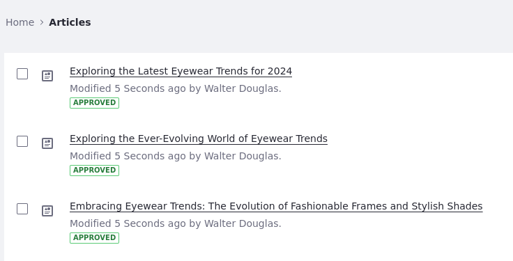
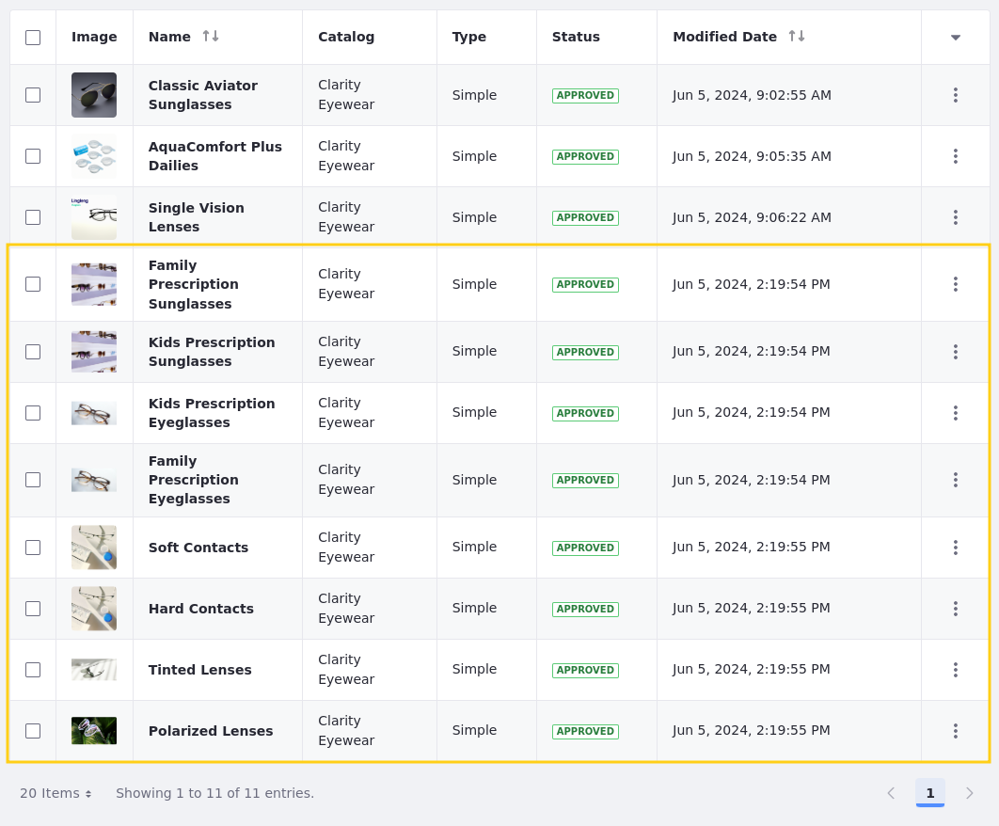
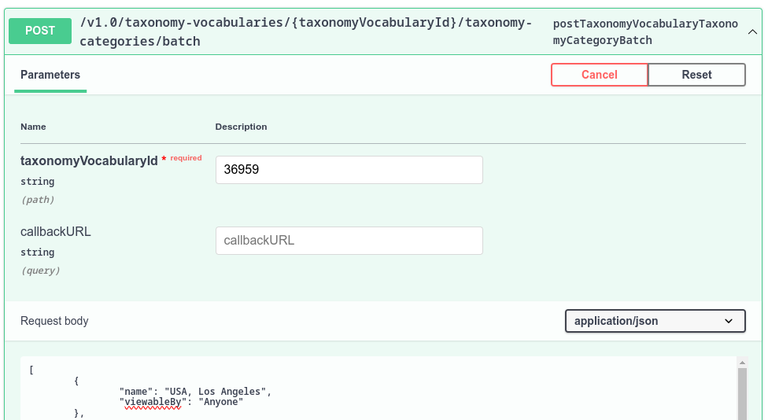

# Using Headless APIs

Clarity wants to use leverage Liferay's headless APIs to import content from their legacy systems. They also want to leverage headless APIs to import Clarity products from their Product Information Management system (PMI).

## Exercise: Connecting to Headless APIs Using the API Explorer

<!--Exercise 15a-->

Let's see how headless APIs can be used by interacting with it through Liferay's API Explorer. Here you'll add a new blog post as Walter Douglas.

To do this,

1. Open the *Site Menu* (), expand *Configuration*, and select *Site Settings*.

1. Select *Site Configuration* under Platform.

1. Copy the Site ID and save it for a future step.

1. Open the *Site Menu* (), expand *Categorization*, and select *Categories*.

1. Click *Blog Posts* under the Clarity vocabularies.

1. Select one of the categories in the list.

1. In your browser's navigation bar, take note of the category's ID in the page URL. For example, `(...)categories_admin/vocabulary/37819/category/[category-id]`. You'll use this ID in a later step.

1. Use a new browser window and access Liferay's API Explorer at `http://localhost:8080/o/api`.

1. Click the *REST Applications* drop-down menu and select *headless-delivery/v1.0*.

1. Scroll down to the *Document* section and expand the *postSiteDocument* endpoint.

    

1. For the `siteId` field, enter the site ID you copied in a previous step.

1. In the request body, delete the JSON in the document field and uncheck the *Send empty value* checkbox.

1. Choose the file from the `[repository-folder]/exercises/lesson-15/` folder which is called `glasses-book.png`.

1. Click *Execute*.

    This uploads a new image file to Clarity's Documents and Media.

1. In the response body, look for the image's ID. For example:

    ```json
    (...)
    "fileExtension" : "png",
    "fileName" : "glasses-book.png",
    "id" : [image-id],
    "keywords" : [ ],
    (...)
    ```

    Copy down the image ID to use in the next step.

1. Scroll up to the *BlogPosting* section and expand the *postSiteBlogPosting* endpoint.

1. For the `siteId` field, enter your site ID you noted above.

1. From the training workspace, go to the `[repository-folder]/exercises/lesson-15/` folder and open the `blog-entry.json` file on your machine.

    This file contains a blog post entry with a custom headline and body content.

1. Copy the data from the file and paste it into the *Request Body* field.

1. Replace `{image-id}` and `{category-id}` with your image ID and the blog category ID, respectively.

1. Click *Execute*. Make sure the response code is `200`.

1. In the Clarity website, open the *Site Menu* () and go to *Content & Data* &rarr; *Blogs*. Confirm that the `Things I Find Interesting in Eyewear` blog post was added by the headless API request.

   

## Exercise: Using Headless APIs to Batch Import Web Content

<!--Exercise 15b-->

Clarity wants to import three legacy web articles from their old portal into their new enterprise website. Here you'll add them using Liferay's Headless APIs as Walter Douglas.

To do this,

1. Use a new browser window and access Liferay's API Explorer at `http://localhost:8080/o/api`.

1. Click the *REST Applications* drop-down menu and select *headless-delivery/v1.0*.

1. Scroll down to the *StructuredContent* section and expand the *postSiteStructuredContentBatch* endpoint.

1. Enter your site ID in the *siteId* field.

1. From the downloaded course bundle, navigate to the `[repository-folder]/exercises/lesson-15/` folder and open the `import-web-content-articles-batch.json` file on your machine.

1. Copy the data from the file and paste it into the *Request Body* field.

1. Click *Execute*.

1. Back in your Clarity website, open the *Site Menu* () and go to *Content & Data* &rarr; *Web Content*.

1. Open the *Articles* folder and confirm all three articles were successfully imported.

   

## Exercise: Using Headless APIs to Batch Import Products

<!--Exercise 15c-->

Similarly to the previous exercise, you'll use REST APIs to import Clarity's legacy products as Ian Miller.

To do this,

1. Sign in as Ian Miller.

   * Username: `ian.miller@clarityvisionsolutions.com`
   * Password: `learn`

1. Open the *Global Menu* (), go to the *Commerce* tab, and click *Products*.

   Take note of the number of existing products (i.e. 3).

1. Open the *Global Menu* (), go to the *Commerce* tab, and click *Catalogs*.

1. Click *Clarity Eyewear*.

   Take note of the catalog's ID. You'll use it in a later step.

1. Use a new browser window and access Liferay's API Explorer at `http://localhost:8080/o/api`.

1. Click the *REST Applications* drop-down menu and select *headless-commerce-admin-catalog/v1.0*.

1. Scroll down to the *Product* section and expand the *postProductBatch* endpoint.

1. From the downloaded course bundle, navigate to the `[repository-folder]/exercises/lesson-15/` folder, then open the `import-products-batch.json` file.

1. Copy the data from the file and paste it into the *Request Body* field.

1. Scroll through the request body and enter your Clarity Eyewear catalog ID as the `catalogId` for all products.

1. Click *Execute*.

1. Back in your Clarity website, open the *Global Menu* (), go to the *Commerce* tab, and click *Products*.

1. Confirm eight additional products were added.

   

## Exercise: Using Headless to Import Taxonomy Categories

<!--Exercise 15d-->

As a multinational company, Clarity has many business locations around the globe. To better support recruitment efforts, Clarity needs to define categories that they can apply to job openings for each office location. Some categories already exist, but others are still missing.

Here you'll add the missing location categories as Walter Douglas.

To do this,

1. Sign in as Walter Douglas.

   * Email: `walter.douglas@clarityvisionsolutions.com`
   * Password: `learn`

1. Open the *Site Menu* (), expand *Categorization*, and click *Categories*.

1. Click *Location* under the Clarity vocabularies.

   Take note of the number of existing location categories (i.e. 14).

1. In your browser's navigation bar, take note of the vocabulary's ID in the page URL. For example, `(...)categories_admin/vocabulary/[vocabulary-id]`. You'll use this vocabulary ID in a later step.

1. Use a new browser window and access Liferay's API Explorer at `http://localhost:8080/o/api`.

1. Click the *REST Applications* drop-down menu and select *headless-admin-taxonomy/v1.0*.

1. Scroll down to the *TaxonomyCategory* section and expand the *postTaxonomyVocabularyTaxonomyCategoryBatch* endpoint.

1. For the *taxonomyVocabularyId* field, input your vocabulary ID.

1. From the downloaded course bundle, navigate to the `[repository-folder]/exercises/lesson-15/` folder and open the `import-taxonomy-categories-batch.json` file.

1. Copy the data from the file and paste it into the *Request Body* field.

    

1. Click *Execute*.

1. Back in Clarity's website, refresh the page. The new locations should appear.

1. Navigate to *Site Menu* &rarr; *Content & Data* &rarr; *Web Content*.

1. Click the *Job Listings* folder. Open any of the web content entries.

1. In the right menu, scroll down to the *CATEGORIZATION* section. Click *Select* next to the location category.

1. Select any of the newly added locations (e.g. *Morocco, Casablanca*) and click *Done*.

1. Click *Publish*. The web content can now be searched by the location you added.

## Conclusion

Congratulations, you've completed *Module 8: Headless APIs*. Throughout this module, you've seen different use cases for using Headless APIs and how a company like Clarity can leverage them to migrate existing data.

Next, let's explore how Clarity can leverage Liferay's search tools and capabilities to improve user experience.

Up Next: [Module 9: Search](../module-9-search.md)
