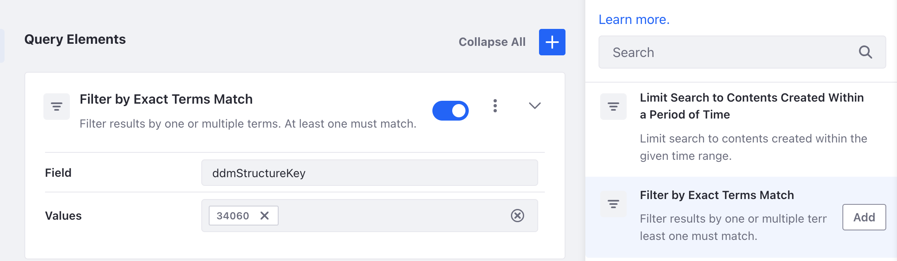
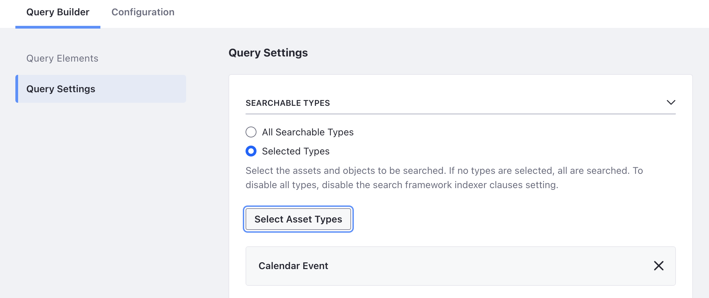

# Personalizing Clarity's Search Experiences

As we saw in the previous lesson, using search facets is great in providing visitors a way to quickly filter search results. However, Clarity has some search use cases that they wish to further customize and personalize. Liferay's Search Blueprints provide the necessary tools to meet Clarity's customization needs.

Use Blueprints to define implicit search criteria that can be added to any user's search query to help enhance the search experience. Blueprints offers a UI-based configuration experience where search criteria is set by dragging and dropping elements. Use Blueprints to boost, filter, or even hide specific search results. Apply a different Blueprint to each search results page, or leverage your Blueprints with headless APIs.

Complete the following exercises to better understand the capabilities of Search Blueprints.

## Exercise: Customizing Search Results with Search Blueprints

<!-- ## Exercise 18a: Customizing Search Results with Search Blueprints -->

<!-- TASK: Create an introduction explaining Search Blueprints at a high-level. -->

Here you'll revisit the Open Positions results page and create a Search Blueprint to only return recent job listing articles as the Clarity Admin user.

<!--TASK: Change persona to avoid using Clarity Admin -->

To do this,

1. Sign in as the Clarity Admin user.

   * Username: `admin@clarityvisionsolutions.com`
   * Password: `learn`

1. Open the *Global Menu* (), go to the *Applications* tab, and click *Asset Libraries*.

1. Select the *HR* library and click *Web Content*.

1. Go to the *Structures* tab and begin editing *Job Listing*.

1. Click *Properties* () and copy down the Structure Key value.

1. Open the *Global Menu* (), go to the *Applications* tab, and click *Blueprints*.

1. Click *Add* ().

1. For Title, enter `Job Listings Last 60 Days`.

1. Click *Create*.

1. In the right side menu, search for `Filter by Exact Terms Match` and click *Add* to include it in your query.

1. For Field, enter `ddmStructureKey`.

1. For Values, enter the Job Listing Structure Key.

   

1. In the left navigation, click *Query Settings*.

1. Click *Selected Types* and click *Select Asset Types*.

1. Select *Web Content Article* and click *Done*.

1. In the top menu, click *Preview* and enter a job listing search (e.g., `Developer`).

1. In the left navigation, click *Query Elements*.

1. Click *Add* () to add another query element above the first one.

1. In the right side menu, search for `Custom JSON Element` and click *Add* for the element.

1. Delete the Custom JSON Element's sample JSON. 

1. From the training workspace, open the `filter-last-60d.json` file in the `[repository-folder]/exercises/lesson-18/` folder.

1. Copy the contents of `filter-last-60d.json` into the Custom JSON Element.

   

1. Click *Preview* and click *Refresh* to see the filter applied.

1. In the Custom JSON Element, change `"now-60d"` to `"now-1d"` and click *Refresh* in the search preview to see the filter applied.

1. Change the value back to `"now-60d"`.

1. Click *Save*.

   Next, you'll update the Open Positions page to use the search blueprint.

1. Go to the *Open Positions* page and click *Edit* ().

1. From the *Fragments and Widgets* panel, drag and drop a *Blueprints Options* widget below the Search Options widget in the Search Results and Options container.

1. Click the *Actions* menu () and select *Configuration*.

1. For Blueprint, click *Select* and select the *Job Listings Last 60 Days* blueprint.

1. Click *Save* and close the window.

   With the blueprint applied, you can now remove the Type Facet and Custom Filter widgets from the page.

1. Click *Publish*.

   Now the search results only include job listings created in the last 60 days.

Great! You've created a search blueprint and applied it to the Open Positions page as an alternative to the Type Facet and Custom Filter widgets.

Next, you'll learn how to use search blueprints with collection providers.

## Exercise: Dynamic Collections with Search Blueprints

<!-- ## Exercise 18b: Dynamic Collections with Search Blueprints -->

One simple way to leverage search blueprints is with collection providers. Every time you create a search blueprint, a collection provider is automatically generated. Then, showing the results of the search blueprint is as easy as adding a collection display fragment to site pages.

For example, Clarity wants to have a site page that automatically displays a list of upcoming events. A search blueprint can query upcoming events on their calendar to automatically fetch these upcoming events.

<!--TASK: Change persona to avoid using Clarity Admin -->

<!--TASK: Restructure to remove sub-steps. Consider using H3s.-->

Here you'll implement this as Clarity Admin.

### Creating a Calendar Page

1. Open the *Site Menu* (), expand *Site Builder*, and click *Pages*.

1. Click *New* and select *Page*.

1. Select *Primary Master Page*.

1. For Name, enter `Calendar`.

1. Click *Add*.

1. In the *Fragments and Widgets* side panel, go to the *Widgets* tab.

1. Drag and drop the *Calendar* widget into the page.

1. Click *Publish*.

   Now that you've created the page, add some events to the calendar.

1. In the list of site pages, click *Actions* () for the Calendar page and select *View*.

1. Select the *Month* view and click any date before your current date, enter `Past Event 1` as the name, and click *Save*.

1. Click any date that is after your current date, enter `Future Event 1` as the name, and click *Save*.

1. Add one more event after Future Event 1 that is named `Future Event 2`.

   

With the page and events set up, you can set up a search blueprint. But before you do that, enable the feature flag for the blueprint integration with collections  element for future events.

### Enabling the Blueprint and Collections Integration

1. Open the *Global Menu* (), go to the *Control Panel* tab, and click *Instance Settings*.

1. Click *Feature Flags* and go to the *Beta* tab

1. Enable *Collections with Search Blueprints (LPS-129412)*.

   **Important**: Beta features should not be used in production environments.

With this feature enabled, you can create a search blueprint element for future calendar events.

### Creating a Future Events Search Blueprint Element

1. Open the *Global Menu* (), go to the *Applications*, and click *Blueprints*.

1. Go to the *Elements* tab and click *Add*.

1. For Title, enter `Future Events`

1. Click *Create*.

1. Delete the default JSON content.

1. From the training workspace, open the `filter-future-events.json` file in the `[repository-folder]/exercises/lesson-18/` folder.

1. Copy the contents of `filter-future-events.json` into the JSON field.

1. Click *Save*.

Now you can create a blueprint that uses this element to query future events.

### Creating a Future Events Search Blueprint

1. While in the Blueprints application, go to the *Blueprints* tab.

1. Click *Add* ().

1. For Title, enter `Future Events`

1. Click *Create*.

1. In the right side menu, search for `Future Events` and click *Add* to include it in your query.

1. In the left navigation, click *Query Settings*.

1. Click *Selected Types* and click *Select Asset Types*.

   

1. Select *Calendar Event*.

1. Click *Done*.

1. Click *Save*.

With the blueprint defined, you can now use its collection provider in a site page to render future events.

### Using the Blueprint Collection Provider

1. Go to the *Calendar* page.

1. From the *Fragments and Widgets* panel, drag and drop a *Container* fragment above the below the Calendar widget.

1. Select the *container* and configure these settings in the configuration side panel:

   | Tab     | Setting           | Value                       |
   |:--------|:------------------|:----------------------------|
   | General | Content Display   | *Flex Column*               |
   | General | Align Items       | *Center*                    |
   | General | Justify Content   | *Center*                    |
   | Styles  | Spacing > Padding | *Spacer 6* (top and bottom) |

1. From the *Fragments and Widgets* panel, drag and drop a *Heading* fragment into the container.

1. Set the Heading fragment's text to `Upcoming Events`.

1. From the *Fragments and Widgets* panel, drag and drop a *Collection Display* fragment into the container below the Heading.

1. Select the *Collection Display*.

1. In the configuration side panel, click *Select Collection* ().

1. Go to the *Collection Providers* tab and select *Future Events*.

1. Configure these settings:

   | Tab     | Setting       | Value           |
   |:--------|:--------------|:----------------|
   | General | Style Display | *Bulleted List* |
   | General | Pagination    | *None*          |

1. Click *Publish*.

   

   The search blueprint automatically provides a collection of future events that's rendered by the collection display.

You've now created and configured a search blueprint that uses a collection provider to display future calendar events.

Next, you'll learn how to leverage search blueprints with custom fields, then query those fields using headless APIs.

## Exercise: Search Blueprints with Custom Fields

<!-- ## Exercise 18c: Search Blueprints with Custom Fields -->

Occasionally businesses need to integrate with other web services. For example, Clarity wants their employee benefits system to reference their employees based on the service's registration ID numbers. In Liferay, you can add custom fields to user accounts for this value. Then you can use Liferay's headless APIs to query the custom field. 

User Account APIs cannot filter for custom fields directly, but you can use search blueprints for this purpose. Here you'll implement this as Clarity Admin.

To do this,

1. Open the Global Menu (), go to the *Control Panel* tab, and click *Custom Fields*.

1. Select *User* and click *New*.

1. Select *Input Field* and enter these details.

   | Field      | Value            |
   |:-----------|:-----------------|
   | Field Name | `RegistrationId` |
   | Data Type  | Integer          |

1. Click *Save*.

1. Open the Global Menu (), go to the *Control Panel* tab, and click *Users & Organizations*.

1. Select *Ian Miller*, scroll down to the bottom, and enter `555777` for the registration ID.

1. Click *Save*.

1. Open the Global Menu (), go to the *Applications* tab, and click *Blueprints*.

1. Click *Add* ().

1. For Title, enter `Registration ID`.

1. Click *Create*.

1. In the right side menu, search for `Filter by Exact Terms Match` and click *Add* to include it in your query.

1. For Field, enter `expando__keyword__custom_fields__RegistrationId_long`.

1. For Values, enter `${keywords}`.

   

1. Click *Save* and copy down the blueprint's ID.

1. Open the Global Menu (), go to the *Control Panel* tab, and click *Instance Settings*.

1. Click *Feature Flags* and go to the *Beta* tab.

1. Enable *Search Headless API (LPS-179669)*.

   **Important**: Beta features should not be used in production environments, but this feature will be available as a full feature Q3 2024.

1. Open a new browser window and access Liferay's API Explorer at `http://localhost:8080/o/api`.

1. Click the *REST Applications* drop-down menu and select *portal-search-rest/v1.0*.

1. Expand the *postSearchPage* endpoint.

1. For nestedFields, enter `embedded`.

1. For search, enter `555777`.

1. For Request Body, delete the default JSON content.

1. From the training workspace, open the `api-post-search.json` file in the `[repository-folder]/exercises/lesson-18/` folder.

1. Copy the contents of `api-post-search.json` into the *Request Body* field.

1. Replace `{blueprint ID}` with your blueprint's ID.

1. Click *Execute*.

1. Verify this returns Ian Miller's user information.

   

   This is one way you can use Liferay as a headless system that's utilized by a third-party service.

You've used a custom registration ID field with search blueprints to retrieve user information.

## Conclusion

Congratulations! You've completed *Module 9: Search*. Throughout this module, you learned about working with the various tools and features Liferay Search offers.

In the next module, you'll learn how you can use Liferay Objects to customize Liferay DXP.

Up Next: [Module 10 - Customizing Liferay DXP](../module-10-customizing-liferay-dxp.md)

## Additional Resources

See official documentation to learn more about using search blueprints to tailor search experiences:

* [Search Blueprints](https://learn.liferay.com/w/dxp/using-search/liferay-enterprise-search/search-experiences/search-blueprints)
* [Collections with Search Blueprints](https://learn.liferay.com/w/dxp/using-search/liferay-enterprise-search/search-experiences/search-blueprints/collections-with-search-blueprints)
* [Adding Custom Fields](https://learn.liferay.com/web/guest/w/dxp/system-administration/configuring-liferay/adding-custom-fields)
