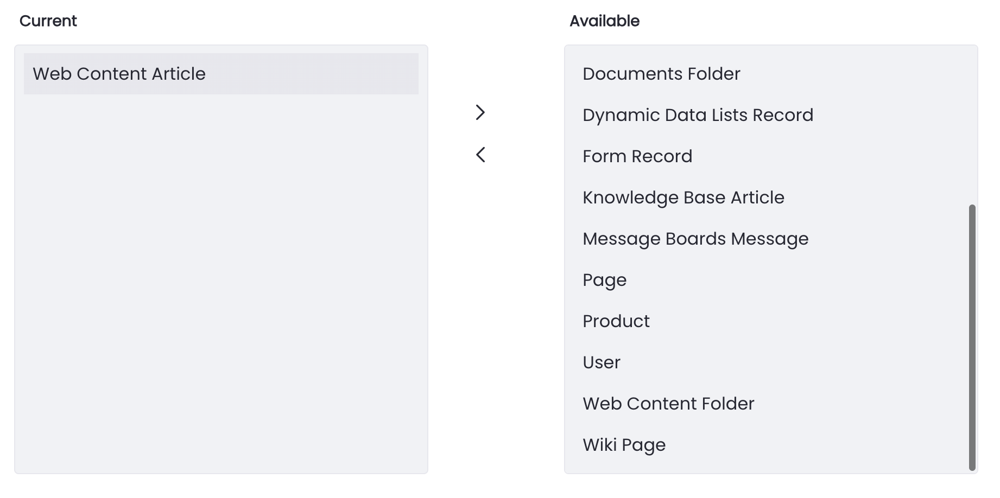
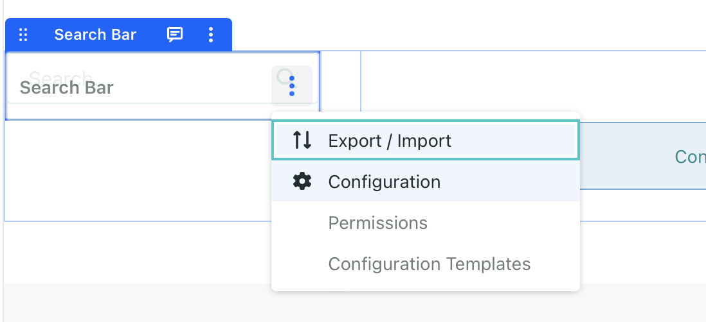
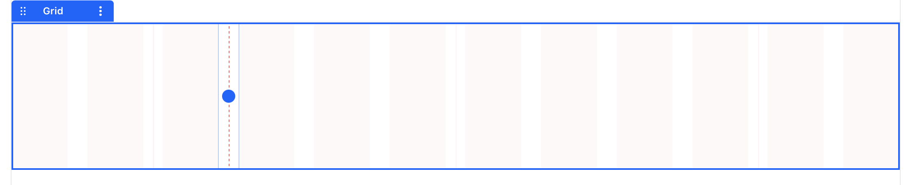
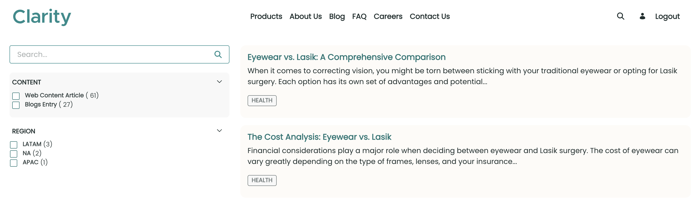

# Understanding and Customizing Search Results Pages

Clarity wants to have site visitors be able to search for content and find content quickly and easily. This is accomplished by creating good navigation and leveraging Liferay's search features. For example, a customer looking for a pair of eyeglasses or sunglasses should be able to navigate the site to find the type of product they are looking for. The user might search by keyword or they might use search categories to filter through the list of products. Navigating Clarity's site should match the visitor's expectation for good user experience.

At the same time, configuring the look and layout of search results pages should be quick and easy. Fortunately, no development background is required. Liferay provides various out-of-the-box components and search widgets to empower Liferay users to easily design pages and search experiences right from the UI.

Typically, a search results page will contain at a minimum:

* **Search Bar:** Where users can enter a search term
* **Search Facets:** The various criteria in which results can be filtered (e.g. asset type, categories, tags, etc.)
* **Search Results:** The actual results returned by the search query

Follow the exercises below to see how the different search components are set up and used in Clarity's website.

## Exercise: Adding Search Capabilities to the Job Listings Page

<!-- ## Exercise 17a: Adding Search Capabilities to the Job Listings Page -->

As part of improving their recruitment efforts, Clarity wants to implement a search page for open positions. Currently, Clarity's website includes a wireframed page for this purpose, but it is missing the necessary search widgets to make it functional.

Here you'll add and configure these widgets as Walter Douglas.

To do this,

1. Sign in as Walter Douglas.

   * Email: `walter.douglas@clarityvisionsolutions.com`
   * Password: `learn`

1. Go to Clarity's *Open Positions* page and click *Edit* ().

1. Open the *Fragments and Widgets* tab () in the side panel.

1. Go to the *Widgets* tab.

1. Drag and drop a *Search Bar* widget into the Banner container, placing it under the Heading fragment.

1. Select the widget and configure this setting:

   | Tab             | Setting   | Value |
   |:----------------|:----------|:------|
   | General > Frame | Min Width | 500px |

   This completes the search bar, next you'll add widgets for displaying and filtering search results, as well as defining additional search options.

1. From the *Fragments and Widgets* menu, drag and drop a *Type Facet* widget into the grid's left dropzone.

1. Hover over the widget, click *Actions* () in the top right corner of the widget, and select *Configuration*.

1. Use the right arrow button () to remove all asset types except for Web Content Article.

   

   This ensures that only web content articles appear in search results.

1. Click *Save* and close the window.

1. From the *Fragments and Widgets* menu, drag and drop three *Category Facet* widgets into the left dropzone of the grid fragment, under the type facet widget.

1. Hover over the first Category Facet widget, click the *Actions* button () in the top right corner of the widget, and select *Configuration*.

1. For Display Template, select the *Clarity Search Category* template.

   

1. For Category Parameter Name, enter a unique value (e.g., `category-region`). 

   **Note**: Each Category Facet widget must have a unique parameter name to function as expected.

1. Scroll down and choose *Select Vocabularies*.

1. Expand the *Clarity Enterprise Website* vocabularies and select the *Region* vocabulary.

   

1. Click *Save* and close the window.

1. Repeat steps 12-17 for the other category facet widgets, though select different vocabularies for each one:

   * For the second widget, select the *Location* vocabulary.

   * For the third widget, select the *Job Positions* vocabulary.

1. From the *Fragments and Widgets* menu, drag and drop a *Search Results* widget into the right dropzone of the grid fragment.

   **Important**: Ensure you're using the widget from the Search widget section. The Commerce *Search Results* widget is different.

1. From the *Fragments and Widgets* menu, drag and drop a *Search Options* widget below the grid fragment in the *Search Results and Options* container.

1. Hover over the Search Options widget, click *Actions* () in the top right corner of the widget, and select *Configuration*.

1. Check *Allow Empty Searches*.

1. Click *Save* and close the window.

1. Click *Publish*.

   

   Finally, let's update the *Explore Open Positions* button in the Careers page to link to the Open Positions page.

1. Go to the *Careers* page and begin editing it ().

1. Double click the banner's *Explore Open Positions* button to open the configuration side panel for the button's link element.

1. In the configuration side panel, go to the *Link* tab and configure these settings:

   | Setting | Value          |
   |:--------|:---------------|
   | Link    | Page           |
   | Page    | Open Positions |

1. Click *Publish*.

Now that you've added search functionality to Clarity's open positions page, site visitors can search and filter openings by different categories. You'll revisit this page in a later exercise to further restrict which web content articles appear in the search results.

Next, you'll apply these search concepts to Clarity's product pages.

## Exercise: Adding Search Capabilities to Product Pages

<!-- ## Exercise 17b: Adding Search Capabilities to Product Pages -->

<!-- Feedback from Russ: "One important thing to cover with product search pages: I think products are global/instance scoped and so you need to set the search bar widget to search the Everything scope to see products in a site's search page.

If you do mention that perhaps you could also sneak in a mention that instance scoped objects need to be searched this way too." https://github.com/JamesAGarcia/liferay-learn/pull/212#discussion_r1718547047 -->

Here you'll take a closer look at the product list page to understand the different Liferay search widgets and how to configure them as Walter Douglas.

To do this,

1. Go to Clarity's *Product List* page. Most of the page is already built with different search widgets.

   

   The left side module is made up of a search bar widget, a specification facet widget, and an option facet widget. The right side module is made up of a sort widget and a search results widget. Note that the search results widget under the commerce category of widgets is different from the search results widget under the search category of widgets. Only the commerce-related widget returns products.

   Below these two modules, there is a search options widget. If you inspect the configuration of this widget, you will see that *Allow Empty Searches* is enabled. This setting is enabled so that all available assets are shown without any search queries.

1. In the top menubar, click *Edit* ().

   The page is still missing a category facet widget that would allow visitors to filter by the different types of Clarity products. Let's go ahead and add that widget.

1. From the *Fragments and Widgets* menu, drag and drop a *Category Facet* widget below the Search Bar in the left dropzone of the grid fragment.

1. Select the *Category Facet* widget and configure this setting:

   | Tab    | Field              | Value   |
   |:-------|:-------------------|:--------|
   | Styles | Background > Color | #F8F8F8 |

1. Click *Publish*.

   

Great! You've included a category facet widget on the Product List page, allowing customers to filter their search results by product category.

Next, let's finish configuring the Open Positions page to only display Job Listings in the search results.

## Exercise: Filtering Results with Custom Filters

<!-- ## Exercise 17c: Filtering Results with Custom Filters -->

<!-- Feedback from Russ: "Results aren't sorted by filters. I know it's not wordsmithed yet but let's make sure we're clear about facets, filters, and sorts, and the widgets that contribute them." https://github.com/JamesAGarcia/liferay-learn/pull/212#discussion_r1718582792 -->

As previously discussed, search results can be sorted by different filters such as content type (e.g. blogs, web content, etc.) or keyword categories (e.g. different categories found in the FAQ section.). In addition, you can arrange them with custom filters that sorts results against almost any indexed attribute in your content, such as a Web Content Structure.

In a previous exercise, we limited the search results on the Open Positions page to only display Web Content Articles. However, there are many different types of undesired Web Content that are currently being displayed.

Here you'll further limit the search results to only display Job Listings web content with a Custom Filter widget as Walter Douglas.

To do this,

1. Go to Clarity's *Open Positions* page and click *Edit* ().

1. From the *Fragments and Widgets* menu, drag and drop a *Custom Filter* widget below the grid fragment in the *Search Results and Options* container.

1. Hover over the Custom Filter widget, click *Actions* () in the top right corner of the widget, and select *Configuration*.

1. Enter these values:

   | Setting      | Value       |
   |:-------------|:------------|
   | Filter Field | classTypeId |
   | Filter Value | 33769       |
   | Invisible    | Checked     |

1. Click *Save* and close the window.

1. Publish the page. You should only see Job Listings displayed in the Search Results.

   

Great! You've set a custom filter widget that limits the search results to only display Job Listings web content in the Open Positions page.

Next, you'll learn how to use Search Blueprints as another method for customizing search results.

## Conclusion

Great job! Visitor's to Clarity's site now have a clear and simple way to search for content and filter through different Clarity products and content. Next, we'll turn our attention to Liferay blueprints to bring personalization and further customization to the search experience.

Next Up: [Personalizing search experiences with blueprints](./personalizing-search-experiences-with-blueprints.md)
