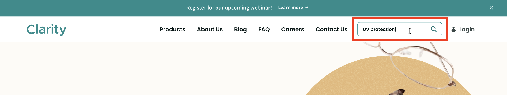

# Understanding and Customizing Search Results Pages

Clarity wants to have site visitors be able to search and find content quickly and easily. This can be accomplished with creating good navigation and leveraging Liferay search features. For example, if a visitor performs a global search with the search bar in the website's top header, the search results should show everything (e.g. products, blog posts, documents, etc.). Or a visitor might click the products navigation tab in the top header and be shown a catalog of products. If a visitor clicks on the products tab, the search results should only show products and not any other types of site content. This matches the visitor's expectation and results in good user experience.

!!! important "Key Decision"
    In Liferay, commerce search results are separate from regular search results. The commerce search results, as the name implies, only returns commerce products. The regular search results can be set to return just site content (i.e. blog posts, documents, etc.) or everything (i.e. including products). For Clarity, providing quick access to both products and site content is important, so they will enable everything to be searched.

## Exercise 1: Walk through the Global Search Bar

By default, a Liferay search bar is set to only search within site content. To be able to give visitors the ability to search across products as well, the scope must be changed.

1. From the Clarity website's global search bar, search for the term `UV Protection`.

   

1. In the search results, notice that the results only show site content such as blog posts.

1. In the top menu bar, click the pencil icon to edit the page.

1. For the search bar widget in the left module, click the options icon and click _Configuration_.

   

1. Under the scope section, change the selection to _Everything_. Click _Save_ and close the window. Click _Publish_ to update the page.

1. Search for `UV Protection` again. Now both the website content and the Clarity products show up in the search results.

   ![Both website content and Clarity products show up in the search results.]

## Exercise 2: Filtering Products with Facets

The Clarity team has added some of their products already onto the website (e.g. eyeglasses, sunglasses, etc.). As their product catalog gets bigger and bigger, the team needs a way to give visitors a quick way to filter through products based on different properties (e.g. fit, material, color, etc.). 

<!--- Not sure if some of this page can already be prebuilt with the site initializer --->

1. Open the product menu and navigate to _Site Builder_ &rarr; _Pages_. Click the add icon and click _Page_.

1. Select the blank page template and give the page the name `All Products` and click _Add_.

1. In the left navigation, drag over a container element onto the new page. Next, drag over a grid element into the container. Double click the grid element and change the number of modules from three to two. Drag the divider between the two modules to the left so that the left module takes about one-fourth of the total size.

   

1. Drag a search bar widget into the left module. Click the options icon of the widget and click _Configuration_. Change the scope from _This Site_ to _Everything_. Click _Save_ and close the window.

1. Drag a search options widget under the search bar. Click the options icon of the widget and click _Configuration_. Check the box for _Allow Empty Searches_ and click _Save_. Close the window. This setting allows for all the products to be displayed by default.

1. Drag a category facet widget under the search options widget. Click the options icon of the widget and click _Configuration_. Under display template, select the _Vocabulary Layout_. Click _Save_ and close the window. This helps to group the categories by the different properties (i.e. fit, material, color, etc.).

1. Drag a commerce search results widget onto the right module. Click _Publish_. See that the products can now be filtered across different facets.

   

## Conclusion

Great job! Visitor's to Clarity's site have a clear and simple way to search for content and filter through different Clarity products. Next, we'll turn our attention to Liferay blueprints to bring personalization to the search experience.

Next Up: [Personalizing search experiences with blueprints](./personalizing-search-experiences-with-blueprints.md)

## Additional Resources

See our documentation to learn more about the different Liferay search features and functionalities.

* [Using Search](https://learn.liferay.com/w/dxp/using-search)
