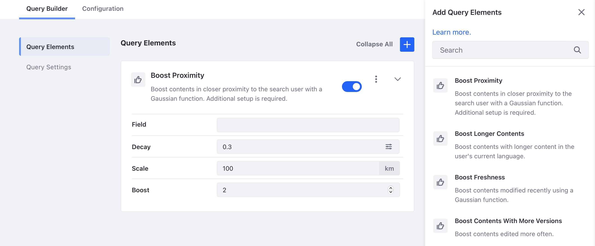

# Understanding Liferay Search

Liferay Search is a powerful tool that enables users to efficiently find information within a Liferay portal. It leverages the capabilities of a robust search engine to index and retrieve content, providing a seamless search experience for end-users. Let's delve deeper into the core components and architecture of Liferay Search.

## Liferay Search at a High-level

At the heart of Liferay's default search capabilities is [Elasticsearch](https://www.elastic.co/elasticsearch), a powerful open-source search and analytics engine. This technology serves as the backbone for indexing, storing, and retrieving vast amounts of search data with remarkable speed and scalability. The process of transforming content into a searchable format is known as indexing. Liferay indexes a wide array of content types, including documents, web content articles, and blog posts. Once indexed, this data becomes accessible through the search engine, which is responsible for processing user queries, ranking results based on relevance, and delivering the most pertinent information.

!!! note "Using Alternative Search Engines"
  Liferay search is API driven, which means you can use alternative search engine implementations. While Elasticsearch provides the best search experience, some industries or use cases may require using an alternative search engine.

Beyond basic search features like faceting, sorting, and filtering, Liferay offers powerful tools to enhance user experience. Blueprints enable low-code customization of search experience, allowing manipulation of search queries, filters, sorts, and more. Additionally, personalization of search results can be achieved through the use of segmentation and search widgets, tailoring search results to individual user preferences and behaviors.

## Search Architecture Overview

Liferay stores its information in a database. However, searching database tables directly can be a time-consuming task. Therefore most of Liferay's entities utilize a search index. Whenever a Liferay entity is created, a separate entry is also created in the search index by Liferay's indexer framework. Each entry has a collection of fields for that entity. For example, a blog entry might contain index fields for the title, content, tags, etc. This index is then used by Elasticsearch to provide an effective and efficient way to search for data. Some of the Liferay entities that use the search index out-of-the-box include:

* Blog entries
* Categories and tags
* Documents and media
* Objects
* Web content articles

Therefore, when a search is performed, the query is executed against the search index, which is optimized for handling large datasets. The results of the query are then referenced back to the original assets when the search results are displayed to the user.

## Search Configuration and Administration

By default, Liferay Search is ready to use right out of the box. However, to customize search behavior, many configuration options are available. These options can be adjusted at the page level using search widgets, at the site level, or at the instance's Control Panel. Make changes to areas such as,

* Content filtering, by limiting search results to specific content types.
* Search blueprint application, by applying any existing Search Blueprint to the page and search suggestions.
* Widget customization, by creating reusable search widget templates at the site or global level.
* System-wide adjustments, by performing index maintenance tasks like reindexing and inspecting the field mappings.
* Index management, by inspecting and modifying index mappings for a better control over search behavior.

<!-- I'm not sure if we want the "Changing System Settings" admonition here, but I won't remove it rn -->

!!! note Changing System Settings
  Access to system settings is not available in Liferay SaaS. Discuss any specific search configuration requirements with Liferay Support team.

You can also adjust low-level settings, such as search engine connections and field mappings, within the System Settings, which includes search framework and engine configurations.

## Refining Search Results

Liferay's search index, powered by Elasticsearch, provides a powerful and effective way to quickly get search results. These search results can be further refined using facets, sorting, or custom filters.

Search facets refine search results across specific content and criteria. Out of the box, Liferay offers a collection of different search facets. For example, a type facet could be used to quickly filter out blog entries, documents, or site pages. We'll see in the next lesson how category facets can be used by Clarity to filter across their products.

Sorting is another way to refine search results. By default, search results are sorted by relevance, a score calculated by Elasticsearch's algorithms. However, users can also sort alphabetically by title or user, chronologically by creation or modified date, or by other sorting strategy that meets their needs.

The search bar itself also serves as a filter with its auto-suggestion functionality. As a user begins typing a search term, the search engine begins processing the query and suggests possible relevant results.

Finally, custom filters are available to exclude specific content, such as certain file types, folders, or documents. Custom filters can also be used to boost the results of certain content. For even more advanced customization, explore Search Blueprints, discussed below.

## Customizing Search Results Pages

Similar to how we created site pages using pre-built widgets in previous exercises, search results pages can be created in the same way. Liferay offers many search widgets that can be dragged and dropped onto a site page to quickly create a customized search results page. This enables non-technical team members to create search pages effortlessly. Liferay even provides search page templates to use without needing to create a page from scratch.

Some of the available search widgets are:

* Various types of search facets
* Results preview
* Similar results
* Sort
* Suggestions

We also saw in a previous module that segmentation can be used to deliver personalized pages to different segments. This could also be leveraged for search results pages. For example, you could present one search results page for most visitors, while offering a different search results page with additional search widgets for Clarity distributors. Furthermore, the search results itself can also be personalized based on segments, or other criteria, with Search Blueprints.

## Search Blueprints

Blueprints enable the creation of targeted search results by applying implicit search criteria. That is, automatically adding search criteria to a search query that is not part of what the user entered. A simple example might be boosting search results based on geolocation and prioritizing certain results that are closer in proximity to the user's location.

Modifying the search query itself typically requires developing custom code, but search blueprints can be configured right from Liferay's UI without the need to deploy any code. This makes it simple enough for even non-technical users to utilize blueprints. Some ways blueprints might be leveraged are:

* Boosting search results based on different criteria
* Conditional search results based on certain keywords or categories
* Limiting the search query based on different criteria
* Hiding certain content and certain results

We'll see a specific example of Clarity utilizing search blueprints later in this module.

## Other Advanced Search Options

Liferay offers semantic search, giving you results that go beyond just matching keywords. Semantic search utilizes natural language processing and tries to understand the meaning or intent of the search term. Note, this is currently a beta feature and is available by enabling the feature flag. See [semantic search](https://learn.liferay.com/web/guest/w/dxp/using-search/liferay-enterprise-search/search-experiences/semantic-search) to learn more.

Search results are sorted by the ranking of a relevance score automatically assigned by Elasticsearch. The higher the relevance score, the higher the ranking in the search results. However, an Elasticsearch Learning to Rank plugin can be used with Liferay to prioritize search results based on your specific criteria. See [learning to rank](https://learn.liferay.com/w/dxp/using-search/liferay-enterprise-search/learning-to-rank) to learn more.

Synonym sets can be created in Liferay to add additional coverage for different search terms. For example, visitors to Clarity's website might search for terms such as *eyeglasses* or *sunglasses*, but some might search for synonyms such as *spectacles* or *shades*. Create synonym sets in Liferay to ensure users find relevant content regardless of their exact keywords. See [synonym sets](https://learn.liferay.com/w/dxp/using-search/search-administration-and-tuning/synonym-sets) to learn more.

## Conclusion

Now that you have an understanding of Liferay's search functionality, let's dive into Clarity's specific use cases.

Next Up: [Understanding and Customizing Search Results Pages](./understanding-and-customizing-search-results-pages.md)

## Additional Resources

See our documentation to learn about working with search in Liferay.

* [Working with Search Pages](https://learn.liferay.com/w/dxp/using-search/search-pages-and-widgets/working-with-search-pages)
* [Search Results](https://learn.liferay.com/w/dxp/using-search/search-pages-and-widgets/search-results)
* [Search Facets](https://learn.liferay.com/w/dxp/using-search/search-pages-and-widgets/search-facets)
* [Search Blueprints](https://learn.liferay.com/w/dxp/using-search/liferay-enterprise-search/search-experiences/search-blueprints)
