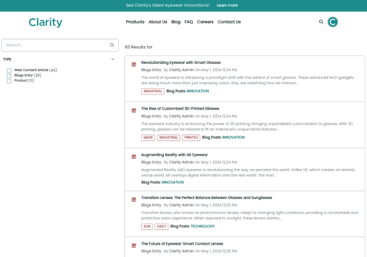

# Understanding Liferay Search

Liferay Search is a core tool that enables users to find information efficiently and effectively in Liferay. Liferay Search leverages the capabilities of a robust search engine and indexing framework to provide seamless search experiences. Let's delve deeper into the core components and architecture of Liferay Search.

## Liferay Search at a High-level

At the heart of Liferay Search is [Elasticsearch](https://www.elastic.co/elasticsearch), a powerful open-source search engine. Elasticsearch serves as the backbone for indexing, storing, and retrieving vast amounts of search data with remarkable speed and scalability. Liferay indexes a wide array of content types, including documents, web content articles, and blog posts. Once indexed, this data becomes accessible through the search engine, which is responsible for processing user queries, ranking results based on relevance, and delivering the most pertinent information. 

!!! note "Using Alternative Search Engines"
  Liferay search is API driven, which means you can use alternative search engine implementations. While Elastic search provides the best search experience, industry standards may require an alternative search engine (e.g., SOLR).

Beyond these core components, Liferay offers a rich set of tools for refining search results, including faceting, sorting, filtering, and autocomplete. Additionally, it provides extensive capabilities for customizing search experiences through Liferay's page builder features and a variety of search widgets. Personalization of search results is achieved through the use of blueprints and segmentation, tailoring search results to individual user preferences and behaviors.

## Search Architecture Overview

Liferay stores its information in a database. However, directly searching database tables can be a time-consuming task. Therefore most of Liferay's entities utilize a search index. Whenever a Liferay entity is created, a separate entry is also created in the search index by Liferay's indexer framework. Each entry has a collection of fields for that entity. For example, a blog entry might contain index fields for the title, content, tags, etc. This index is then used by Elasticsearch to provide an effective and efficient way to search for data. Some of the Liferay entities that use the search index out of the box include:

* Blog entries
* Categories and tags
* Documents and media
* Objects
* Users and organizations
* Web content articles

Therefore, anytime a search is performed, the query occurs against the search index and not the database tables of each asset. The results of the query are then referenced back to the original assets when the search results are displayed to the user. Even with very large data sets, because Liferay leverages multiple internal indexes, Liferay search is able to ensure fast search results.

## Search Configuration and Administration

By default, Liferay Search is ready to use right out of the box without any additional configuration. However, if you have a specific use case that requires something different from the default behavior, the configuration settings are accessible under Liferay's system settings.

To change the default configuration settings, navigate to *Global Menu* &rarr; *System Settings* &rarr; *Search*. Make changes to areas such as,

* Default Keyword Query
* Default Search Result Permission Filter
* Index Query Preprocessor
* and much more

!!! note Changing System Settings
  Access to system settings is not available in Liferay SaaS. Discuss any specific search configuration requirements with you Liferay SaaS team.

Other administration tasks are also available such as reindexing to refresh parts of your search index or overriding any search field mappings within a search index.

## Refining Search Results

Together with Liferay's search index, Elasticsearch provides a powerful and effective way to quickly get search results. These search results can be further refined through the use of facets, sorting, or custom filters.

Search facets are a way to refine search results across specific content and criteria. Out of the box, Liferay offers a collection of different search facets. For example, a type facet could be used by a visitor to quickly filter out blog entries, documents, or site pages. We'll see in the next lesson how category facets can be used by Clarity to filter across their products.

Sorting is another way search results can be refined. By default, search results are sorted by relevance. Relevance is a search score calculated by Elasticsearch's algorithms. However, visitors can have options to sort by other parameters such as sorting alphabetically by title or user, by create date or modified date, etc. Users can choose an alternative sorting strategy that meets their needs.

Custom filters are available to exclude certain content such as certain file types, certain folders, or certain documents. Custom filters can also be used to boost the results of certain content. Note, even greater customization is offered through Search Blueprints discussed below.

Finally, the search bar itself also serves as a filter with its auto-suggestion functionality. As a visitor begins typing a search term, the search engine begins processing the query and suggests possible relevant results.

## Customizing Search Results Pages

As we saw in previous exercises of how site pages can quickly be built with the use of out-of-the-box widgets, search results pages can be crafted in the same manner. Liferay offers many search widgets that can be dragged and dropped onto a site page to quickly create a customized search results page. This makes it easy for even non-technical team members to create search pages effortlessly. Liferay even provides search page templates to use without needing to create a page from scratch.

Some of the available search widgets are:

* Various types of search facets
* Results preview 
* Similar results
* Sort
* Suggestions

As we saw in a previous module, segmentation can also be used to deliver personalized pages to different segments. For example, you could present one search results page for most visitors, but a different search results page with additional search widgets for a segment for Clarity distributors. Finally, the search results itself can also be customized based on segments, or other criteria, with Search Blueprints.

## Search Blueprints

Blueprints offer the ability to create targeted search results with the use of implicit search criteria. That is, automatically adding search criteria to a search query that is not part of what the user entered. A simple example might be boosting search results based on geolocation and prioritizing certain results that are closer in proximity to the user's IP address.

Modifying the search query itself typically requires developing custom code, but search blueprints can be configured right from Liferay's UI without the need to deploy any code. This makes it simple enough for even non-technical members to utilize blueprints. Some ways blueprints might be leveraged are:

* Boosting search results based on different criteria
* Conditional search results based on certain keywords or categories
* Limiting the search query based on different criteria
* Hiding certain content and certain results

We'll see a specific example of Clarity utilizing search blueprints later in this module.

## Advanced Search Options

Liferay offers semantic search, giving you results that go beyond just matching keywords. Semantic search utilizes natural language processing and tries to understand the meaning or intent of the search term. Note, this is currently a beta feature and is available by enabling the feature flag. See [semantic search](https://learn.liferay.com/web/guest/w/dxp/using-search/liferay-enterprise-search/search-experiences/semantic-search) to learn more.

Search results are sorted by the ranking of a relevance score. The higher the relevance score, the higher the ranking in the search results. Scoring is automatically assigned based on Elasticsearch's scoring algorithm. However, an Elasticsearch Learning to Rank plugin can be used with Liferay to prioritize search results based on your specific criteria. See [learning to rank](https://learn.liferay.com/w/dxp/using-search/liferay-enterprise-search/learning-to-rank) to learn more.

Synonym sets can be created in Liferay to add additional coverage for different search terms. For example, visitors to Clarity's website might search for terms such as *eyeglasses* or *sunglasses*, but some might search for synonyms such as *spectacles* or *shades*. Create *Synonym Sets* in Liferay to ensure users find relevant content even if they don't use the exact keywords. See [synonym sets](https://learn.liferay.com/w/dxp/using-search/search-administration-and-tuning/synonym-sets) to learn more.

## Conclusion

Now that you have an initial understanding of Liferay's search functionality, let's dive into Clarity's specific use cases.

Next Up: [Understanding and Customizing Search Results Pages](./understanding-and-customizing-search-results-pages.md)

## Additional Resources

See our documentation to learn about working with search in Liferay.

* [Working with Search Pages](https://learn.liferay.com/w/dxp/using-search/search-pages-and-widgets/working-with-search-pages)
* [Search Results](https://learn.liferay.com/w/dxp/using-search/search-pages-and-widgets/search-results)
* [Search Facets](https://learn.liferay.com/w/dxp/using-search/search-pages-and-widgets/search-facets)
* [Search Blueprints](https://learn.liferay.com/w/dxp/using-search/liferay-enterprise-search/search-experiences/search-blueprints)
