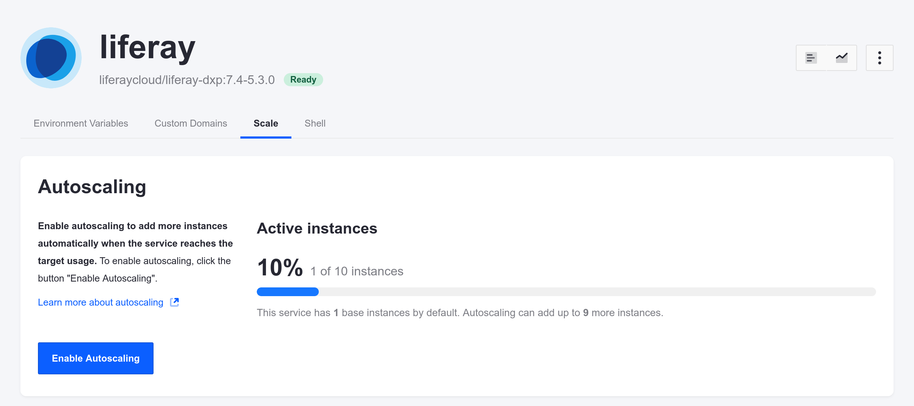

# Configuring Auto-scaling

Once you've enabled production environment clustering with any number of nodes, you can configure auto-scaling to better handle site traffic during peak hours.

Help Marcus configure auto-scaling by following these steps.

```{important}
You are billed quarterly based on the usage of instances automatically added from auto-scaling. Contact your Liferay account manager for details on the rates for these additional instances.
```

## Enable Auto-scaling in the Console

Use the Liferay Cloud console to enable auto-scaling for your production environment.

1. In the Liferay Cloud console, navigate to your production environment.

1. Navigate to *Services* &rarr; *Liferay*.

1. Select the *Scale* tab.

   

1. Click *Enable Auto Scaling*.

Auto-scaling is now enabled. You have a minimum of two nodes because of your clustering configuration, and if usage increases, more nodes are added up to the default maximum of ten.

## Set the Maximum Number of Instances

Several iterations at peak hours reveal that Delectable Bonsai's website requires more than the default 10 Liferay instances. Help Marcus reconfigure the auto-scale maximum from 10 to 12. 

Set the maximum number of instances via the `maxInstances` property in your Liferay service's `LCP.json` file:

1. In your project repository, navigate to the `liferay/` directory and open the `LCP.json` file.

1. Set the `maxInstances` value to 12, within the `autoscale` JSON object:

   ```json
    "autoscale": {
        "maxInstances": 12
    }
   ```

1. Commit and push the changes in your Git repository.

   ```bash
   git add liferay/LCP.json
   ```

   ```bash
   git commit -m "Increase the maximum number of instances to 12."
   ```

   ```bash
   git push origin [branch_name]
   ```

Your repository on GitHub now has the updated number of maximum instances, and Liferay Cloud creates a new build with your changes.

## Deploy the Configuration

Deploy the updated configuration to your production environment.

1. Log into the Liferay Cloud console.

1. Click the *Builds* link at the top-right of the screen to access the Builds page.

1. Click the Actions menu  for the build corresponding to the commit with your new changes, and select *Deploy build to...*

   

1. Select your production environment in the *Environment* drop-down menu.

1. Check the boxes acknowledging the impacts of the deployment.

   

1. Click *Deploy Build*.

Once your services restart, auto-scaling is enabled, up to a maximum of 12 instances.

Next: [change the password for your database service](./rotating-your-database-password.md).

## Related Concepts

* [Auto-scaling](https://learn.liferay.com/w/liferay-cloud/manage-and-optimize/auto-scaling)
* [Deploying to the Liferay Service](https://learn.liferay.com/w/liferay-cloud/customizing-liferay-dxp-in-the-cloud/deploying-to-the-liferay-service)
* [Deploying Changes via the Liferay Cloud Console](https://learn.liferay.com/w/liferay-cloud/updating-services-in-liferay-paas/deploying-changes-via-the-liferay-cloud-console)
