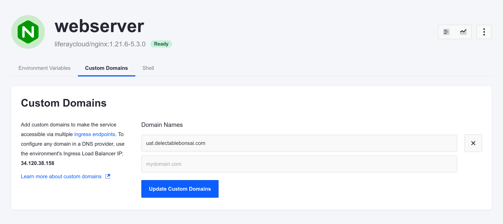
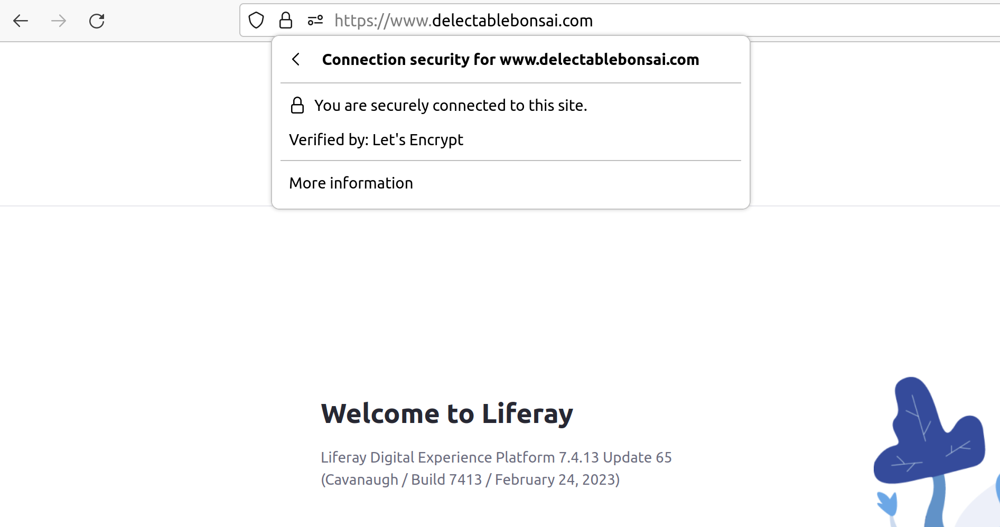

# Configuring Your Site's Domain

Now that the Delectable Bonsai site is up and running, you can connect it to its domain name.

Here, you'll register and configure a custom domain for your site.

```{important}
This exercise assumes you've reserved your own custom domain(s) using a domain registration service. 
```

## Finding Your Ingress Load Balancer IP Address

First, find your production environment's Ingress load balancer's IP address. 

1. In the Liferay Cloud console, navigate to your production environment and click *Network* from the left-side menu. 

1. On the Network page, your load balancer's IP address is shown in the Ingress Endpoints section.


## Registering Your Custom Domains

Use the domain registration service of your choice to register your desired domain with the IP address for your production environment. Choose a domain name that you plan to use for your own site. Register the domain as a type `A` record.

If you plan to configure additional custom domains or subdomains for your other environments, find the IP addresses from the *Network* page in those environments to use them for domain registration.

See your chosen domain registration service's documentation for more information on registering your domains and specifying their IP addresses. 

## Configuring Your Web Server Service

Finally, configure your web server service to use the custom domain that you registered.

1. Navigate to your production environment in the Liferay Cloud console.

1. Click *Services* from the left-side menu.

1. Select your `webserver` service.

1. Click the *Custom Domains* tab.

1. Add a new entry to the *Domain Names* list with the domain you registered.

   

1. Click *Update Custom Domains*.

Your web server uses the new domain name you configured. If you registered an additional domain or subdomain, follow the same process to configure your UAT environment's web server service. 



## Verifying Your Custom Domains

When you specify a custom domain, Liferay Cloud automatically generates an SSL certificate for your domain via [Let's Encrypt](https://letsencrypt.org/). This can take less than an hour or many hours to complete.

```{note}
Securing and updating the load balancer with an SSL certificate for your domain usually takes longer than updating the route to your site. If you try to access the site with your custom domain before the certificate update completes, your browser shows security warnings until it does.
```

Once the process completes, access your chosen domain in a browser to see it route to your Liferay instance. Your browser shows that the connection is secured and verified by Let's Encrypt.



Next: [enable clustering for your Liferay service](./setting-up-clustering-for-the-liferay-service.md) to handle more traffic.

## Relevant Concepts

* [Custom Domains](https://learn.liferay.com/w/liferay-cloud/configuring-the-cloud-network/custom-domains)
* [Custom SSL Certificates](https://learn.liferay.com/w/liferay-cloud/configuring-the-cloud-network/load-balancer#custom-ssl)
* [VPN Integration](https://learn.liferay.com/w/liferay-cloud/configuring-the-cloud-network/vpn-integration-overview)
