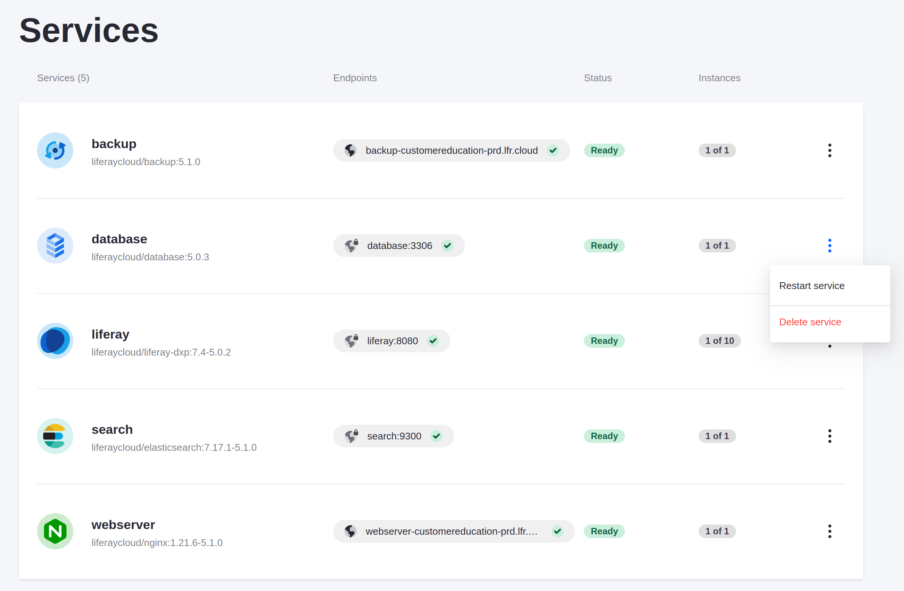
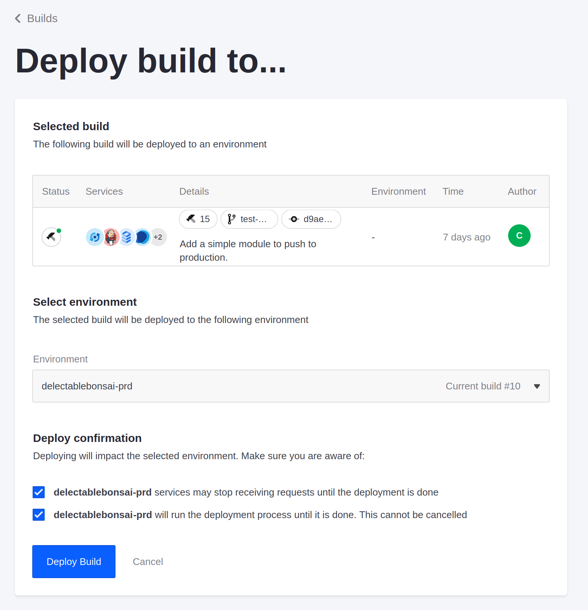
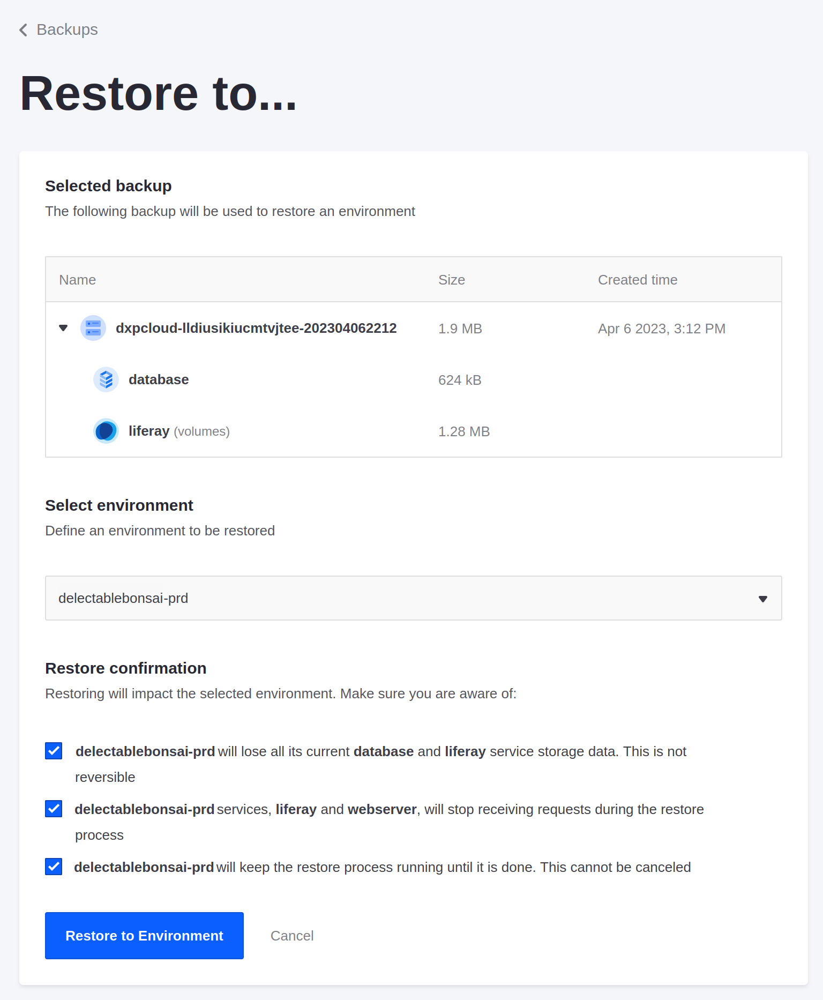

# Rotating Your Database password

Delectable Bonsai's database security policy is to rotate the password at least every 90 days.

Here, you'll change your database password in your production environment.

```{important}
Changing database credentials requires a period of scheduled downtime for live production environments, because your environment's services must restart.
```

## Creating a Manual Backup

Before you change any database credentials, create a manual backup so that you can restore it after the update.

1. In the Liferay Cloud console, navigate to your production environment.

1. Click *Backups*.

1. On the Backups page, click *Backup Now*.

   

The backup service's controls are temporarily unavailable while a backup is created. Wait for the backup to finish before proceeding.

```{warning}
Do not skip this step! You must create a backup before proceeding. Changing the database password requires deleting and recreating the database service, and then restoring your data. If you do not create a backup first, you will lose all your data. 
```

## Changing Your Database Password

Next, change the database password.

1. Click *Settings* on the left side of the screen.

1. On the Settings screen, select the *Secrets* tab.

1. Click the row for the `lcp-secret-database-password` secret.

   

1. Click *Edit* at the top-right corner of the screen.

   

1. On the Edit Secrets page, under *Value*, click *Show* to reveal the secret, and change the value to a new database password.

   ```{tip}
   Opt to use a strong password for improved security. The password does not need to be easily memorized because your environment's administrators can retrieve it from the Secrets page when needed.
   ```

1. Check the checkboxes under *Publish secret* (at the bottom of the page) to acknowledge the impact of the change.

1. Click *Publish Changes*.

The secret value is changed, but the database service is not using the new password yet.

## Deleting and Deploying the Database Service

Delete and re-deploy the database service for your new password to take effect. Be sure you have backed up your data first! 

1. Click *Services* on the left side of the screen.

1. Click *Actions* (  ) for the database service, and click *Delete service*.

   

1. Click the checkboxes under *Delete confirmation* to acknowledge the impact of the deletion.

   

1. Click *Delete Service*.

1. Click *Builds* at the top of the screen.

1. Click *Actions*  for the latest build, and click *Deploy build to...*

1. From the *Environment* drop-down menu, select your production environment.

1. Click the checkboxes under *Deploy confirmation* to acknowledge the impact of the deployment.

   

1. Click *Deploy Build*.

Your production environment's services restart, and when they're back up, they use the new database password.

## Restoring the Backup

Once your services are up and running again (with the `Ready` status), restore the backup you created beforehand.

1. Navigate back to your production environment in the Liferay Cloud console.

1. Click *Backups* on the left side of the screen.

1. Click *Actions* (  ) for the manual backup you created previously, and click *Restore to...*

   

1. In the *Select environment* drop-down menu, select your production environment.

1. Click the checkboxes to confirm the impact of the restore process.

   

1. Click *Restore to Environment*.

Your production environment's services restart, and when they're back up, all services that use the database use the new password.

Next: walk through the process of [installing a hotfix](./installing-a-hotfix.md).

## Relevant Concepts

* [Changing Your Database Password](https://learn.liferay.com/web/guest/w/liferay-cloud/platform-services/database-service/changing-your-database-password)
* [Changing Your Database Username](https://learn.liferay.com/web/guest/w/liferay-cloud/platform-services/database-service/changing-your-database-username)
* [Database Service](https://learn.liferay.com/web/guest/w/liferay-cloud/platform-services/database-service/database-service)
* [Defining Environment Variables](https://learn.liferay.com/w/liferay-cloud/reference/defining-environment-variables)
* [Managing Secure Environment Variables with Secrets](https://learn.liferay.com/w/liferay-cloud/tuning-security-settings/managing-secure-environment-variables-with-secrets)
