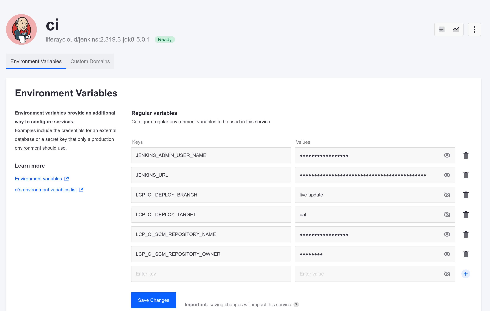

# Setting Up Automatic Deployment

Kyle is able to begin developing and testing with Liferay Cloud, but it's easier if he can test his changes immediately after deployment. 

Here, you'll configure a branch to deploy newly pushed changes to your UAT environment automatically. 

## Add the Configuration

Configure automatic deployment via the `LCP_CI_DEPLOY_BRANCH` and `LCP_CI_DEPLOY_TARGET` CI service environment variables.

1. In the Liferay Cloud console, navigate to your `infra` environment.

1. Click on the CI service.

1. Click the *Environment Variables* tab.

1. Set these environment variable values:

   * **LCP_CI_DEPLOY_BRANCH**: `live-update`

   * **LCP_CI_DEPLOY_TARGET**: `uat`

   

1. Click *Save Changes*.

The CI service restarts with the new configuration. Once it's back up, builds created from that point on via the `live-update` branch are deployed to your UAT environment automatically. 

## Test with a New Push

Next, make a commit and test that automatic deployment is working properly.

1. Open your command prompt in your project repository.

1. Create and switch to a new branch called `live-update`. You'll use this branch to deploy immediately any new developments you push up to UAT.

   ```bash
   git checkout -b live-update
   ```

1. Add and commit a dummy file to trigger a new build.

   ```bash
   touch dummy.txt
   ```

   ```bash
   git add dummy.txt
   ```

   ```bash
   git commit -m "First automatic deployment"
   ```

1. Push the change to your remote `live-update` branch.

   ```bash
   git push origin live-update
   ```

1. Return to the Liferay Cloud console and click *Deployments*.

   

Your new commit appears in the list of deployments, deployed to the UAT environment.

Now you can deploy any new developments or changes straight from your repository for testing. 

Next: [practice using a backup to revert changes from development](./restoring-data-from-a-backup.md).

# Relevant Concepts

* [Automatically Deploying CI Service Builds](https://learn.liferay.com/w/liferay-cloud/updating-services-in-liferay-paas/automatically-deploying-ci-service-builds)
