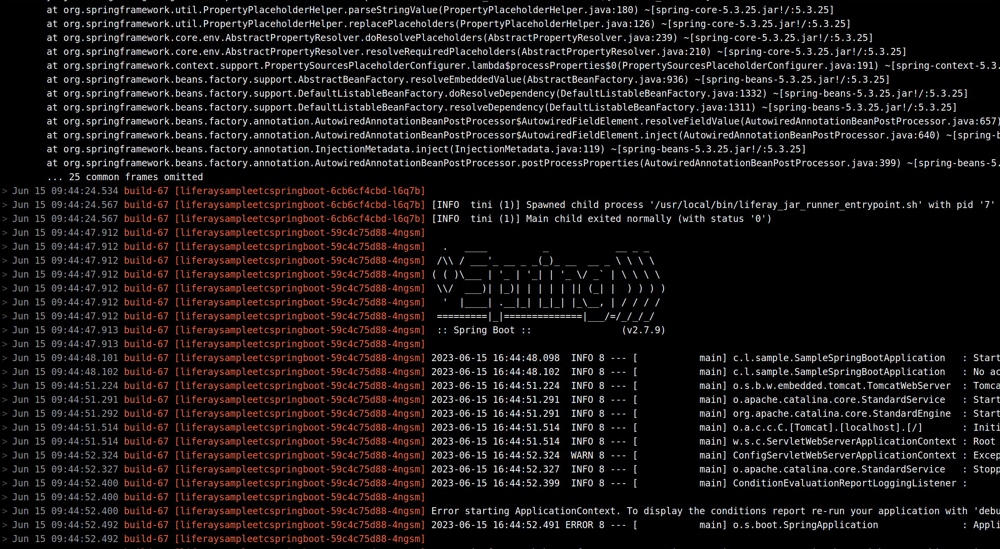
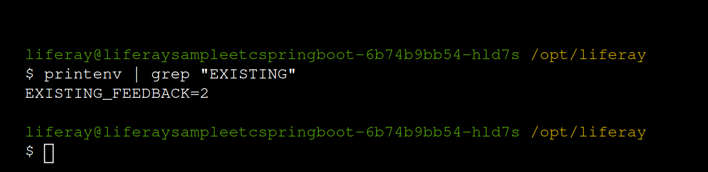
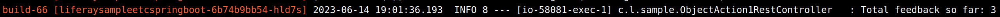

# Troubleshooting a Microservice in the Cloud Console

Previously, you tested using an [object action client extension](https://learn.liferay.com/w/dxp/building-applications/client-extensions/microservice-client-extensions#object-action-client-extensions) to log when a feedback entry is submitted in Liferay. Now, Kyle wants to add a simple counter variable to the Spring Boot application to log the total number of entries.

Here, you'll modify the sample client extension project you [deployed previously](./deploying-and-managing-a-microservice-client-extension-project.md), troubleshoot a problem in the Cloud console when something goes wrong, and resolve the issue.

## Add a Counter to the Object Action REST Controller

The [sample Spring Boot client extension](https://github.com/liferay/liferay-portal/tree/master/workspaces/liferay-sample-workspace/client-extensions/liferay-sample-etc-spring-boot) uses the `ObjectAction1RestController.java` file to log object data received from Liferay. Kyle wants to add a simple variable that counts each new feedback entry and adds it to a pre-existing number of entries for a new log message.

Add some additional code to implement this behavior.

1. In the `liferay-sample-etc-spring-boot` folder that you [deployed the Spring Boot project from previously](./deploying-and-managing-a-microservice-client-extension-project.md#download-the-sample-workspace), open the `src/main/java/com/liferay/sample/ObjectAction1RestController.java` file.

1. Add a `count` variable as a field in the class:

   ```java
   public class ObjectAction1RestController extends BaseRestController {

   private int count = 0;

   ...
   ```

1. Add another field to inject the value of pre-existing entries:

   ```java
   @Value("${EXISTING_FEEDBACK}")
   protected int existingFeedback;
   ```

1. Add an extra line to the `import` statements at the top for this value injection to work:

   ```java
   import org.springframework.beans.factory.annotation.Value;
   ```

1. Use these new variables to add additional logging. Add these lines before the `return` statement in the `post` method:

   ```java
   count++;

   int total = count + existingFeedback;

   _log.info("Total feedback so far: " + total);
   ```

Now you have enough code for a minimal counter implementation.

## Deploy the Updated Project

Now open your command line in the `liferay-sample-etc-spring-boot/` folder to rebuild and deploy the project.

1. Build the project into a new deployable LUFFA:

   ```bash
   ../../gradlew clean build
   ```

1. Use the CLI tool to deploy the built LUFFA:

   ```bash
   lcp deploy --extension dist/liferay-sample-etc-spring-boot.zip
   ```

   When prompted, choose the number that corresponds to your UAT client extension environment.

The client extension project is deployed, and it appears in the Cloud console after a delay.

## Check the Microservice

The `liferaysampleetcspringboot` service appears in the Cloud console, but even if you wait a while, the "Ready" status does not seem to appear.


Try triggering the object action the same way you did previously.

1. Log into your UAT Liferay instance.

1. Click *Submit* on the form to create a new object entry and trigger the action.

1. Go back to the Cloud console and click *Logs*.

Even if you wait a minute, the logs don't show the new message you added, or even the logging for the new entry. You can also see there are error messages above.



If you wait a while longer, you can see that the service is continually restarting because of these errors. Your new code seems to have broken something.

## Search the Application Logs

In the Liferay Cloud console, search the application logs for signs of what went wrong with the microservice. Use the Logs page so you can use filtering and searching tools to find relevant information.

1. While on the Logs page, make sure *Application logs* is selected from the drop-down menu at the top of the screen.

   You only have one client extension service running, so there's no need to filter by service.

1. Look for some clue related to the new variables you added by searching for the term "feedback".

The logs filter down to a complete stack trace, where the root `Exception` is clearly related to the variable you added via injection.

```
Caused by: java.lang.IllegalArgumentException: Could not resolve placeholder 'EXISTING_FEEDBACK' in value "${EXISTING_FEEDBACK}"
```

Now Kyle realizes the problem: Spring Boot can't find the value for `EXISTING_FEEDBACK` anywhere!

## Add the Missing Environment Variable

Spring Boot can inject values from environment variables with the same name in the container. Try adding the `EXISTING_FEEDBACK` value as an environment variable for the service.

1. Click *Services* in the left-side menu to return to where your `liferaysampleetcspringboot` service appears.

1. Click the `liferaysampleetcspringboot` service to see its environment variables.

1. Add a new environment variable to the Regular variables list. Use `EXISTING_FEEDBACK` for the key and add `2` as the value (for the two entries you've created so far).

   

1. Click *Save Changes*.

1. Click the *Actions* menu (  ) at the top of the screen and click *Restart Service* so the new variable is properly initialized.

The service restarts again after a delay with the new environment variable.

## Verify the Environment Variable is Present

Use the shell to make sure the variable is in the environment where Spring Boot can detect it. Shell access in the console puts you directly in the container where your microservice runs.

1. While you're on the service's page, click the *Shell* tab.

1. Use a `printenv` command to check whether the new environment variable is present:

```bash
printenv | grep "EXISTING"
```



The environment variable is present where Spring Boot can use it.

## Test the New Logging Again

Try testing the new changes one more time.

1. Go back to your UAT Liferay instance (and make sure you're logged in).

1. Click *Submit* on your input object's form.

1. Go back to the Cloud console again and click *Logs*.



Now you can see the object action client extension works again, and your new log message appears alongside the existing logging. If you submit more values on your Liferay instance, the counter value increments each time.

Congratulations! You've completed the final module covering Liferay SaaS. The rest of the course focuses on Liferay PaaS. 

Next: [Cloud Configuration](../cloud-configuration.md). 

## Relevant Concepts

* [Object Action Client Extensions](https://learn.liferay.com/w/dxp/building-applications/client-extensions/microservice-client-extensions#object-action-client-extensions)
* [Reading Liferay Cloud Service Logs](https://learn.liferay.com/w/liferay-cloud/troubleshooting/reading-liferay-cloud-service-logs)
* [Shell Access](https://learn.liferay.com/w/liferay-cloud/troubleshooting/shell-access)
* [Troubleshooting Services](https://learn.liferay.com/w/liferay-cloud/troubleshooting/troubleshooting-services)
* [Self-Healing](https://learn.liferay.com/w/liferay-cloud/troubleshooting/self-healing)
* [Defining Environment Variables](https://learn.liferay.com/w/liferay-cloud/reference/defining-environment-variables#defining-environment-variables-via-the-liferay-cloud-console)
