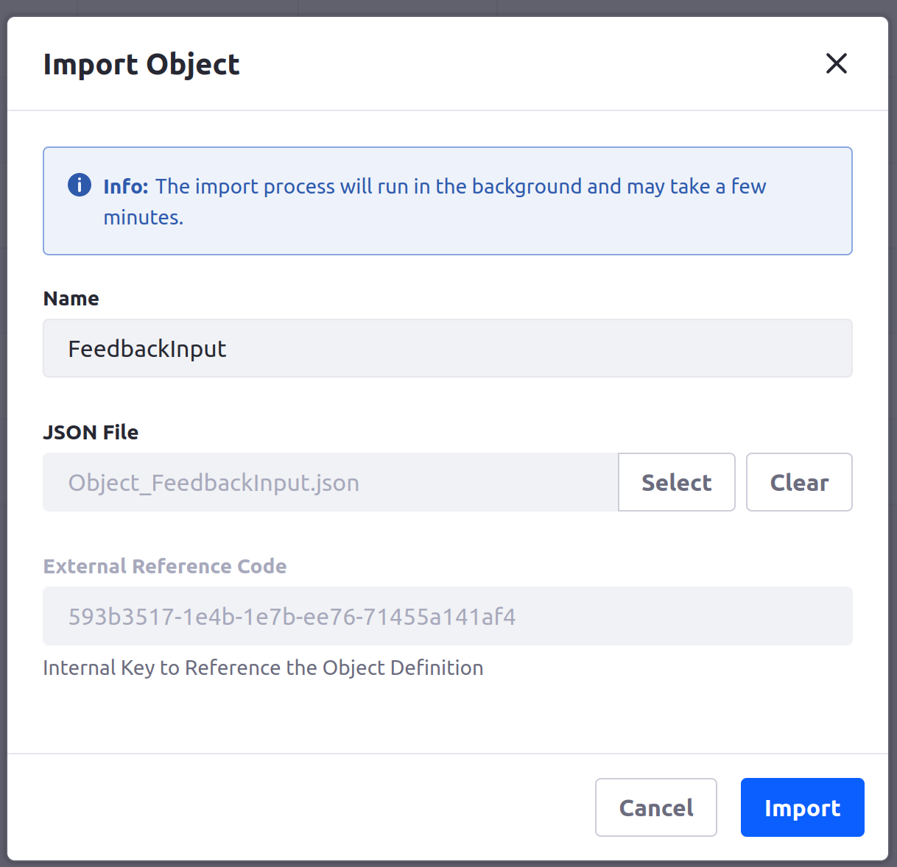
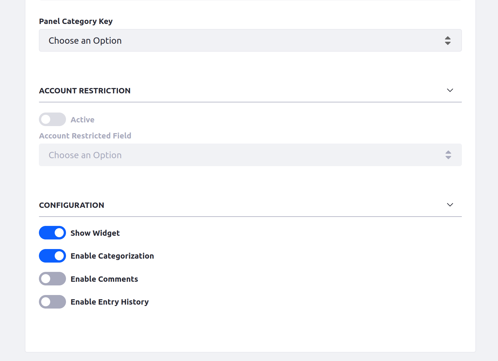
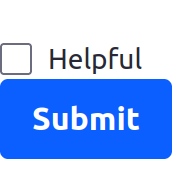
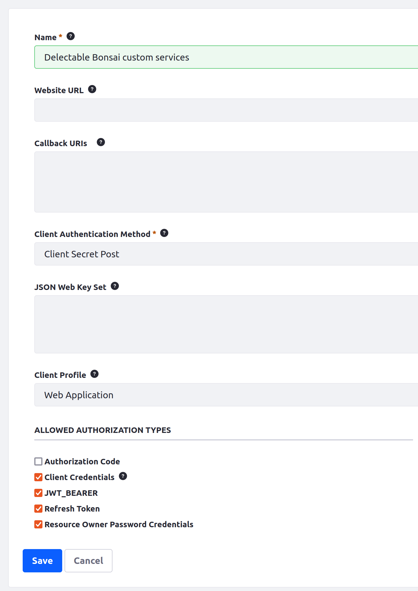
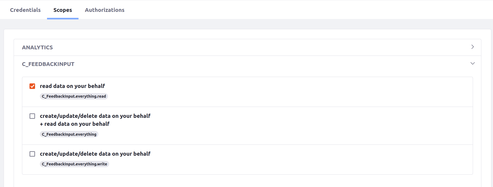

# Configuring Liferay for a Custom Feedback Counter Service

Kyle has an idea for a simple application that can help keep track of user feedback by fetching Liferay [object data](https://learn.liferay.com/web/guest/w/dxp/building-applications/objects). He created a simple Spring Boot application that can call a Liferay API to achieve this, and now he wants to run it as a custom service in Liferay Cloud.

In the next few exercises, you'll turn Kyle's simple application into a custom service that runs in Liferay Cloud. You'll start by configuring your Liferay instance so that it works with Kyle's application.

To start this task, you need to

* [Install Docker](https://docs.docker.com/engine/install/) to build Docker images
* Create an account on [Docker Hub](https://hub.docker.com/) to publish Docker images
* Have a [Liferay workspace](https://learn.liferay.com/w/dxp/building-applications/tooling/liferay-workspace/what-is-liferay-workspace) ready
* Have an extra service provisioned for your Liferay Cloud project

## Creating Object Data

First, import the object definition and use it to create some data for your application.

### Import and Publish the Object Definition

1. In a new folder within a [Liferay Workspace](https://learn.liferay.com/w/dxp/building-applications/tooling/liferay-workspace/what-is-liferay-workspace), download and unzip Kyle's feedback counter project:

    ```bash
    curl https://resources.learn.liferay.com/courses/latest/en/liferay-administrator/cloud-administrator/cloud-development-lifecycle/w9g6.zip -O
    ```

    ```bash
    unzip liferay-w9g6.zip
    ```

    The feedback counter application contains code for a Spring Boot application and an `Object_FeedbackInput.json` file with an object definition.

1. Log into your UAT Liferay instance.

1. Open the _Applications_ menu (  ) at the top of the screen and navigate to *Control Panel* &rarr; *Objects*.

1. Click _Actions_ (  ) at the top of the screen and click *Import*.

1. Enter `FeedbackInput` as the name.

1. Click *Select*, and select the `Object_FeedbackInput.json` file from your local file system.

   

1. Click *Import*.

Now the object definition is added as a draft. It has a single boolean field for whether the feedback is "helpful."

Enable it in widgets and fragments and publish it:

1. Click the Feedback Input object definition from the list.

1. Enable the Show Widget switch at the bottom of the page.

   

1. Click *Publish* at the top of the page.

The object definition is published and available to use as a form.

### Populate Some Data

Next, add a form using the object to a page and submit some values to create usable data.

1. Navigate back to your site's home page.

1. Click _Edit_ (  ) at the top of the page to edit the page.

1. In the list of fragments on the left side of the screen, drag the *Form Container* fragment onto the page.

   

1. In the Form Container's drop-down menu, select your new Feedback Input object.

1. Click *Publish* at the top of the page.

   

   The form appears on the page with a single "Helpful" checkbox.

1. Click the *Submit* button on the new form to submit a false result.

1. Refresh the page and submit a few more times with the checkbox checked.

Now you have a few true results and a false result submitted for your object.

## Configuring Liferay to Authorize Your Service

Next, configure your Liferay instance to allow remote requests and OAuth 2 authorization.

### Add and Configure an OAuth 2 Profile

1. Open the _Applications Menu_ (  ) at the top of the screen and navigate to *Control Panel* &rarr; *OAuth 2 Administration*.

1. Click _Add_ (  ) to add a new OAuth 2 profile for your custom service.

1. Fill in *Delectable Bonsai custom services* as the OAuth 2 profile's name.

1. Deselect the *Authorization code* checkbox.

   

1. Click *Save*.

Now you have an OAuth 2 profile created, with a client ID and client secret value needed to grant authorization. Copy these values somewhere so that you can use them for your custom service later.

You must also configure the scopes for this profile so that it can be used to retrieve object data.

1. Click the *Scopes* tab at the top of the screen.

1. Click to expand the new scope category named after your object definition (`C_FEEDBACKINPUT`).

1. Select the checkbox for *read data on your behalf*.

   

1. Scroll down to the bottom and click *Save*.

Next, you'll [create a custom service for your Liferay Cloud environment](./creating-your-custom-feedback-counter-service.md) that retrieves data via the `feedbackinput` object's API.

## Relevant Concepts

* [Creating OAuth2 Applications](https://learn.liferay.com/web/guest/w/dxp/headless-delivery/using-oauth2/creating-oauth2-applications)
* [Setting Up CORS](https://learn.liferay.com/web/guest/w/dxp/installation-and-upgrades/securing-liferay/securing-web-services/setting-up-cors)
* [Using a Custom Service](https://learn.liferay.com/web/guest/w/liferay-cloud/platform-services/using-a-custom-service)
