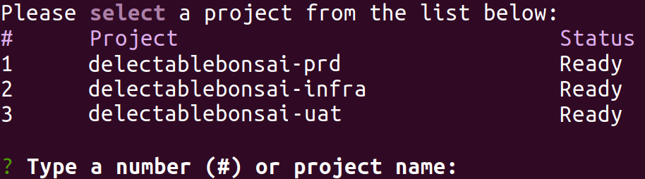
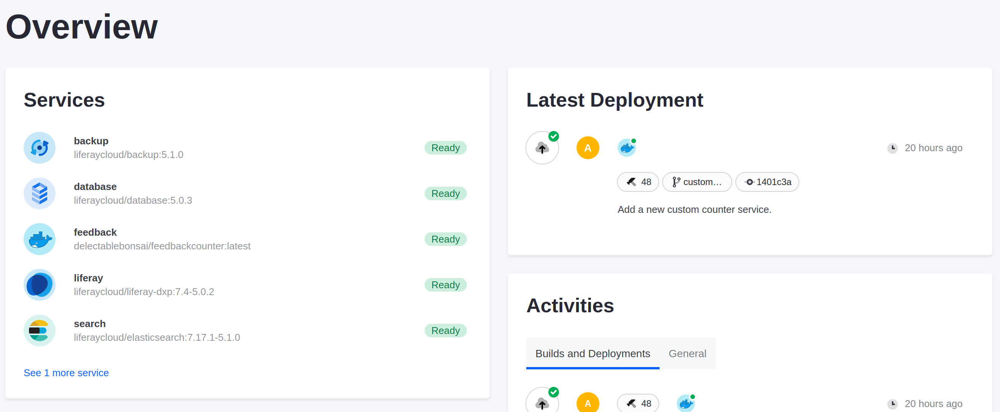
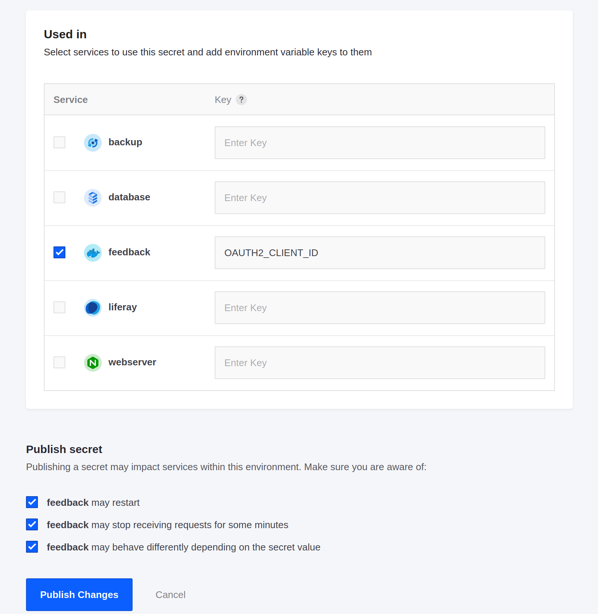
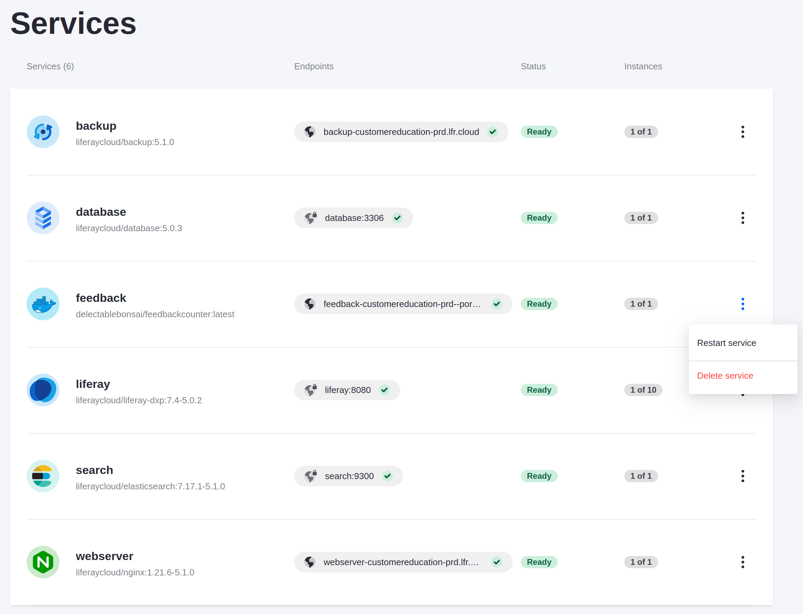
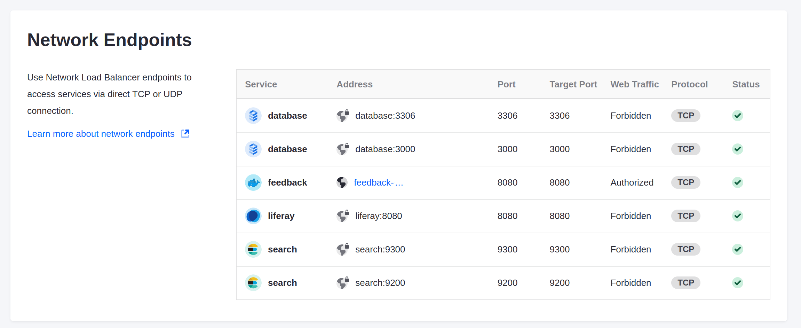
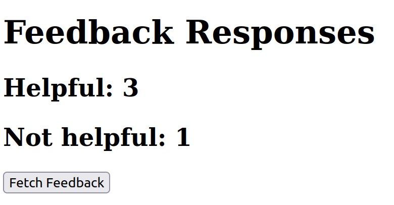

# Deploying and Configuring Your Custom Service

Previously, you built a Docker image and designed a custom service to use Kyle's simple Spring Boot application.

Here, you'll deploy it to Liferay Cloud, add secret environment variables, and see the application in action.

## Deploying Your Custom Service to Your UAT Environment

Navigate to your custom service's directory in your project repository, and use the CLI tool to deploy it directly.

```bash
lcp deploy
```

When prompted, enter the number corresponding to your UAT environment.



The service is deployed to your UAT environment, and it appears in the Liferay Cloud console after a delay.

## Disabling Basic Authentication in Your UAT Web Server

```{warning}
Disabling basic authentication enables public access to your UAT Liferay instance. Only leave it disabled while you are testing your custom service, and re-enable it afterward.
```

Disable basic authentication for your UAT environment's web server so your custom service can send requests to the Liferay instance.

1. In your project's repository, open the `webserver/configs/uat/conf.d/liferay.conf` file.

1. Find the line that enforces basic authentication:

    ```
    auth_basic "Authentication Required";
    ```

1. Comment out this line by adding a `#` character to the beginning of the line.

1. From the `webserver` folder, re-deploy the web server service to your UAT environment:

    ```bash
    lcp deploy
    ```

    Choose your UAT environment when prompted.

When your web server service restarts, web traffic to the Liferay instance is enabled and your custom service can send requests to it.

## Adding Your Credentials as Secrets

Your service is running, but it can't authenticate with Liferay yet because it doesn't have the client ID or client secret to get the OAuth 2 token.

Add the client ID to your new `feedback` service as a [secret](https://learn.liferay.com/web/guest/w/liferay-cloud/infrastructure-and-operations/security/managing-secure-environment-variables-with-secrets) for secure use.

1. In the Liferay Cloud console, navigate to your UAT environment.

    

    Your new `feedback` service is present in the list of services running.

1. Click *Settings* from the left-side menu.

1. In the *Secrets* tab, click *Create New Secret*.

1. Fill in the form to add a new secret for the OAuth 2 client ID:

    * **Name**: `oauth2-client-id`

    * **Description**: Client ID used to authenticate with Liferay.

    * **Value**: (Use the client ID you [copied from your OAuth 2 profile](./configuring-liferay-for-a-custom-feedback-counter-service.md#add-and-configure-an-oauth-2-profile))

1. At the bottom of the page, select the `feedback` service and enter `OAUTH2_CLIENT_ID` as the environment variable key.

1. Check all of the checkboxes to confirm the impact of the change.

    

1. Click *Create Secret*.

Then repeat the process to add the OAuth 2 client secret value.

1. Click the Back arrow to return to the list of secrets.

1. Click *Create New Secret*.

1. Fill in the form for the OAuth 2 client secret:

    * **Name**: `oauth2-client-secret`

    * **Description**: Client secret used to authenticate with Liferay.

    * **Value**: (Use the client secret value you [copied from your OAuth 2 profile](./configuring-liferay-for-a-custom-feedback-counter-service.md#add-and-configure-an-oauth-2-profile))

1. At the bottom of the page, select the `feedback` service and enter `OAUTH2_CLIENT_SECRET` as the environment variable key.

1. Check all of the checkboxes to confirm the impact of the change.

1. Click *Create Secret*.

Now the OAuth 2 credentials are available to your custom service. Manually restart the service from your Services page to ensure that the service runs with them properly initialized.



## Testing the Feedback Counter App

Now your custom service has everything it needs to count feedback submissions. Visit the exposed network endpoint to see how it looks.

1. From your UAT environment in the Liferay Cloud console, click *Network* in the left-side menu.

1. Click the address shown next to your `feedback` service in the list of network endpoints.

    

    You set `external: true` in the custom service's `LCP.json` file, so public web traffic is authorized with port 8181.

1. By default, the endpoint listed uses an `https` address. However, your custom service uses `http`. Remove the `s` from the URL in your browser's address bar to access your custom service's endpoint.

1. Click *Fetch Feedback* to update the values on the page.

The button triggers a call to the Spring Boot application, which calls Liferay's object API to get the number of helpful and not helpful responses. The numbers on the page update with the response.

If you submit more responses to the form in your Liferay instance and click the button again, the numbers update to the new totals.



Next, you'll modify your project's Jenkins pipeline to add a CI test for your new custom service.

## Relevant Concepts

* [Using a Custom Service](https://learn.liferay.com/web/guest/w/liferay-cloud/platform-services/using-a-custom-service)
* [Managing Secure Environment Variables with Secrets](https://learn.liferay.com/web/guest/w/liferay-cloud/infrastructure-and-operations/security/managing-secure-environment-variables-with-secrets)
