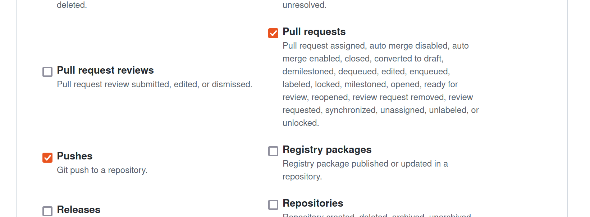

# Setting Up the GitHub Repository

Your first task after your Liferay Cloud account is provisioned is to set up the project's Git repository so you can deploy configurations as an administrator. Marcus must follow this procedure as the Delectable Bonsai project's administrator.

Set up the repository and complete your first push to ensure it's working.

## Install the CLI Tool

First, you must install the CLI tool so you can deploy changes quickly to different services in Liferay Cloud. 

Install the CLI tool via your command prompt.

**On Linux/MacOS**:

```bash
curl https://cdn.liferay.cloud/lcp/stable/latest/install.sh -fsSL | bash
```

**On Windows**:

Download the latest version of the [Windows installer](https://cdn.liferay.cloud/lcp/stable/latest/lcp-install.exe) and follow the steps in the wizard.

## Fork and Clone the GitHub Repository

First, you must install Git and create your own fork of the GitHub repository. For the Delectable Bonsai project, Marcus must follow all of these steps for the initial setup, but Kyle needs only perform the last two steps (clone and add a remote repository) as a contributor.

You'll transfer your Liferay Cloud project to your fork for new builds.

1. [Set up Git](https://docs.github.com/en/get-started/quickstart/set-up-git) on your local system.

1. Open your provisioned repository's page on GitHub.

   ```{tip}
   If you don't have the link to your project's repository, navigate to the *Builds* page in the Liferay Cloud console and click the link under *Branch* for the most recent build. This link points to a specific branch in the provisioned repository.
   ```

1. [Create your own fork](https://docs.github.com/en/get-started/quickstart/fork-a-repo) of the repository.

1. [Clone the fork you created](https://docs.github.com/en/repositories/creating-and-managing-repositories/cloning-a-repository) on your local system.

1. In your command prompt (with Git installed), add your fork as an (upstream) [remote repository](https://docs.github.com/en/pull-requests/collaborating-with-pull-requests/working-with-forks/configuring-a-remote-repository-for-a-fork).

Now you have a forked repository that you own with the Liferay Cloud project structure, locally and on GitHub.

## Configure the Webhook

Next, configure a webhook so Liferay Cloud can access your repository.

1. On the GitHub website, go to your repository’s Settings page and click *Webhooks*.

   

1. Click *Add Webhook*.

1. In the *Payload URL* field, add the domain of your Liferay Cloud `infra` environment's CI service with `github-webhook/` at the end (e.g., `https://ci-delectablebonsai-infra.lfr.cloud/github-webhook/` for the `delectablebonsai` project).

1. In the *Content type* drop-down menu, select *application/json*.

1. Ensure that *Enable SSL verification* is selected.

   

1. Under *Which events would you like to trigger this webhook?*, select *Let me select individual events*.

1. Select *Pushes* and *Pull Requests* from the list of events that appears.

   

1. Ensure that the *Active* checkbox is selected.

1. Click *Add webhook*.

Now Liferay Cloud can access your repository. 

## Point Liferay Cloud to Your Private Repository

Finally, configure the CI service in your `infra` environment to work with the private repository.

1. Log in to the Liferay Cloud console.

1. Navigate to your `infra` environment, and click *Services*.

1. Select the CI service.

1. Under the Environment Variables tab, add the values for these environment variables:

    | **Name** | **Value** |
    | :--- | :--- |
    | `LCP_CI_SCM_PROVIDER` | `github` |
    | `LCP_CI_SCM_REPOSITORY_NAME` | [Your repository's name] |
    | `LCP_CI_SCM_REPOSITORY_OWNER` | [Your repository owner's account] |
    | `LCP_CI_SCM_TOKEN` | [Personal access token] |

    Use a [personal access token](https://docs.github.com/en/authentication/keeping-your-account-and-data-secure/creating-a-personal-access-token) that has every permission checked under the *repo* and *admin:repo_hook* categories.

Once the CI service restarts, any pushes or pull requests to your private repository trigger new builds in your Liferay Cloud project.

Next, you'll configure your site to use your own [custom domain](./configuring-your-sites-domain.md).

## Related Concepts

* [Configuring Your GitHub Repository](https://learn.liferay.com/w/liferay-cloud/getting-started/configuring-your-github-repository)
* [Command-Line Tool](https://learn.liferay.com/w/liferay-cloud/reference/command-line-tool)
* [Configuring Your Bitbucket Repository](https://learn.liferay.com/w/liferay-cloud/getting-started/configuring-your-bitbucket-repository)
* [Configuring Your GitLab Repository](https://learn.liferay.com/w/liferay-cloud/getting-started/configuring-your-gitlab-repository)
