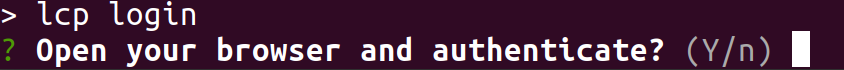
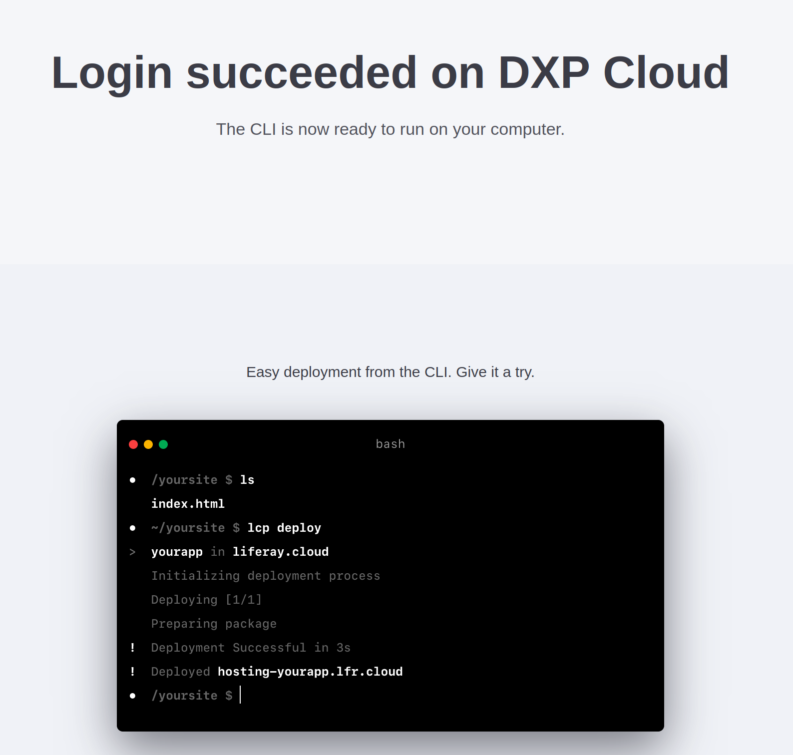

# Logging In and Using the CLI Tool

Now that the Delectable Bonsai site is up and running on Liferay Experience Cloud, Kyle is ready to start deploying [client extensions](https://learn.liferay.com/w/dxp/building-applications/client-extensions) the development team created. To get started, he needs to install the [command-line tool](https://learn.liferay.com/w/liferay-cloud/reference/command-line-tool) and access the [Cloud console](https://console.liferay.cloud).

Here, you'll log into the console and start using the CLI tool.

## Accessing the Cloud Console

When your Liferay Experience Cloud environment is created, you receive (separate) emails inviting you to set up your account and become an administrator for both the Cloud console and your Liferay instances on LXC. If you haven't already done so, accept the invitations in these emails and set up your account passwords so you can log into the console (and your Liferay instances).

Once you've logged in successfully, you can see the UAT and production environments for your client extension projects.


## Install the CLI Tool

Install the tool at the command line with this command:

```bash
curl https://cdn.liferay.cloud/lcp/stable/latest/install.sh -fsSL | sudo bash
```

```{note}
If you have a Windows environment, you can download and run the [Windows installer](https://cdn.liferay.cloud/lcp/stable/latest/lcp-install.exe) instead.
```

Once this completes, you are able to use the tool with the `lcp` command.

## Use the Tool to Log In

You must log in through the CLI tool to deploy client extension projects.

Run the `lcp login` command to log in, and enter `y` when prompted to open a browser.



A browser tab automatically opens to `https://console.liferay.cloud/login`. If your console session has expired, log in again with the credentials you received to authorize the CLI tool.



Now the tool can connect to your environments to deploy your client extension projects.

Next, you'll [deploy a microservice client extension](./deploying-and-managing-a-microservice-client-extension-project.md) to your UAT environment and see it running in the console.

## Relevant Concepts

* [Liferay Cloud Command-Line Tool](https://learn.liferay.com/w/liferay-cloud/reference/command-line-tool)
