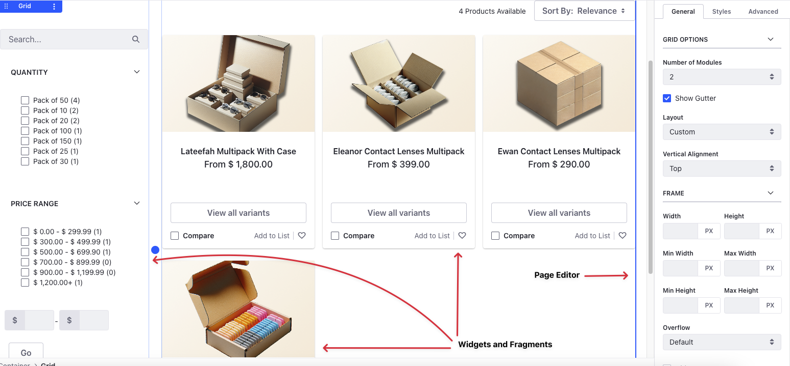

# Building the B2B Storefront

Now that you've finished building the B2C storefront for Clarity, your consumers can view products and place orders. However, Clarity's business customers have a different storefront that's not accessible to regular consumers. This storefront contains all the products that are available specific to B2B customers. s

We'll continue our journey with Preston Palmer, the site administrator, and build out the B2B storefront. This would enable Clarity’s business customers to view products, place orders, get specialized offers, and more. 

You’ll use the out-of-the-box fragments and widgets to build the site and use the page editor to style the content pages.

* A [content page](https://learn.liferay.com/en/w/dxp/site-building/creating-pages/using-content-pages) is one of the several available page types in Liferay. It's the default and the most used type. Content pages provide a convenient user interface for managing and editing page content and design. You'll design Clarity's pages through fragments and widgets added to content pages.
* [Fragments](https://learn.liferay.com/en/w/dxp/site-building/creating-pages/page-fragments-and-widgets/using-fragments) are reusable snippets of HTML, JavaScript (if necessary), and CSS. You can use them to add content and improve the look-and-feel of the pages. You'll use out-of-the-box fragments to build the Clarity site.
* [Widgets](https://learn.liferay.com/w/dxp/site-building/creating-pages/page-fragments-and-widgets/using-widgets) are full-blown web applications that provide a way to create customized web experiences for users.

## Shopping Experience

You’ll start by building the catalog page that displays all of Clarity's B2B products with facets. The facets let you dial down on the exact product you want. These facets auto-populate data based on the product information you've added.

Once your business customer selects a product, they're directed to the product details page. This page contains all the relevant information about the product. There's also a section below that display related products relevant to the currently chosen product.

From here, the customer can choose to go back to viewing other products or proceed to buying the selected one. To buy a product, they must add it to their cart. After adding it to their cart, they must checkout.

When they checkout, they're redirected to the [checkout page](https://learn.liferay.com/w/commerce/creating-store-content/commerce-storefront-pages/checkout). The checkout flow contains several steps. The customer can enter their billing and shipping addresses, choose a preferred shipping option, view terms and conditions associated with the payment method, confirm their order details, and place the order.

After placing an order, they can view details about the order on the orders page. The orders page displays both [pending](https://learn.liferay.com/w/commerce/creating-store-content/commerce-storefront-pages/pending-orders) and [placed orders](https://learn.liferay.com/w/commerce/creating-store-content/commerce-storefront-pages/placed-orders). Pending orders are those that haven't been checked out yet.

Ready? 

[Let's Go!](./building-the-b2b-storefront/creating-the-catalog-page.md)