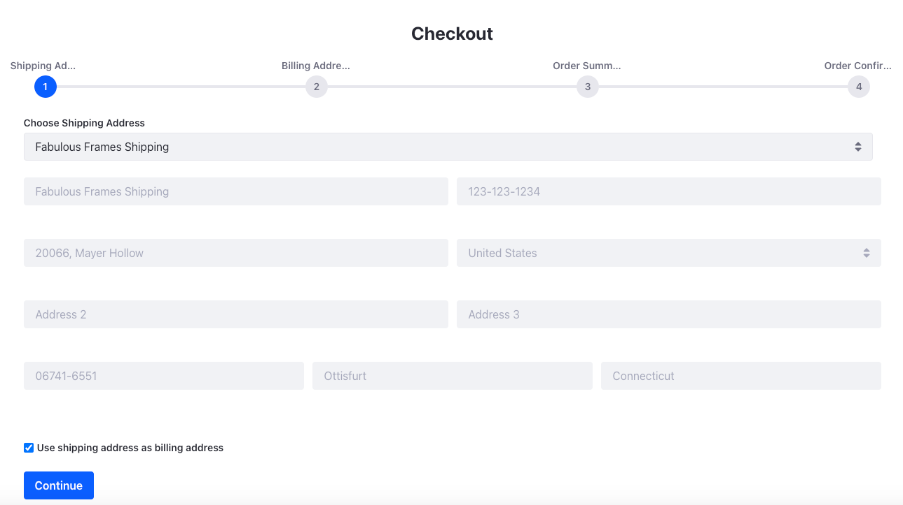
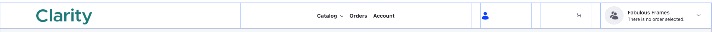

# Creating a Checkout Page

Before you can check out and submit an order, you must have a checkout page. This is also necessary for the mini cart fragment to work correctly. 

## Creating a New Page

1. Open the *Product Menu* (), and navigate to *Site Builder* &rarr; *Pages*.

1. To add a child page, click *Add* () next to the catalog page and click *Add Page*.

1. Select the master page template.

1. Enter the name as `Checkout` and click *Add*. This opens the new page in edit mode.

## Customizing the Checkout Page

1. Drag and drop a container on the page. Change the Container Width to *Fixed Width*.

1. Go to the *Styles* tab and in the Spacing settings, choose *Spacer 5* for the margin on the top of the element.

1. Drag and drop a Heading fragment inside the fixed width container.

1. Set the header title to *Checkout*.

1. Go to the *Styles* tab and in the Spacing settings, choose *Spacer 4* for the margin at the bottom of the element.

1. In the Text settings, set the text alignment to center.

1. Drag and drop the *Checkout* widget inside the fixed width container.

The checkout page is now ready to use.

## Adding the Mini Cart and Account Selector Fragments to the Header

Once you have created the Orders page and Checkout page, you can add the mini cart fragment to the page header. The mini cart fragment requires you to have these pages to work correctly. The account selector fragment displays the user's currently selected account. This allows sales agents of Clarity, like Tommy Tanner, to process orders for multiple accounts that they're in charge of.

1. Open the *Product Menu* () and navigate to *Design* &rarr; *Page Templates*.

1. Select the master page template.

1. Select the Grid in the header and change the Number of Modules to *5*.

1. Resize the grid as shown in the image below. 

   

   The module for the logo should take 4 columns, the menu display another 4 columns, the user info fragment and the mini cart fragment one columns each, and the account selector fragment should take up the last two columns.

1. Drag and drop the *Mini Cart* fragment inside the fourth module of the grid.

1. Go to the *Styles* tab and in the Spacing settings, enter `3.5rem` for the margin at the bottom of the element.

1. Drag and drop the *Account Selector* fragment inside the fifth module of the grid.

1. Click *Publish Master*.

Finally, you completed building the B2B storefront. In the next and final module, you'll customize the B2B experience for business customers by adding custom price lists, terms and conditions, order types and more!

[Customizing the B2B Experience](../customizing-the-b2b-experience.md)