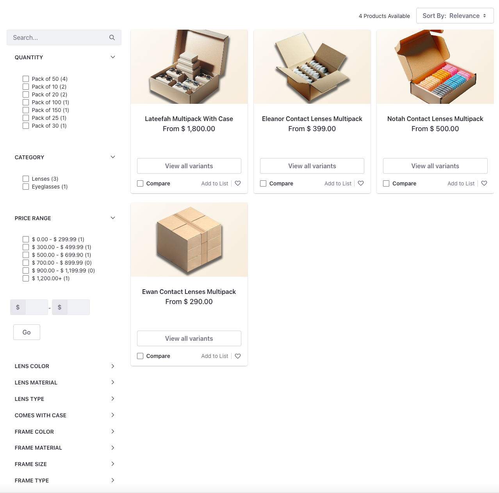

# Creating the Catalog Page

The catalog page displays all of Clarity's products for its business customers. The page contains a list of all the products, their associated facets, and search and sort functionality.



## Adding a Container for Products and Facets

1. Drag and drop a container.

1. Click the container and open its settings. In the General section, set the Container Width to *Fixed Width*.

1. Go to the *Styles* tab and in the Spacing settings, choose *Spacer 5* for the margin on the top of the element.

1. Drag and drop a Grid fragment inside this container.

1. In the right sidebar menu, set the *Number of Modules* to 2.  Adjust the size of the first module so that it takes up one-fourth of the total size of the container. 

## Adding the Search Bar and Facets

1. Inside the first module of the grid, drag and drop a Search Bar fragment from the left menu.

1. Go to its Styles section from the right sidebar menu and set its Margin Top to `3.5rem`.

1. Click *Actions* () on the fragment, and choose *Configuration*.

1. Set the scope to *Everything* and click *Save*.

1. Drag and drop the following widgets under the search bar one below the other:

   1. Option Facet
   2. Category Facet
   3. Price Range Facet
   4. Specification Facet

1. Click *Actions* () on the category facet, and choose *Configuration*.

1. Choose *Select Vocabularies* and select *Clarity* from the Global scope.

1. Click *Save*.

1. Click *Actions* () on the price range facet, and choose *Configuration*.

1. In the *Ranges JSON Array* textarea, paste the following array:

   ```json
   [
      {'range': '[0 TO 299.99]'}\,
      {'range': '[300 TO 499.99]'}\,
      {'range': '[500 TO 699.9]'}\,
      {'range': '[700 TO 899.99]'}\,
      {'range': '[900 TO 1199.99]'}\,
      {'range': '[1200 TO *]'}
   ]
   ```

1. Click *Save*.

1. Lastly, drag and drop a Search Options widget below the specification facet.

1. Click *Actions* () and select *Configuration*. 

1. Check the box to *Allow Empty Searches*.

1. Click *Save*.

1. In the left hand layout menu, hide the search options widget.

## Adding the Products

1. From the left menu, drag and drop a Sort widget from the Commerce section to the second module of the grid.

1. Right below this, drag and drop the Search Results widget, again from the Commerce section.

1. Click *Publish*.

With that you have a catalog page displaying all the products in the catalog. There's also a search bar to search for products along with several functioning facets.

Next: [Creating a Catalog Page](./creating-a-product-details-page.md)