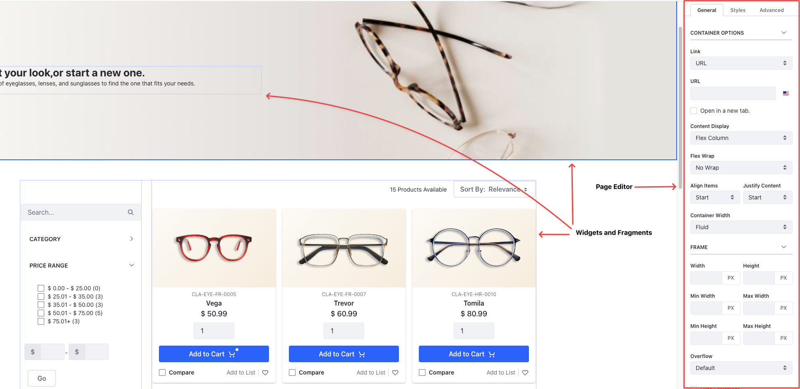

---
toc:
  - ./building-the-b2c-storefront/creating-the-shop-page.md
  - ./building-the-b2c-storefront/creating-a-product-details-page.md
  - ./building-the-b2c-storefront/creating-an-orders-page.md
  - ./building-the-b2c-storefront/creating-a-checkout-page.md
  - ./building-the-b2c-storefront/creating-a-discount-and-enabling-guest-checkout.md
uuid: 7a8e616c-8124-48fc-9376-da7114288c8e
---
# Building the B2C Storefront

Now that you've created and configured catalogs, channels, products, and warehouses, you’re all set to create and design the storefront. Preston Palmer, the site administrator, needs your help in building out the B2C storefront so Clarity’s consumers can view products, place orders, redeem promotions, and more. 

You’ll use the out-of-the-box fragments and widgets to build the site and use the page editor to style the content pages. 

* A [content page](https://learn.liferay.com/en/w/dxp/site-building/creating-pages/using-content-pages) is one of the several available page types in Liferay. It's the default and the most used type. Content pages provide a convenient user interface for managing and editing page content and design. You'll design Clarity's pages through fragments and widgets added to content pages.
* [Fragments](https://learn.liferay.com/en/w/dxp/site-building/creating-pages/page-fragments-and-widgets/using-fragments) are reusable snippets of HTML, JavaScript (if necessary), and CSS. You can use them to add content and improve the look-and-feel of the pages. You'll use out-of-the-box fragments to build the Clarity site.
* [Widgets](https://learn.liferay.com/w/dxp/site-building/creating-pages/page-fragments-and-widgets/using-widgets) are full-blown web applications that provide a way to create customized web experiences for users.

## Shopping Experience

You’ll start by building the shop page that displays all the available products with facets. The facets auto-populate data based on the product information you've added, and they help customers choose the features they want.

When customers select a product, they're directed to the product details page. This page contains all the relevant information about the product. Below this appears related products relevant to the currently chosen product.

From here, customers can choose to go back to viewing other products or proceed to buying the selected one. To buy a product, they must add it to their cart. After adding it to their cart, they must check out.

When they check out, they're redirected to the [checkout page](https://learn.liferay.com/w/commerce/creating-store-content/commerce-storefront-pages/checkout). The checkout flow contains several steps. Customers can enter their billing and shipping addresses, choose a preferred shipping option, confirm their order details, and make the payment.

After purchasing an item, they can view details about the order on the orders page. The orders page displays both [pending](https://learn.liferay.com/w/commerce/creating-store-content/commerce-storefront-pages/pending-orders) and [placed orders](https://learn.liferay.com/w/commerce/creating-store-content/commerce-storefront-pages/placed-orders). Pending orders haven't been checked out yet. The store also has a guest checkout feature that lets users purchase products without creating an account. They must only provide an email address and their shipping/billing addresses. 

Ready? 

[Let's Go!](./building-the-b2c-storefront/creating-the-shop-page.md)
