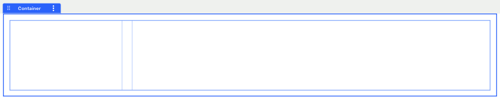
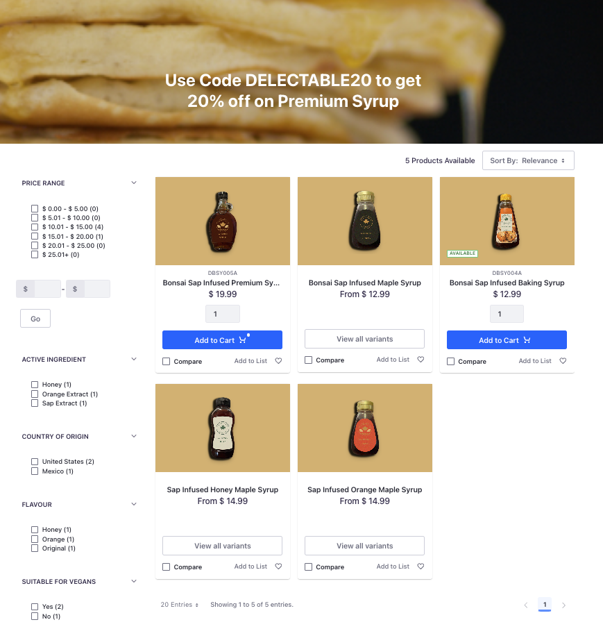

# Creating a Catalog Page

The catalog page displays all the products in the catalog. It contains a search bar, different facets, and sorting options. 

## Creating a New Page

1. Open the *Product Menu* (), and navigate to *Site Builder* &rarr; *Pages*.

1. Click *Add* () next to the shop page, to add a child page, and click *Add Page*.

1. Select the master page template.

1. Enter the name as *Catalog* and click *Add*. This opens the new page in edit mode.

## Applying the CSS Client Extension

You must now configure the created page in Liferay to use your deployed client extension:

1. Open the catalog page, click on *Edit* () at the top.

1. In the sidebar, navigate to the *Page Design Options* menu () and click the *Configuration* () icon at the top of the menu.

1. In the CSS Client Extensions section toward the bottom of the page, click *Add CSS Client Extensions*.

1. Select your CSS client extension from the pop-up modal and click *Add*.

1. Click *Save*.

## Customizing the Catalog Page

1. Drag and drop a container on the page. 

1. Drag and drop the *Banner Center* fragment inside that container. 

1. From the left-hand browser menu, delete the paragraph and button fragments inside the banner center fragment.

1. Go to the *Styles* section of the fragment and choose *banner_shop_page.png* as the background image.

1. Edit the heading text to “Use Code DELECTABLE20 to get 20% off on Premium Syrup”. This is for a discount that you’ll create later.

1. Drag and drop a container on the page. Change the *Container Width* to *Fixed Width*.

1. In the *Advanced* section, give it the CSS class `p-3`.

1. Drag and drop a *Grid* inside the container. 

1. Set the number of *Modules* to 2.

1. Resize the grid as shown below. The second module should be thrice the size of the first module. 

   

1. In the first module of the grid, drag and drop the following widgets and configure them as follows:

   | Widget               | Configuration                                                                                          |
   | :------------------- | :----------------------------------------------------------------------------------------------------- |
   | Search Options       | 1. Click on the *Actions* () icon and select *Configuration*. |
   |                      | 1. Check the box to *Allow Empty Searches*.                                                            |
   |                      | 1. Click *Save*.                                                                                       |
   |                      | 1. In the left hand layout menu, hide the search options widget.                                       |
   | Price Range Facet    | 1. Click on the *Actions* () icon and select *Configuration*. |
   |                      | 1. Paste the following values in the *Ranges JSON Array*:                                              |
   |                      | ```                                                                                                    |
   |                      | [                                                                                                      |
   |                      | {'range': '[0 TO 5]'}\,                                                                                |
   |                      | {'range': '[5.01 TO 10]'}\,                                                                            |
   |                      | {'range': '[10.01 TO 15]'}\,                                                                           |
   |                      | {'range': '[15.01 TO 20]'}\,                                                                           |
   |                      | {'range': '[20.01 TO 25]'}\,                                                                           |
   |                      | {'range': '[25.01 TO *]'}                                                                              |
   |                      | ]                                                                                                      |
   |                      | ```                                                                                                    |
   |                      | 1. Click *Save*.                                                                                       |
   |                      | 1. In the *Advanced* section, give it the CSS class `mt-5`.                                            |
   | Specifications Facet | No additional configuration required.                                                                  |

1. In the second module of the grid, drag and drop the following two widgets:

   * Sort 

   * Search Results

   Both these widgets work without requiring any additional configuration. With that you should have a catalog page that displays all products in the catalog and you can use all the facets and sorting options right away. 

   

   You must now add a link to this page from the shop page. 

1. Go back to the Shop page and open it in edit mode. 

1. Scroll down to the product grid and select the *View All Products* button.

1. Select the button and click on the *Link* tab from the right-hand configuration menu.

1. Set the URL to `/web/delectable-bonsai-b2c/catalog` and check the box to open in a new tab.
<!-- TASK: Change this to the actual URL once finalized -->
Next: [Creating a Product Details Page](./creating-a-product-details-page.md)
